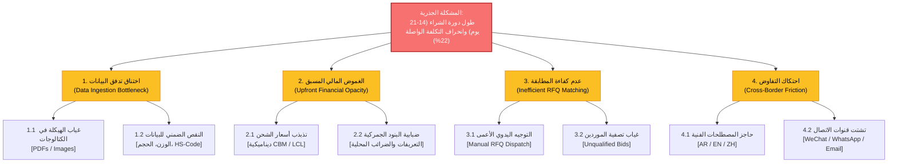

# Problem Structuring & MECE Issue Tree

**المشروع:** AI-Sourcing Hub

**المنهجية المستخدمة:** شجرة القضايا (Issue Tree) خاضعة لمبدأ MECE الاستشاري.

---

## 1. المخطط الهيكلي لشجرة المشكلات (Visual Issue Tree)

---

## 2. التفكيك التحليلي للشجرة (MECE Breakdown)

### 📊 الفرع الأول: اختناق تدفق البيانات في المصدر (Data Ingestion Bottleneck)

> يختص هذا الفرع بـ "مدخلات النظام" فقط.
> 
- **القضية 1.1: غياب الهيكلة البرمجية في الكتالوجات الصينية**
    - **فرضية الخلل:** الموردون يعتمدون في التسويق على ملفات (PDF/Images) مصممة للبشر، تفتقر إلى جداول قاعدة بيانات واضحة.
    - **الأثر المعماري:** عجز المنصات التقليدية عن قراءة المنتجات آلياً.
- **القضية 1.2: النقص الضمني في البيانات اللوجستية**
    - **فرضية الخلل:** الكتالوج يحتوي على السعر والوصف، لكنه يغفل ذكر (الوزن الصافي، الحجم CBM، ورمز النظام المنسق الجمركي HS-Code).
    - **الأثر المعماري:** توقف أي حاسبة شحن عن العمل لعدم وجود متغيرات رياضية.

---

### 💰 الفرع الثاني: الغموض المالي المسبق (Upfront Financial Opacity)

> يختص هذا الفرع بـ "المعالجة الحسابية" فقط.
> 
- **القضية 2.1: التذبذب اللحظي في تسعير الشحن الدولي**
    - **فرضية الخلل:** أجور الشحن البحري (LCL/FCL) تتغير أسبوعياً بناءً على أسعار الوقود ومواسم الذروة، ولا يمكن تثبيتها كقيمة ثابتة في الداتابيز.
    - **الأثر المعماري:** السعر الذي يراه المستورد اليوم يصبح غير صالح بعد 5 أيام.
- **القضية 2.2: ضبابية وتداخل البنود الجمركية**
    - **فرضية الخلل:** المستورد الصغير لا يعرف الـ HS-Code الدقيق لمنتجه، مما يؤدي إلى تخمين خاطئ للرسوم الجمركية وضريبة المبيعات في ميناء الوصول.
    - **الأثر المعماري:** مفاجآت مالية غير سارة للعميل عند التخليص.

---

### 🔀 الفرع الثالث: عدم كفاءة مطابقة العرض والطلب (Inefficient Marketplace Routing)

> يختص هذا الفرع بـ "منطق التوجيه والربط" فقط.
> 
- **القضية 3.1: التوجيه اليدوي الأعمى لطلبات التسعير (RFQ Dispatching)**
    - **فرضية الخلل:** يقوم المستورد بإرسال الطلب لجميع الموردين في المنصة بشكل عشوائي، مما يغرق الموردين بطلبات غير ذات صلة.
    - **الأثر المعماري:** انخفاض معدل استجابة الموردين (Response Rate).
- **القضية 3.2: غياب الفلترة المسبقة لقدرات المورد (Supplier Qualification)**
    - **فرضية الخلل:** المورد يستلم RFQ لمنتج يتطلب حداً أدنى للطلب (MOQ = 1000 قطعة) بينما المستورد يطلب 100 قطعة فقط.
    - **الأثر المعماري:** إهدار 3 أيام من التفاوض لتنتهي الصفقة بالرفض بسبب الـ MOQ.

---

### 🤝 الفرع الرابع: احتكاك التفاوض العابر للحدود (Cross-Border Negotiation Friction)

> يختص هذا الفرع بـ "التواصل البشري ما بعد المطابقة" فقط.
> 
- **القضية 4.1: التباين الدلالي في المصطلحات الصناعية (Trilingual Barrier)**
    - **فرضية الخلل:** الترجمة الحرفية العامة (مثل ترجمة جوجل) تفشل في ترجمة المصطلحات الفنية والهندسية الدقيقة بين (صيني ↔ إنجليزي ↔ عربي).
    - **الأثر المعماري:** وصول منتج بمواصفات تختلف عن المتفق عليه في الشات.
- **القضية 4.2: التشتت غير المتزامن (Asynchronous Platform Lag)**
    - **فرضية الخلل:** أطراف الصفقة يتفاوضون عبر منصات مشتتة (WeChat للمورد الصيني، WhatsApp للمستورد، Email للإدارة المالية).
    - **الأثر المعماري:** ضياع المرجعية القانونية الموحدة للصفقة عند حدوث نزاع تجاري.

---

## 3. جدول التحقق من سلامة معيار (MECE Integrity Test)

| الفرع الرئيسي | مانع للتبادل (Mutually Exclusive) | شامل للكل (Collectively Exhaustive) |
| --- | --- | --- |
| **1. البيانات** | مستقل تماماً؛ يختص بـ "كيفية إدخال الكتالوج للنظام" ولا يتدخل في الحسابات. | يغطي 100% من مشاكل "ملفات الموردين". |
| **2. المالية** | مستقل؛ يفترض أن البيانات دخلت نظيفة، ويختص بـ "معادلة السعر الواصل". | يغطي 100% من مسببات "صدمة الميناء المالية". |
| **3. المطابقة** | مستقل؛ يختص بـ "ربط المشتري A بالبائع B" دون التدخل في محتوى الكتالوج. | يغطي 100% من أسباب "تأخر الردود وإلغاء الطلبات". |
| **4. التفاوض** | مستقل؛ تبدأ وظيفته "بعد أن تتم المطابقة" ليدير الحوار الإنساني. | يغطي 100% من عوائق "اللغة والوقت والتوثيق". |