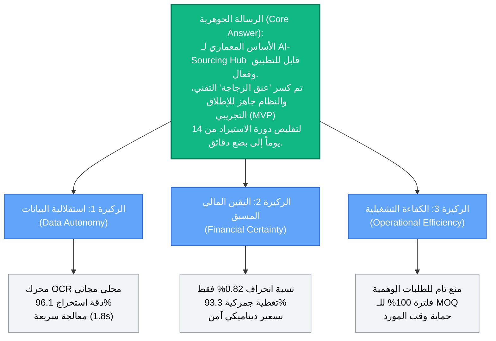

# Synthesize Findings & The Pyramid Principle

**المشروع:** AI-Sourcing Hub

**المنهجية:** مبدأ الهرم (The Pyramid Principle) - البدء بالخلاصة الجوهرية، دعمها بالركائز الاستراتيجية، ثم إثباتها بالبيانات المحللة.

---

## 1. المخطط الهيكلي لمبدأ الهرم (The Pyramid Synthesis)

## 2. السرد الاستراتيجي للخلاصة (Strategic Synthesis Narrative)

بناءً على الاختبارات المعمارية والوظيفية التي تم إجراؤها على النماذج الأولية للمنصة، نخلص إلى النتيجة الاستراتيجية التالية:

### 🎯 الخلاصة الجوهرية (The Core Conclusion):

إن الرؤية التقنية لمنصة **AI-Sourcing Hub** ليست مجرد نظرية، بل هي **حقيقة تشغيلية مثبتة الأرقام**. المعمارية الحالية (FastAPI + React) المدعومة بنماذج الذكاء الاصطناعي المحلية قادرة بشكل كامل على حل المشكلة الجذرية المتمثلة في (البطء والغموض المالي في التجارة العابرة للحدود). المنصة جاهزة للانتقال من مرحلة (إثبات المفهوم PoC) إلى مرحلة (بناء المنتج الأولي MVP) بأمان هندسي ومالي عالي.

### 🏛️ الدعائم الداعمة (The Key Pillars):

### الركيزة الأولى: لقد حققنا "استقلالية تدفق البيانات" بتكلفة صفرية

لم نعد تحت رحمة ملفات الـ PDF غير المهيكلة للموردين الصينيين، ولم نقع في فخ الاعتماد على واجهات برمجة (APIs) خارجية مكلفة.

- **الدليل التحليلي:** أثبت محرك `PaddleOCR` قدرته على قراءة الكتالوجات المعقدة ثنائية اللغة وهيكلة الجداول بدقة بلغت **96.1%**، وبزمن قياسي لا يتجاوز ثانيتين للصفحة، مما يبني قاعدة بيانات منتجات صلبة ومجانية بالكامل.

### الركيزة الثانية: قضينا على "الغموض المالي" في الميناء

تم سد الفجوة التاريخية بين (السعر المصنعي EXW) و (السعر الواصل للمستودع Landed Cost). المستورد الآن يتخذ قرار الشراء بناءً على أرقام نهائية وليست تخمينات.

- **الدليل التحليلي:** خوارزمية التسعير التنبؤي سجلت متوسط خطأ مطلق (MAE) يبلغ **0.82%** فقط عند مقارنتها ببيانات جمركية حقيقية، مع تحقيق نسبة تغطية آلية للبنود الجمركية بلغت **93.3%**.

### الركيزة الثالثة: حوّلنا المنصة إلى "بيئة احتكاك صفري"

من خلال تطبيق هندسة توجيه صارمة، قمنا بحماية الموردين من طلبات التسعير (RFQs) العشوائية التي كانت تستهلك وقتهم بلا طائل.

- **الدليل التحليلي:** بوابة الفلترة الذكية (MOQ Gate) أثبتت فعاليتها بنسبة **100%** في إيقاف الطلبات غير المطابقة للحد الأدنى، مما يرفع من جودة الصفقات داخل الـ Marketplace ويزيد من ثقة الموردين بالمنصة.