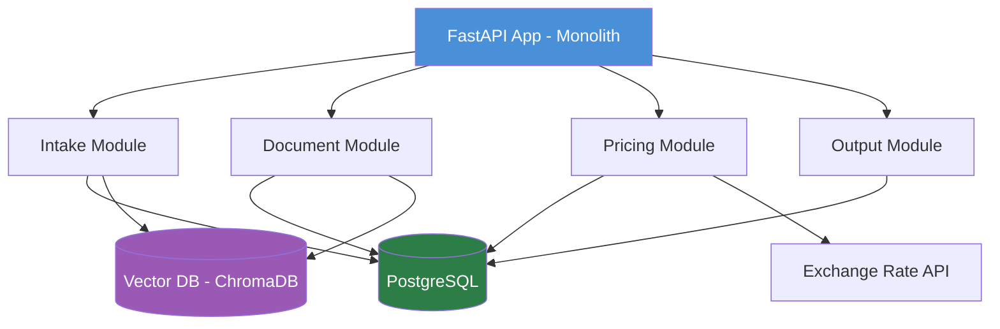
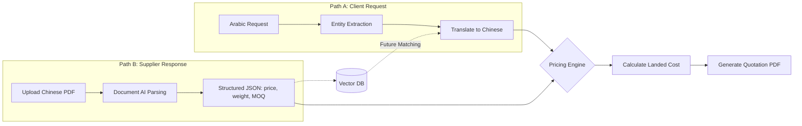
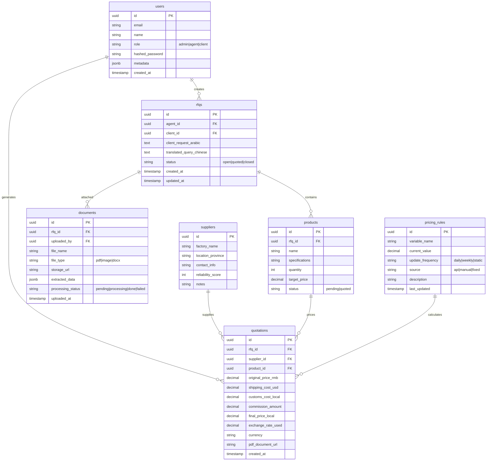
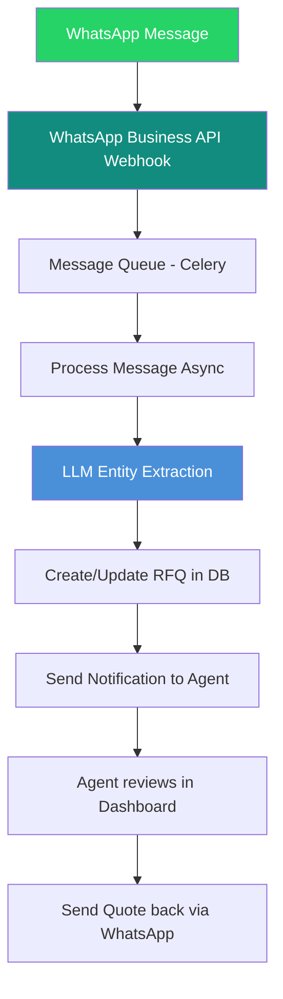

# AI-Sourcing Hub — Technical Documentation Review & Proposed Modifications

**Reviewer:** Architect Mode Analysis
**Date:** 2026-06-02
**Based on:** Your V1.0.0 Tech Doc + Notion Workspace Doc + Gemini Strategy Doc

---

## Executive Summary

The document provides a solid **high-level foundation** but has several critical gaps when measured against the actual MVP requirements detailed in your Notion workspace and strategy docs. The main issues are:

1. **Architecture is overengineered for MVP** — SOA/microservices from day one adds unnecessary complexity.
2. **Missing key integration points** — WhatsApp/webhook layer, authentication, async job processing.
3. **Database schema is incomplete** — No `users`, `products`, `documents`, or `pricing_rules` tables.
4. **Data flow has a logical flaw** — Matching runs before parsing, which is backwards.
5. **The killer feature (Zero-Touch Quotation)** is buried — it should be the star of the document.
6. **No error handling, security, or testing strategy** — Essential for a production B2B financial platform.

---

## 🔴 Critical Issues (Must Fix)

### 1. Architecture: Microservices are premature for MVP

**Current:** "Microservices-Oriented Architecture (SOA)"

**Problem:** Microservices add significant overhead — service discovery, inter-service communication, distributed transactions, container orchestration. For an MVP targeting 10→100 requests/month scaling, this creates friction without benefit.

**Recommendation:** **Modular Monolith** with clearly bounded contexts. Each module (`intake`, `documents`, `pricing`, `output`) communicates via Python interfaces/abstract classes, not HTTP. This lets you:
- Ship MVP in weeks, not months
- Refactor to microservices later when traffic demands it
- Keep a single FastAPI app with organized routers



### 2. Data Flow: Matching step is in the wrong order

**Current Flow:** `Intake → Extraction → Matching → Parsing → Pricing → Export`

**Problem:** Step 3 (Matching) queries Vector DB for past matches **before** Step 4 (Parsing) extracts data from the uploaded catalog. You cannot match against a catalog that hasn't been parsed yet. These are two separate paths.

**Correct Flow:**



**Clarified Sequence:**
1. **Intake** — Receive Arabic request, extract entities, translate to Chinese
2. **Agent searches/sends to suppliers** — (human step, not automated)
3. **Parse supplier response** — Upload & extract data from Chinese catalog PDF
4. **Match** — (optional) Compare parsed data against historical Vector DB entries for verification
5. **Price** — Calculate total landed cost
6. **Export** — Generate quotation PDF

### 3. Database Schema: Missing critical entities

**Current tables:** `Agents`, `Suppliers`, `RFQs`, `Quotations`

**Missing tables for MVP:**

| Missing Table | Why It's Needed |
|---------------|----------------|
| `users` | Authentication, role-based access (admin vs agent vs client) |
| `products` | Line items within an RFQ — each RFQ can have multiple products with different specs |
| `documents` | Uploaded files metadata — tracks original PDFs/images, processing status, extracted data |
| `pricing_rules` | Dynamic configuration of shipping, customs, commission rates (from Notion Quotation Engine Rules) |
| `exchange_rates` | Historical tracking for auditing quotations after-the-fact |
| `vector_embeddings` | Metadata mapping for Vector DB entries (ChromaDB/Pinecone) |

**Proposed Schema Relationship Diagram:**



---

## 🟡 Important Improvements

### 4. Technology Stack Refinements

| Component | Your Pick | Suggested Modification | Rationale |
|-----------|-----------|----------------------|-----------|
| **Vector DB** | ChromaDB or Pinecone | **ChromaDB for MVP**, migrate to Pinecone/Pgvector later | Self-hosted, free, simpler DevOps; Pgvector is an option if you want to keep it in PostgreSQL |
| **Predictive Modeling** | XGBoost | **Rule-based engine first**, XGBoost as v2 feature | XGBoost requires significant historical data to be useful. MVP should use configurable rules (from your Notion Quotation Engine Rules DB) |
| **Missing: Cache Layer** | — | **Redis** | Cache exchange rates, frequent queries, session data. Reduces API calls and latency |
| **Missing: Async Queue** | — | **Celery + Redis/RabbitMQ** | PDF parsing (Vision API) can take 5-30s. Don't block the request. Process async, poll for result |
| **Missing: Object Storage** | — | **S3/MinIO** | Store uploaded PDFs, generated quotations; don't store binary files in PostgreSQL |
| **Missing: Monitoring** | — | **Prometheus + Grafana** or Sentry | Essential for tracking API errors, Vision API costs, processing times |

### 5. API Endpoints: Gaps and Missing Routes

**Current:** 4 endpoints for core operations.

**Missing endpoints for a complete API:**

#### Authentication
| Endpoint | Method | Purpose |
|----------|--------|---------|
| `/api/v1/auth/register` | POST | User registration |
| `/api/v1/auth/login` | POST | JWT token generation |
| `/api/v1/auth/refresh` | POST | Token refresh |
| `/api/v1/auth/me` | GET | Current user profile |

#### CRUD Operations
| Endpoint | Method | Purpose |
|----------|--------|---------|
| `/api/v1/rfqs` | GET | List RFQs with pagination, filtering |
| `/api/v1/rfqs/{id}` | GET | Get single RFQ with products |
| `/api/v1/rfqs/{id}/products` | POST | Add product to RFQ |
| `/api/v1/suppliers` | GET | List suppliers |
| `/api/v1/documents/{id}/status` | GET | Poll document processing status |

#### Webhooks & Integration
| Endpoint | Method | Purpose |
|----------|--------|---------|
| `/api/v1/webhooks/whatsapp` | POST | Incoming WhatsApp message webhook |
| `/api/v1/webhooks/exchange-rate` | POST | Receive updated exchange rates |

#### System
| Endpoint | Method | Purpose |
|----------|--------|---------|
| `/health` | GET | Health check for Docker/k8s |
| `/api/v1/pricing-rules` | GET/PUT | List/update pricing rules |

**Standardized Error Response Format:**
```json
{
  "error": {
    "code": "RFQ_NOT_FOUND",
    "message": "RFQ with ID xyz-123 not found",
    "details": {},
    "request_id": "req-abc-456"
  }
}
```

### 6. WhatsApp Integration — Missing from Architecture

Your Notion doc prioritizes WhatsApp Arabic NLP parsing as **P0-Critical**, yet the technical doc has no mention of WhatsApp architecture.

**Proposed WhatsApp Flow:**



---

## 🟢 Minor Improvements & Polish

### 7. Security Additions

| Concern | Recommendation |
|---------|---------------|
| **API Auth** | JWT with short-lived access tokens (15min) + long-lived refresh tokens (7 days) |
| **Rate Limiting** | Implement per-user/IP rate limiting (e.g., 100 req/min) |
| **Input Validation** | Pydantic models for all request/response schemas (FastAPI-native) |
| **File Upload Security** | Validate file type (PDF/Image only), size limit (10MB), virus scan |
| **API Key for Webhooks** | WhatsApp webhook should require verification token |
| **HTTPS Only** | Enforce TLS in production; consider HSTS headers |
| **DB Encryption** | Encrypt PII fields (contact info, financial data) at rest |

### 8. Document Processing Pipeline

The current doc describes Document AI as a simple POST→response flow. In reality, PDF parsing with Vision LLMs is **slow and expensive**. You need an async pipeline:

```mermaid
flowchart LR
    U[Upload PDF] --> A[POST /documents/parse]
    A --> B[Return: document_id, status: processing]
    B --> C[Async Celery Task]
    C --> D[OCR Preprocessing if scanned]
    D --> E[GPT-4o Vision API Call]
    E --> F[Validate & Structure Output]
    F --> G[Save to DB + Vector DB]
    G --> H[Webhook/WebSocket: ready]
    
    U -.-> I[Poll: GET /documents/{id}/status]
    I -.->|done| J[GET extracted data]
```

### 9. PDF Generation Strategy

**Current:** "Template engine" — too vague.

**Recommendation:** Use **WeasyPrint** (HTML→PDF with CSS) or **Jinja2 + wkhtmltopdf**. This allows:
- Beautiful, responsive quotation templates
- Arabic RTL support (critical!)
- Brand customization per agency
- Easy to modify without redeploying code

### 10. Missing Sections to Add

| Section | Content |
|---------|---------|
| **Testing Strategy** | Unit tests (pytest), integration tests (TestContainers for PostgreSQL), E2E testing for critical flows |
| **CI/CD Pipeline** | GitHub Actions: lint → test → build Docker image → deploy to staging → deploy to production |
| **Cost Tracking** | GPT-4o Vision API costs per page, monitoring dashboard for AI spend |
| **Local Development** | Docker Compose setup with FastAPI, PostgreSQL, Redis, ChromaDB |
| **Environment Configuration** | `.env` structure, secrets management (HashiCorp Vault or GitHub Secrets) |
| **Error Handling Strategy** | Global exception handlers, structured logging (JSON), Sentry integration |
| **Glossary** | Define terms: FOB, CBM, MOQ, Landed Cost, RAG, Entity Extraction |
| **Future Roadmap** | XGBoost pricing, multi-language support, mobile app, direct factory integration |

---

## Summary of Proposed Document Structure

Here's how I'd restructure the technical doc:

```
# AI-Sourcing Hub — Technical Reference v1.1

## 1. Product Overview (NEW - concise mission, killer feature)
## 2. Technology Stack (updated with Redis, Celery, MinIO)
## 3. System Architecture (Modular Monolith diagram)
## 4. Core Modules
   4.1 Intake & Translation Module (with WhatsApp)
   4.2 Document Processing Pipeline (async)
   4.3 Pricing & Rules Engine
   4.4 Output Generation Module
## 5. Data Flow (corrected sequence)
## 6. API Reference (complete with auth, webhooks, CRUD)
## 7. Database Schema (full schema with all tables)
## 8. Security & Compliance
## 9. Deployment & Infrastructure (Docker, CI/CD, monitoring)
## 10. Testing Strategy (NEW)
## 11. Cost & Performance Considerations (NEW)
## 12. Future Roadmap
```

---

## Final Opinion

**Overall assessment:** The document is a clean, well-structured starting point, but it reads like a **solution architecture doc** for a funded startup, not an **MVP engineering spec**. For a solo/small team building an MVP, it needs to be more pragmatic.

**The single biggest change I'd make:** Replace "Microservices-Oriented Architecture" with "Modular Monolith" and add the WhatsApp/webhook layer. This alone cuts development time by 40-60% while keeping the same clean module boundaries.

**Second biggest change:** Complete the database schema — the current 4 tables will block development within the first sprint. You need `users`, `products`, `documents`, and `pricing_rules` to ship anything functional.

**Third:** Add the async processing pipeline. Vision API calls take 5-30 seconds — blocking a request for that long is unacceptable for a real-time platform.
