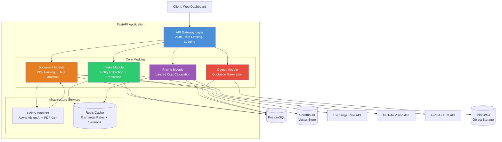
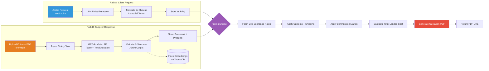
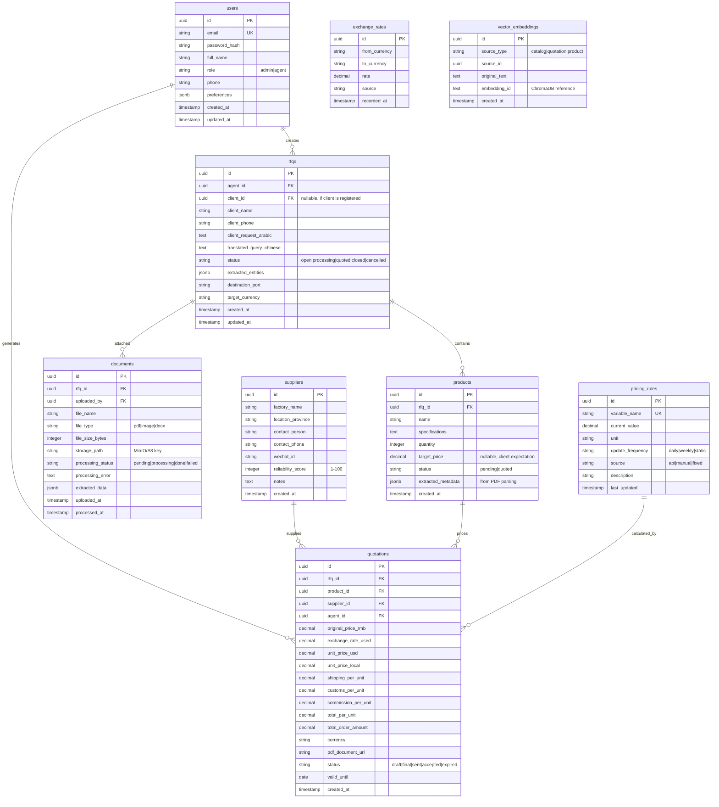
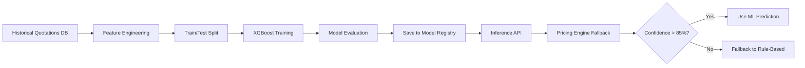
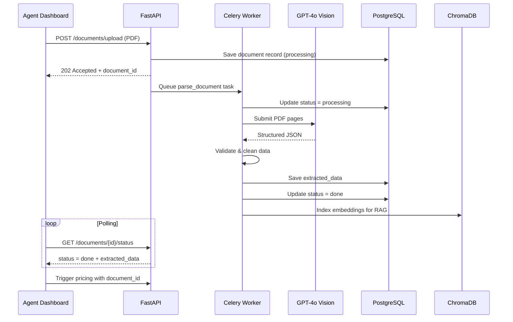
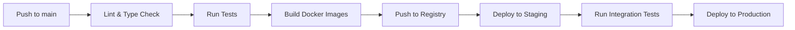

# Technical Documentation — AI-Sourcing Hub

**Version:** 1.1.0 (Revised)
**Objective:** A B2B sourcing automation platform connecting China and the MENA region, leveraging AI for document processing, commercial translation, and dynamic pricing.

---

## 1. Product Overview

### Mission
Bridge Chinese suppliers with MENA buyers by eliminating language barriers, manual document processing, and complex pricing calculations — transforming sourcing agents from data-entry operators into strategic deal managers.

### The Killer Feature
**Zero-Touch Quotation Generation:** Input an Arabic client request (text), upload a Chinese factory catalog (PDF), and receive a professional Arabic quotation with full landed-cost breakdown in under 2 minutes.

### Target Users
- **Primary:** Independent sourcing agents in China serving MENA clients
- **Secondary:** MENA import merchants, small-to-medium trading companies
- **Tertiary (future):** Shipping offices, logistics coordinators

---

## 2. Technology Stack

| Component | Technology | Rationale |
|-----------|-----------|-----------|
| **Backend Framework** | Python, FastAPI | High performance, native async, Pydantic validation, auto-generated OpenAPI docs |
| **Relational Database** | PostgreSQL | ACID compliance for financial data, JSONB for flexible metadata, strong ecosystem |
| **Vector Database** | ChromaDB | Self-hosted, free, lightweight; stores embeddings for RAG on past catalogs/quotations |
| **AI/LLM Orchestration** | LangChain | Structured chains for entity extraction, translation, RAG workflows |
| **Document AI (OCR/Vision)** | GPT-4o API | High accuracy parsing complex tables, Chinese characters, scanned PDFs |
| **Predictive Modeling** | XGBoost (phased) | Phase 1: rule-based engine. Phase 2: train XGBoost on accumulated data for cost prediction |
| **Cache Layer** | Redis | Exchange rate caching, session storage, rate limiting counters, Celery broker |
| **Async Task Queue** | Celery + Redis | Background processing of Vision API PDF parsing, quotation generation |
| **Object Storage** | MinIO (self-hosted) or S3 | Store uploaded PDFs, images, generated quotation PDFs |
| **Containerization** | Docker + Docker Compose | Consistent dev/prod environments, single-command local setup |
| **Monitoring** | Prometheus + Grafana (basic) + Sentry | API metrics, Vision API cost tracking, error aggregation |

---

## 3. System Architecture — Modular Monolith

The system follows a **Modular Monolith** pattern for the MVP phase. Each domain is a self-contained Python module with clear interfaces, enabling future extraction into microservices when scaling demands it.



### Module Responsibilities

| Module | Responsibility | Key Dependencies |
|--------|---------------|-----------------|
| **Intake** | Accept Arabic text, extract entities (product, qty, specs), translate to Chinese industrial terminology | LLM API, PostgreSQL |
| **Document** | Accept PDF/image upload, submit to Vision AI async via Celery, extract structured pricing data | GPT-4o Vision, Celery, ChromaDB |
| **Pricing** | Calculate landed cost: exchange rates + shipping + customs + commission. Phase 2: ML prediction | Redis (rates), PostgreSQL (rules) |
| **Output** | Generate Arabic quotation PDF from template, store to object storage, return URL | MinIO/S3, WeasyPrint/Jinja2 |

---

## 4. Corrected Data Flow



### Step-by-Step Sequence

1. **Intake:** Agent enters Arabic client request via dashboard. LLM extracts product, quantity, specifications. Translates to Chinese industrial terminology.
2. **RFQ Created:** System creates an RFQ record with status `open`. Agent shares Chinese query with factory suppliers.
3. **Supplier Response:** Agent receives Chinese PDF catalog/quote from factory. Uploads to system.
4. **Async Parsing:** Celery worker submits PDF to GPT-4o Vision API. Extracts table data: prices, weights, MOQs, dimensions. Stores structured JSON.
5. **Pricing Trigger:** Once parsing is complete, pricing engine calculates:
   - RMB→USD (live rate via API)
   - USD→Local currency (live rate)
   - Inland shipping (China) + Ocean freight (per CBM/weight)
   - Local customs duties % + clearance fees
   - Agent commission %
   - Final landed cost
6. **Output Generation:** Template engine renders Arabic quotation PDF with full breakdown. Stored in MinIO/S3. URL returned via API and dashboard.
7. **Future RAG:** Parsed data indexed in ChromaDB for future automated matching against similar RFQs.

---

## 5. Complete API Reference

### 5.1 Authentication

| Endpoint | Method | Description | Auth Required |
|----------|--------|-------------|---------------|
| `/api/v1/auth/register` | POST | Register new user (agent) | No |
| `/api/v1/auth/login` | POST | Authenticate, receive JWT pair | No |
| `/api/v1/auth/refresh` | POST | Refresh access token | Refresh Token |
| `/api/v1/auth/me` | GET | Current user profile | Yes |
| `/api/v1/auth/logout` | POST | Invalidate refresh token | Yes |

**Login Request:**
```json
{
  "email": "agent@example.com",
  "password": "secure_password"
}
```

**Login Response:**
```json
{
  "access_token": "eyJ...",
  "refresh_token": "eyJ...",
  "token_type": "bearer",
  "expires_in": 900
}
```

### 5.2 Core Business Endpoints

#### Intake
| Endpoint | Method | Description |
|----------|--------|-------------|
| `/api/v1/intake/translate` | POST | Translate Arabic request to Chinese, extract entities |

**Request:**
```json
{
  "raw_text": "عاوز 500 كرتونة صابون زيت زيتون حلب بوزن 200 جرام"
}
```

**Response:**
```json
{
  "request_id": "uuid",
  "chinese_query": "500箱200克阿勒颇橄榄皂",
  "entities": {
    "product": "橄榄皂",
    "quantity": 500,
    "unit": "箱",
    "specifications": "200克",
    "origin": "阿勒颇"
  },
  "confidence": 0.92
}
```

#### Documents
| Endpoint | Method | Description |
|----------|--------|-------------|
| `/api/v1/documents/upload` | POST | Upload supplier file (PDF/Image) |
| `/api/v1/documents/{id}/status` | GET | Poll processing status |
| `/api/v1/documents/{id}` | GET | Get extracted data |
| `/api/v1/documents` | GET | List documents (paginated) |

**Upload Response (202 Accepted):**
```json
{
  "document_id": "uuid",
  "status": "processing",
  "estimated_seconds": 15
}
```

**Status Poll Response:**
```json
{
  "document_id": "uuid",
  "status": "done",
  "extracted_data": {
    "product": "LED Panel Light 600x600mm",
    "price_rmb": 85.50,
    "weight_kg": 3.2,
    "moq": 100,
    "dimensions_cm": "62x62x10",
    "material": "铝合金+亚克力"
  }
}
```

#### Pricing
| Endpoint | Method | Description |
|----------|--------|-------------|
| `/api/v1/pricing/calculate` | POST | Calculate total landed cost |
| `/api/v1/pricing/rules` | GET | List all pricing rules |
| `/api/v1/pricing/rules/{id}` | PUT | Update a pricing rule |

**Calculate Request:**
```json
{
  "rfq_id": "uuid",
  "supplier_id": "uuid",
  "price_rmb": 85.50,
  "weight_kg": 3.2,
  "quantity": 500,
  "destination_port": "Aqaba",
  "currency": "JOD"
}
```

**Calculate Response:**
```json
{
  "landed_cost": 1.85,
  "currency": "JOD",
  "breakdown": {
    "unit_price_rmb": 85.50,
    "rmb_to_usd_rate": 7.25,
    "unit_price_usd": 11.79,
    "usd_to_jod_rate": 0.708,
    "unit_price_jod": 8.35,
    "shipping_per_unit": 0.45,
    "customs_per_unit": 0.42,
    "commission_per_unit": 0.92,
    "total_per_unit": 1.85,
    "total_order": 925.00
  },
  "pricing_rules_applied": [
    {"rule": "exchange_rate", "source": "api", "timestamp": "2026-06-02T10:00:00Z"},
    {"rule": "sea_freight_aqaba", "value": 85, "unit": "USD/CBM"},
    {"rule": "customs_jordan", "value": 5, "unit": "%"},
    {"rule": "commission", "value": 10, "unit": "%"}
  ]
}
```

#### Quotations
| Endpoint | Method | Description |
|----------|--------|-------------|
| `/api/v1/quotes/generate` | POST | Generate quotation PDF |
| `/api/v1/quotes` | GET | List quotations (paginated) |
| `/api/v1/quotes/{id}` | GET | Get quotation details |
| `/api/v1/quotes/{id}/pdf` | GET | Download PDF |

**Generate Request:**
```json
{
  "calculation_id": "uuid",
  "rfq_id": "uuid",
  "client_name": "شركة الأمل للتجارة",
  "valid_until_days": 14
}
```

**Generate Response:**
```json
{
  "quotation_id": "uuid",
  "pdf_url": "https://storage.example.com/quotes/quote-123.pdf",
  "generated_at": "2026-06-02T10:05:00Z"
}
```

#### RFQs & CRUD
| Endpoint | Method | Description |
|----------|--------|-------------|
| `/api/v1/rfqs` | GET | List RFQs (paginated, filterable by status) |
| `/api/v1/rfqs/{id}` | GET | Get RFQ with products |
| `/api/v1/rfqs/{id}/products` | POST | Add product to RFQ |
| `/api/v1/suppliers` | GET | List suppliers |
| `/api/v1/suppliers` | POST | Add supplier |

#### Health & System
| Endpoint | Method | Description |
|----------|--------|-------------|
| `/health` | GET | Health check (DB, Redis, API status) |
| `/api/v1/webhooks/exchange-rate` | POST | Receive exchange rate updates |

### 5.3 Standardized Error Response

All errors follow this format:
```json
{
  "error": {
    "code": "RFQ_NOT_FOUND",
    "message": "RFQ with ID xyz-123 not found",
    "details": {},
    "request_id": "req-abc-456"
  }
}
```

Common error codes: `VALIDATION_ERROR`, `AUTH_EXPIRED`, `AUTH_INVALID`, `NOT_FOUND`, `RATE_LIMITED`, `DOCUMENT_PROCESSING_FAILED`, `PRICING_RULE_NOT_FOUND`, `QUOTE_GENERATION_FAILED`.

---

## 6. Database Schema



---

## 7. Pricing Engine — Phased ML Approach

### Phase 1: Rule-Based (MVP)
| Variable | Source | Update Frequency |
|----------|--------|-----------------|
| RMB/USD Rate | Exchange Rate API (e.g., exchangerate-api.com) | Daily |
| USD/Local Rates | Exchange Rate API | Weekly |
| Sea Freight per CBM | Manual config per port | Weekly |
| Inland Transport (China) | Manual config per province | Monthly |
| Customs % | Fixed per country | Static |
| Agent Commission % | Per-agent config | Static |
| Volume Discounts | Rule table (tier-based) | Static |

### Phase 2: ML-Enhanced (Post-MVP, after 100+ transactions)
**Model:** XGBoost Regressor

**Target Variable:** `actual_landed_cost_per_unit`

**Features:**
- Product weight (kg)
- Product volume (CBM)
- Origin province in China
- Destination port/country
- Order quantity
- Historical freight rates for route
- Currency volatility (30-day)
- Season (month)

**Training Pipeline:**


---

## 8. Document Processing Pipeline (Async)

PDF parsing via Vision API is the **most time-sensitive** operation. Average response: 5-30 seconds.



---

## 9. Security & Compliance

| Concern | Implementation |
|---------|---------------|
| **Authentication** | JWT access tokens (15min expiry) + refresh tokens (7 day expiry) |
| **Password Storage** | bcrypt hashing |
| **API Rate Limiting** | 100 requests/min per user (Redis-backed) |
| **Input Validation** | Pydantic schemas on all endpoints |
| **File Upload** | Validate MIME type (PDF, PNG, JPG), max 10MB, virus scan |
| **HTTPS** | Enforce TLS 1.3 in production |
| **DB Encryption** | Encrypt PII fields (phone, email) at rest using pgcrypto |
| **API Keys** | Webhook endpoints require verification tokens |
| **CORS** | Restrict to known dashboard domains |
| **Audit Logging** | Log all pricing calculations, document accesses, auth events |

---

## 10. Deployment & Infrastructure

### Local Development
```yaml
# docker-compose.yml structure
services:
  api:          # FastAPI application
  postgres:     # PostgreSQL 16
  redis:        # Redis 7
  chromadb:     # ChromaDB
  minio:        # S3-compatible storage
  celery:       # Celery worker
  flower:       # Celery monitoring dashboard
```

### CI/CD Pipeline (GitHub Actions)


### Environment Configuration
| Variable | Example | Purpose |
|----------|---------|---------|
| `DATABASE_URL` | `postgresql://user:pass@db:5432/aisourcing` | PostgreSQL connection |
| `REDIS_URL` | `redis://redis:6379/0` | Cache + Celery broker |
| `OPENAI_API_KEY` | `sk-...` | GPT-4o Vision + GPT-4 |
| `EXCHANGE_RATE_API_KEY` | `...` | Live currency rates |
| `JWT_SECRET` | `...` | Token signing |
| `STORAGE_BACKEND` | `s3://bucket/` or `minio://` | Object storage |
| `CHROMA_DB_PATH` | `./chroma_db` or `http://chroma:8000` | Vector store |
| `SENTRY_DSN` | `https://...` | Error monitoring |

### Monitoring & Observability
- **Application Metrics:** Prometheus + Grafana (request latency, error rates, Vision API costs)
- **Error Tracking:** Sentry for exception aggregation and debugging
- **Logging:** Structured JSON logs (stdout), centralized via Grafana Loki or similar
- **Business Metrics:** Dashboard tracking RFQs created, quotes generated, avg processing time
- **AI Cost Tracking:** Monitor GPT-4o Vision token usage per document

---

## 11. Testing Strategy

| Level | Tool | Scope |
|-------|------|-------|
| **Unit Tests** | pytest | Individual module functions, pricing calculations, entity extraction logic |
| **Integration Tests** | pytest + TestContainers | API endpoints with real PostgreSQL + Redis containers |
| **Document Parsing Tests** | pytest | Mocked Vision API responses, test extraction accuracy |
| **E2E Tests** | Playwright or similar | Full flow: login → create RFQ → upload doc → get quote |
| **Load Tests** | Locust | Simulate concurrent agent usage, identify bottlenecks |

---

## 12. Cost & Performance Considerations

| Operation | Est. Cost | Est. Time | Optimization |
|-----------|-----------|-----------|-------------|
| GPT-4o Vision (per PDF page) | ~$0.01-0.03 | 5-15s | Cache results, use smaller model for clean PDFs |
| GPT-4 Translation (per request) | ~$0.005-0.01 | 1-3s | Batching, prompt optimization |
| Quotation PDF Generation | ~$0.001 | <1s | Template caching, async generation |
| Exchange Rate API (per month) | ~$10-30 | <0.5s | Redis caching with TTL, batch updates |
| Hosting (MVP, single instance) | ~$30-80/mo | — | Single VM with Docker Compose |

**Cost Optimization Strategy:**
- Cache Vision API results for identical documents (hash-based)
- Use prompt compression techniques to reduce token usage
- Implement LLM fallback chain: cheap model first, escalate to expensive model only for complex cases
- Batch exchange rate updates instead of per-request API calls

---

## 13. Future Roadmap (Post-MVP)

| Feature | Timeline | Description |
|---------|----------|-------------|
| **WhatsApp Integration** | Post-MVP | Native WhatsApp Business API for request intake and quote delivery |
| **XGBoost Pricing Model** | After 100+ transactions | Train ML model on historical data for predictive cost estimation |
| **Supplier Portal** | Post-MVP | Allow Chinese factories to submit quotes directly via web interface |
| **Multi-Language Support** | Post-MVP | Turkish, French, English, Urdu for broader MENA coverage |
| **Voice Input** | Post-MVP | Convert voice notes (Arabic) to text via Whisper API |
| **Mobile App** | Post-MVP | React Native app for on-the-go quote generation |
| **Direct Freight API Integration** | Post-MVP | Real-time freight quotes from Freightos, Shipa Freight or similar |

---

## 14. Glossary

| Term | Definition |
|------|------------|
| **FOB** | Free On Board — price excludes shipping and insurance |
| **CBM** | Cubic Meter — standard unit for freight volume calculation |
| **MOQ** | Minimum Order Quantity — smallest amount a supplier will sell |
| **Landed Cost** | Total cost of goods including price, shipping, customs, and fees |
| **RAG** | Retrieval-Augmented Generation — LLM query enriched with vector DB search results |
| **Entity Extraction** | Identifying structured data (product, qty, price) from unstructured text |
| **RMB** | Renminbi (Chinese Yuan) — base currency for Chinese factory pricing |
| **OCR** | Optical Character Recognition — extracting text from images/scanned PDFs |

---

> **Version 1.1.0** — Revised Technical Documentation
> Contact: Project Lead
> Last Updated: 2026-06-02
