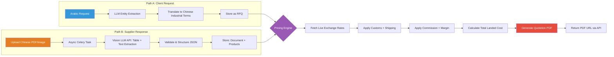
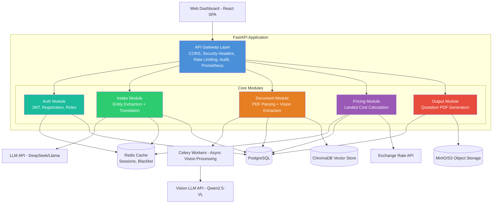
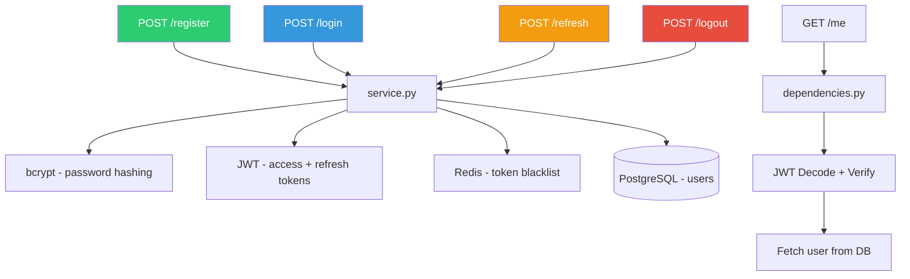
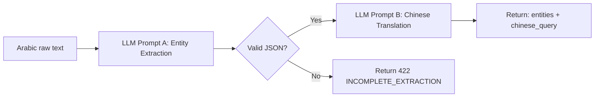
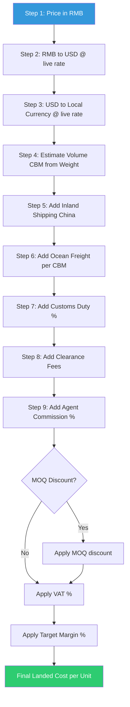
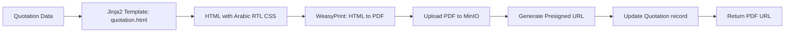
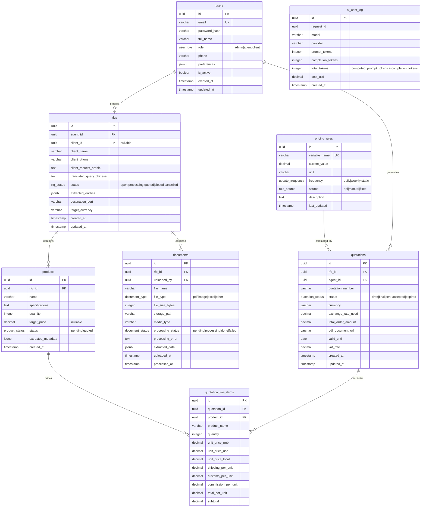
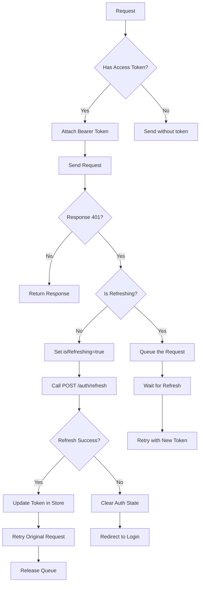
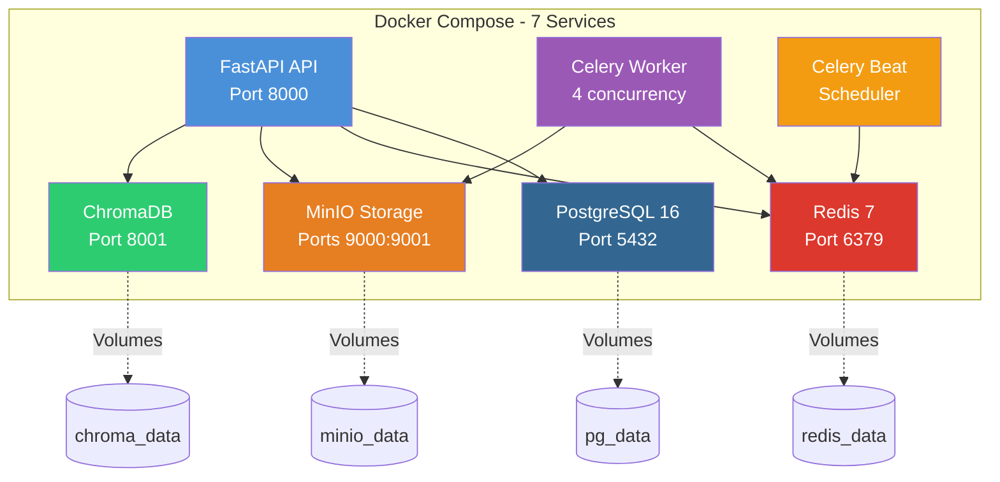
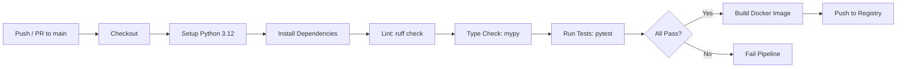

# AI-Sourcing Hub — Complete Technical Documentation

**Version:** 2.0.0  
**Last Updated:** 2026-06-03  
**Objective:** A B2B sourcing automation platform connecting China suppliers with MENA buyers, leveraging AI for document processing, commercial translation, and dynamic pricing.

---

## Table of Contents

1. [Product Overview](#1-product-overview)
2. [System Architecture](#2-system-architecture)
3. [Technology Stack](#3-technology-stack)
4. [Configuration & Settings](#4-configuration--settings)
5. [Auth Module](#5-auth-module)
6. [Intake Module](#6-intake-module)
7. [Documents Module](#7-documents-module)
8. [Pricing Module](#8-pricing-module)
9. [Output Module](#9-output-module)
10. [Database Schema](#10-database-schema)
11. [Frontend Architecture](#11-frontend-architecture)
12. [Deployment & Infrastructure](#12-deployment--infrastructure)
13. [Security, Monitoring & CI/CD](#13-security-monitoring--cicd)
14. [Future Roadmap & Suggestions](#14-future-roadmap--suggestions)

---

## 1. Product Overview

### 1.1 Mission

Bridge Chinese suppliers with MENA buyers by eliminating language barriers, manual document processing, and complex pricing calculations — transforming sourcing agents from data-entry operators into strategic deal managers.

### 1.2 The Killer Feature

**Zero-Touch Quotation Generation:** Input an Arabic client request (text), upload a Chinese factory catalog (PDF), and receive a professional Arabic quotation with full landed-cost breakdown in under 2 minutes.

### 1.3 Target Users

| Tier | User Type | Description |
|------|-----------|-------------|
| **Primary** | Independent Sourcing Agents | Agents in China serving MENA clients |
| **Secondary** | MENA Import Merchants | Small-to-medium trading companies |
| **Tertiary** | Logistics Coordinators | Shipping offices (future) |

### 1.4 Core Workflow



---

## 2. System Architecture

### 2.1 Pattern: Modular Monolith

The system follows a **Modular Monolith** pattern. Each domain is a self-contained Python module with clear interfaces, enabling future extraction into microservices when scaling demands it.

### 2.2 High-Level Architecture



### 2.3 Middleware Stack (Order Matters)

The middleware is applied in [`app/main.py:175-225`](app/main.py:175) in this exact order:

| Layer # | Middleware | Responsibility |
|---------|-----------|---------------|
| 1 | `TrustedHostMiddleware` | Validates `Host` header against allowed hosts |
| 2 | `CORSMiddleware` | Cross-Origin Resource Sharing configuration |
| 3 | `SecurityHeadersMiddleware` | Injects Helmet-style security headers |
| 4 | `RateLimitMiddleware` | Redis-backed sliding window rate limiting |
| 5 | `PrometheusMiddleware` | Request counting and latency metrics |
| 6 | `AuditMiddleware` | Logs all POST/PUT/DELETE with context |

### 2.4 Module Responsibilities

| Module | Directory | Responsibility | Key Dependencies |
|--------|-----------|---------------|-----------------|
| **Auth** | [`app/modules/auth/`](app/modules/auth/) | Registration, login, JWT tokens, role-based access | PostgreSQL, Redis (blacklist) |
| **Intake** | [`app/modules/intake/`](app/modules/intake/) | Arabic entity extraction, Chinese translation, RFQ management | LLM API, PostgreSQL |
| **Documents** | [`app/modules/documents/`](app/modules/documents/) | PDF/image upload, async Vision parsing, JSON repair | Celery, Vision LLM, MinIO, ChromaDB |
| **Pricing** | [`app/modules/pricing/`](app/modules/pricing/) | Landed cost calculation, rule management, rate caching | Redis (rates), PostgreSQL (rules) |
| **Output** | [`app/modules/output/`](app/modules/output/) | Quotation creation, PDF generation via WeasyPrint | MinIO/S3, Jinja2, WeasyPrint |

### 2.5 Application Factory Pattern

The FastAPI application is created via the [`create_app()`](app/main.py:108) factory function in [`app/main.py:108-230`](app/main.py:108):

- **Lifespan handler** ([`lifespan()`](app/main.py:56)): Initializes Sentry, Redis connection pool, MinIO bucket creation on startup; graceful shutdown on teardown.
- **Router mounting**: All 5 module routers mounted under `/api/v1/` prefix.
- **Health check** ([`/health`](app/main.py:181)): Verifies DB and Redis connectivity, returns JSON with component statuses.

---

## 3. Technology Stack

### 3.1 Backend

| Component | Technology | Version | Rationale |
|-----------|-----------|---------|-----------|
| **Runtime** | Python | 3.12+ | Async support, rich ecosystem |
| **Web Framework** | FastAPI | 0.115+ | Native async, Pydantic validation, auto OpenAPI docs |
| **ORM** | SQLAlchemy | 2.0+ (async) | Async session support, mature ecosystem |
| **Database** | PostgreSQL | 16 | ACID compliance, JSONB, strong ecosystem |
| **Cache / Queue** | Redis | 7 | Exchange rates, sessions, rate limiting, Celery broker |
| **Task Queue** | Celery | 5.4+ | Async task processing with Redis broker/backend |
| **Object Storage** | MinIO (self-hosted) | Latest | S3-compatible, stores PDFs, images, generated quotes |
| **Vector DB** | ChromaDB | Latest | Self-hosted embeddings for RAG on past catalogs |
| **Migration** | Alembic | Latest | Database schema version control |
| **Config** | Pydantic Settings | 2.x | Environment variable validation |

### 3.2 AI / LLM Stack

| Component | Service | Purpose |
|-----------|---------|---------|
| **Text LLM** | DeepSeek-V3 / Llama-3.3-70B via Together AI / OpenRouter | Entity extraction, Arabic→Chinese translation |
| **Vision LLM** | Qwen2.5-VL-72B via Together AI / OpenRouter | PDF/image table extraction, Chinese OCR |
| **JSON Repair** | Custom repair module ([`json_repair.py`](app/modules/documents/json_repair.py)) | Recovers malformed LLM JSON output |

### 3.3 Frontend

| Component | Technology | Purpose |
|-----------|-----------|---------|
| **Framework** | React 18 + TypeScript | Component-based UI |
| **Bundler** | Vite | Fast dev server and optimized builds |
| **Routing** | React Router v6 | Client-side routing |
| **Server State** | TanStack React Query v5 | API data fetching, caching, invalidation |
| **Client State** | Zustand | Lightweight global state (auth) |
| **HTTP Client** | Axios | API communication with JWT interceptor |
| **Forms** | react-hook-form + zod | Form validation |
| **Styling** | TailwindCSS (RTL) + shadcn/ui | Utility-first CSS with component library |
| **Auth** | JWT (access + refresh tokens) | Token-based authentication |

### 3.4 Infrastructure

| Component | Technology | Purpose |
|-----------|-----------|---------|
| **Containerization** | Docker + Docker Compose | Consistent dev/prod environments |
| **Reverse Proxy** | Nginx | SSL termination, static serving (production) |
| **Monitoring** | Prometheus + Sentry | Metrics, error tracking |
| **CI/CD** | GitHub Actions | Lint, test, build pipeline |

---

## 4. Configuration & Settings

### 4.1 Pydantic Settings

All environment variables are validated through the [`Settings`](app/config.py:15) class in [`app/config.py:15-146`](app/config.py:15):

```python
class Settings(BaseSettings):
    model_config = SettingsConfigDict(
        env_file=".env",
        env_file_encoding="utf-8",
        extra="ignore",
    )
```

### 4.2 Key Configuration Groups

| Group | Variables | Validation |
|-------|-----------|------------|
| **Environment** | `ENVIRONMENT`, `DEBUG`, `ALLOWED_HOSTS` | ENVIRONMENT regex: `^(development\|staging\|production)$` |
| **Database** | `DB_HOST`, `DB_PORT`, `DB_USER`, `DB_PASSWORD`, `DB_NAME` | Computed `db_url` property |
| **Redis** | `REDIS_HOST`, `REDIS_PORT`, `REDIS_PASSWORD`, `REDIS_DB` | Computed `redis_url` property |
| **Celery** | `CELERY_BROKER_DB`, `CELERY_RESULT_DB` | Computed broker/backend URLs |
| **JWT** | `JWT_SECRET`, `JWT_ALGORITHM`, `ACCESS_TOKEN_EXPIRE_MINUTES`, `REFRESH_TOKEN_EXPIRE_DAYS` | Access: 15min, Refresh: 7 days |
| **MinIO/S3** | `STORAGE_BACKEND`, `STORAGE_BUCKET`, `MINIO_ACCESS_KEY`, `MINIO_SECRET_KEY` | S3-compatible URL parsing |
| **LLM** | `LLM_API_KEY`, `LLM_API_BASE`, `LLM_MODEL`, `VISION_MODEL` | Provider-agnostic |
| **CORS** | `CORS_ORIGINS`, `CORS_METHODS`, `CORS_HEADERS` | Computed `cors_config` property |

### 4.3 Validation Rules

- **`check_not_default`** validator ([`app/config.py:129-146`](app/config.py:129)): Forbids placeholder values (`change_me`, `placeholder`, `password`, `secret`, `default`, `admin`) in sensitive fields (`DB_PASSWORD`, `REDIS_PASSWORD`, `JWT_SECRET`).
- All computed fields generate connection URLs from individual components.

---

## 5. Auth Module

**Location:** [`app/modules/auth/`](app/modules/auth/)

### 5.1 Architecture



### 5.2 Endpoints

| Endpoint | Method | Auth | Description |
|----------|--------|------|-------------|
| `/api/v1/auth/register` | POST | No | Register new user (email, password, name, role) |
| `/api/v1/auth/login` | POST | No | Authenticate, receive JWT pair |
| `/api/v1/auth/refresh` | POST | Refresh Token | Issue new access token |
| `/api/v1/auth/me` | GET | Bearer Token | Current user profile |
| `/api/v1/auth/logout` | POST | Bearer Token | Invalidate refresh token |

### 5.3 Key Implementation Details

- **Password hashing** ([`_hash_password()`](app/modules/auth/service.py:28)): bcrypt via `passlib.context.CryptContext`.
- **Token generation** ([`_create_access_token()`](app/modules/auth/service.py:42), [`_create_refresh_token()`](app/modules/auth/service.py:54)): JWT with `uuid4` JTI, subject = user ID.
- **Access token expiry**: 15 minutes (configurable via `ACCESS_TOKEN_EXPIRE_MINUTES`).
- **Refresh token expiry**: 7 days (configurable via `REFRESH_TOKEN_EXPIRE_DAYS`).
- **Logout** ([`logout_user()`](app/modules/auth/service.py:230)): Blacklists the refresh token's JTI in Redis with TTL matching remaining token lifetime.
- **Role checking** ([`RoleChecker`](app/modules/auth/dependencies.py)): Dependency factory that verifies `user.role` against required roles.

### 5.4 User Roles

| Role | Permissions |
|------|------------|
| `admin` | Full access, manage pricing rules, manage users |
| `agent` | Create RFQs, upload documents, generate quotes |
| `client` | View quotes, download PDFs (future) |

---

## 6. Intake Module

**Location:** [`app/modules/intake/`](app/modules/intake/)

### 6.1 Purpose

Accept Arabic client requests, extract structured entities using LLM, translate to Chinese industrial terminology, and create RFQ records.

### 6.2 Endpoints

| Endpoint | Method | Description |
|----------|--------|-------------|
| `/api/v1/intake/translate` | POST | Translate Arabic → Chinese, extract entities |
| `/api/v1/intake/rfqs` | GET | List RFQs (paginated, filterable by status) |
| `/api/v1/intake/rfqs/{id}` | GET | Get RFQ with products |
| `/api/v1/intake/rfqs` | POST | Create new RFQ |
| `/api/v1/intake/rfqs/{id}/products` | POST | Add product to RFQ |

### 6.3 Translation Flow ([`translate_request()`](app/modules/intake/service.py:33))



### 6.4 LLM Client ([`llm_client.py`](app/modules/intake/llm_client.py))

- **Provider**: Together AI / OpenRouter (configurable via `LLM_API_BASE`).
- **Default model**: DeepSeek-V3 / Llama-3.3-70B.
- **Retry logic**: 3 attempts with exponential backoff (1s / 4s / 15s).
- **Timeouts**: Configurable via `LLM_TIMEOUT` setting.

### 6.5 RFQ Lifecycle

```
OPEN → PROCESSING → QUOTED → CLOSED
                   ↘ CANCELLED
```

### 6.6 Prompt Templates ([`prompt_templates.py`](app/modules/intake/prompt_templates.py))

- **Prompt A (Entity Extraction)**: System prompt for extracting `product`, `quantity`, `unit`, `specifications`, `origin` from Arabic dialect text (Egyptian, Levantine, Gulf). Output strictly JSON with few-shot examples.
- **Prompt B (Chinese Translation)**: Takes extracted JSON, translates to Chinese industrial terminology using standard HS code terms.

---

## 7. Documents Module

**Location:** [`app/modules/documents/`](app/modules/documents/)

### 7.1 Purpose

Handle supplier document uploads (PDFs, images), process them asynchronously via Celery using Vision LLM, and extract structured pricing data.

### 7.2 Endpoints

| Endpoint | Method | Description |
|----------|--------|-------------|
| `/api/v1/documents/upload` | POST | Upload supplier file (PDF/Image) |
| `/api/v1/documents` | GET | List documents (paginated) |
| `/api/v1/documents/{id}` | GET | Get document with extracted data |
| `/api/v1/documents/{id}/status` | GET | Poll processing status |
| `/api/v1/documents/{id}` | DELETE | Delete document and storage object |
| `/api/v1/documents/{id}/items` | GET | Get extracted line items |
| `/api/v1/documents/{id}/items` | PUT | Update/verify extracted items (Human-in-the-Loop) |

### 7.3 Async Processing Pipeline

```mermaid
flowchart LR
    U[Upload PDF] --> A[POST /documents/upload]
    A --> B[Upload to MinIO]
    B --> C[Create DB record: status=pending]
    C --> D[Return 202: document_id]
    D --> E[Async Celery Task]
    E --> F{File Type?}
    F -->|PDF| G[Convert PDF page to PNG]
    F -->|Image| H[Use directly]
    G --> I[Call Vision LLM API]
    H --> I
    I --> J[Validate JSON output]
    J --> K{Valid?}
    K -->|Yes| L[Store extracted data]
    K -->|No| M[Run JSON repair]
    M --> L
    L --> N[Index embeddings in ChromaDB]
    N --> O[Status: done]

    D -.-> P[Poll: GET /documents/{id}/status]
    P -.->|done| Q[GET extracted data]
    Q -.-> R[Human review: PUT /items]

    style U fill:#e67e22,color:#fff
    style E fill:#9b59b6,color:#fff
    style I fill:#2ecc71,color:#fff
    style R fill:#3498db,color:#fff
```

### 7.4 Key Implementation Details

- **Upload** ([`upload_document()`](app/modules/documents/service.py:42)): Validates file type (PDF, image, Excel), uploads to MinIO, creates DB record.
- **Vision processing** ([`process_document_vision()`](app/modules/documents/service.py:192)): Async Celery task that converts PDF to image (via `pdf2image`), sends to Vision LLM, extracts structured data.
- **JSON Repair** ([`json_repair.py`](app/modules/documents/json_repair.py)): Recovers malformed JSON from LLM output using regex patterns, bracket matching, and fallback parsing.
- **Human-in-the-Loop** ([`update_document_items()`](app/modules/documents/service.py:302)): Agents can manually verify and correct extracted data before proceeding to pricing.
- **Vision Client** ([`vision_client.py`](app/modules/documents/vision_client.py)): Provider-agnostic Vision LLM client with retry logic, image encoding, and structured output parsing.

### 7.5 Document Type Inference ([`_infer_document_type()`](app/modules/documents/service.py:363))

| MIME Type / Extension | Inferred Type |
|-----------------------|---------------|
| `application/pdf` | `pdf` |
| `image/*` | `image` |
| `application/vnd.openxmlformats-officedocument.spreadsheetml.sheet` | `excel` |

---

## 8. Pricing Module

**Location:** [`app/modules/pricing/`](app/modules/pricing/)

### 8.1 Purpose

Calculate total landed cost from factory price (RMB) to buyer's doorstep, applying exchange rates, shipping, customs, duties, commissions, and discounts.

### 8.2 Endpoints

| Endpoint | Method | Description |
|----------|--------|-------------|
| `/api/v1/pricing/calculate` | POST | Calculate landed cost |
| `/api/v1/pricing/rules` | GET | List all pricing rules |
| `/api/v1/pricing/rules/{id}` | PUT | Update a pricing rule |

### 8.3 Landed Cost Algorithm ([`PricingEngine`](app/modules/pricing/engine.py:102))

The [`PricingEngine`](app/modules/pricing/engine.py:102) class implements a 9-step calculation:



### 8.4 Pricing Rules ([`pricing_rules` table](app/modules/pricing/models.py))

16 default rules seeded by [`scripts/seed_pricing_rules.py`](scripts/seed_pricing_rules.py):

| Variable | Example Value | Update Frequency | Source |
|----------|--------------|-----------------|--------|
| `RMB_TO_USD` | 7.25 | Daily | API |
| `USD_TO_JOD` | 0.708 | Weekly | API |
| `INLAND_SHIPPING_GUANGDONG` | 200 | Monthly | Manual |
| `SEA_FREIGHT_TO_AQABA` | 85 USD/CBM | Weekly | Manual |
| `CUSTOMS_JORDAN` | 5% | Static | Fixed |
| `CLEARANCE_FEE` | 50 USD | Monthly | Manual |
| `COMMISSION_RATE` | 10% | Per-agent | Manual |
| `MOQ_DISCOUNT_500` | 3% | Static | Fixed |
| `VAT_RATE` | 16% | Static | Fixed |
| `TARGET_MARGIN` | 15% | Per-agent | Manual |

### 8.5 Exchange Rate Caching ([`cache.py`](app/modules/pricing/cache.py))

- Rates fetched from external API, cached in Redis with configurable TTL.
- [`PricingEngine._get_rule_value()`](app/modules/pricing/engine.py:165): Checks Redis cache first, falls back to DB, then to external API.
- Celery Beat task [`refresh-exchange-rates`](app/shared/celery_app.py): Runs every 15 minutes to update rates.

### 8.6 Key Classes

| Class | File | Purpose |
|-------|------|---------|
| [`PricingContext`](app/modules/pricing/engine.py:34) | [`engine.py`](app/modules/pricing/engine.py) | Input dataclass: product specs, destination, MOQ |
| [`LineItemInput`](app/modules/pricing/engine.py:68) | [`engine.py`](app/modules/pricing/engine.py) | Individual product pricing input |
| [`LineItemResult`](app/modules/pricing/engine.py:79) | [`engine.py`](app/modules/pricing/engine.py) | Individual product pricing output with full breakdown |
| [`PricingEngine`](app/modules/pricing/engine.py:102) | [`engine.py`](app/modules/pricing/engine.py) | Core engine orchestrating the 9-step calculation |

---

## 9. Output Module

**Location:** [`app/modules/output/`](app/modules/output/)

### 9.1 Purpose

Generate professional Arabic quotation PDFs with full landed-cost breakdown, store them in MinIO/S3, and return downloadable URLs.

### 9.2 Endpoints

| Endpoint | Method | Description |
|----------|--------|-------------|
| `/api/v1/quotes` | POST | Create quotation from pricing calculation |
| `/api/v1/quotes` | GET | List quotations (paginated) |
| `/api/v1/quotes/{id}` | GET | Get quotation details |
| `/api/v1/quotes/{id}/pdf` | GET | Download generated PDF |
| `/api/v1/quotes/{id}/finalize` | POST | Generate PDF + update status |

### 9.3 PDF Generation Pipeline ([`generate_quotation_pdf()`](app/modules/output/service.py:216))



### 9.4 Key Implementation Details

- **Quotation number format** ([`_generate_quotation_number()`](app/modules/output/service.py:39)): `Q-YYYYMMDD-XXXX` (sequential 4-digit counter).
- **Template**: [`quotation.html`](app/modules/output/templates/quotation.html) — Jinja2 template with Arabic RTL support.
- **Styles**: [`styles.css`](app/modules/output/templates/styles.css) — Print-specific CSS with `@page` rules, Arabic font support.
- **PDF Engine**: WeasyPrint (HTML/CSS → PDF) — supports modern CSS, Arabic text, and complex layouts.
- **Storage**: PDF uploaded to MinIO/S3; presigned URL returned with configurable expiry.
- **Status flow**: `draft → final → sent → accepted → expired`.

---

## 10. Database Schema

### 10.1 Entity Relationship Diagram

**Migration file:** [`alembic/versions/001_initial_schema.py`](alembic/versions/001_initial_schema.py)



### 10.2 PostgreSQL Enums

| Enum Name | Values |
|-----------|--------|
| `user_role` | `admin`, `agent`, `client` |
| `rfq_status` | `open`, `processing`, `quoted`, `closed`, `cancelled` |
| `product_status` | `pending`, `quoted` |
| `document_type` | `pdf`, `image`, `excel`, `other` |
| `document_status` | `pending`, `processing`, `done`, `failed` |
| `quote_status` | `draft`, `final`, `sent`, `accepted`, `expired` |
| `update_frequency` | `daily`, `weekly`, `static` |
| `rule_source` | `api`, `manual`, `fixed` |

### 10.3 Key Relationships

- **RFQ → Products**: One-to-many (an RFQ contains multiple line items).
- **RFQ → Documents**: One-to-many (multiple supplier files per RFQ).
- **Quotation → Line Items**: One-to-many (breakdown per product).
- **User → RFQs**: One-to-many (agent creates many RFQs).
- **Documents → extracted_data**: JSONB column storing Vision LLM output.

---

## 11. Frontend Architecture

**Location:** [`frontend/`](frontend/)

### 11.1 Technology Stack

| Layer | Technology | Purpose |
|-------|-----------|---------|
| **UI Framework** | React 18 + TypeScript | Type-safe component architecture |
| **Bundler** | Vite 5 | Fast HMR, optimized production builds |
| **Routing** | React Router v6 | File-route pattern via `router.tsx` |
| **Server State** | TanStack React Query v5 | API caching, auto-refetch, optimistic updates |
| **Client State** | Zustand | Auth state (token, user profile) |
| **HTTP** | Axios | JWT interceptor, auto-refresh on 401 |
| **Forms** | react-hook-form + zod | Schema validation |
| **Styling** | TailwindCSS + shadcn/ui | Utility-first + accessible components |
| **RTL** | TailwindCSS RTL plugin | Full Arabic right-to-left support |

### 11.2 Project Structure

```
frontend/
├── index.html
├── package.json
├── vite.config.ts
├── tailwind.config.ts          # RTL configuration
├── postcss.config.js
├── tsconfig.json
├── .env.example
├── public/
│   └── favicon.svg
└── src/
    ├── main.tsx                 # Entry point
    ├── App.tsx                  # Root component
    ├── index.css                # Tailwind imports + RTL base
    ├── lib/
    │   ├── api.ts               # Axios instance + JWT interceptor
    │   ├── auth.ts              # Auth helper functions
    │   └── utils.ts             # cn() utility for shadcn/ui
    ├── stores/
    │   └── authStore.ts         # Zustand auth store
    ├── types/
    │   ├── auth.ts              # User, login/register types
    │   ├── intake.ts            # RFQ, Product types
    │   ├── documents.ts         # Document types
    │   ├── pricing.ts           # PricingRule, Calculation types
    │   └── quotes.ts            # Quotation types
    ├── constants/
    │   ├── api.ts               # API base URL, endpoints
    │   └── routes.ts            # Frontend route paths
    ├── services/
    │   └── authService.ts       # Auth API calls
    ├── hooks/
    │   └── useAuth.ts           # Auth hook (login, logout, register)
    ├── components/
    │   ├── auth/
    │   │   ├── ProtectedRoute.tsx  # Auth guard wrapper
    │   │   └── RoleGuard.tsx       # Role-based access control
    │   └── layout/
    │       ├── AppLayout.tsx       # Main layout with sidebar
    │       ├── Sidebar.tsx         # Navigation sidebar
    │       └── Topbar.tsx          # Top navigation bar
    ├── pages/
    │   ├── auth/
    │   │   ├── LoginPage.tsx
    │   │   └── RegisterPage.tsx
    │   ├── dashboard/
    │   │   └── DashboardPage.tsx
    │   ├── rfq/
    │   │   ├── RFQListPage.tsx
    │   │   ├── RFQCreatePage.tsx
    │   │   └── RFQDetailPage.tsx
    │   ├── documents/
    │   │   ├── DocumentUploadPage.tsx
    │   │   └── DocumentDetailPage.tsx
    │   ├── pricing/
    │   │   ├── PricingRulesPage.tsx
    │   │   └── PricingCalcPage.tsx
    │   ├── quotes/
    │   │   ├── QuotationListPage.tsx
    │   │   └── QuotationDetailPage.tsx
    │   └── settings/
    │       └── SettingsPage.tsx
    └── router/
        └── router.tsx           # Route definitions
```

### 11.3 JWT Interceptor Strategy ([`api.ts`](frontend/src/lib/api.ts:25))



### 11.4 Route Map ([`router.tsx`](frontend/src/router/router.tsx))

| Path | Page | Auth | Role |
|------|------|------|------|
| `/auth/login` | LoginPage | No | — |
| `/auth/register` | RegisterPage | No | — |
| `/dashboard` | DashboardPage | Yes | Any |
| `/rfq` | RFQListPage | Yes | agent, admin |
| `/rfq/create` | RFQCreatePage | Yes | agent, admin |
| `/rfq/:id` | RFQDetailPage | Yes | agent, admin |
| `/documents/upload` | DocumentUploadPage | Yes | agent, admin |
| `/documents/:id` | DocumentDetailPage | Yes | agent, admin |
| `/pricing/rules` | PricingRulesPage | Yes | admin |
| `/pricing/calculate` | PricingCalcPage | Yes | agent, admin |
| `/quotes` | QuotationListPage | Yes | agent, admin |
| `/quotes/:id` | QuotationDetailPage | Yes | agent, admin |
| `/settings` | SettingsPage | Yes | any |

### 11.5 State Management Architecture

| State Type | Tool | Data |
|-----------|------|------|
| **Server State** | TanStack React Query | RFQs, documents, pricing rules, quotations |
| **Auth State** | Zustand (`authStore.ts`) | Access token, refresh token, user profile, isAuthenticated |
| **Form State** | react-hook-form | Local form state with zod validation |

### 11.6 RTL & Arabic Support

- **TailwindCSS**: Configured with RTL variant via `tailwind.config.ts`.
- **Base styles**: `index.css` includes RTL-aware base styles.
- **Font**: Noto Sans Arabic (variable font) loaded in `index.html`.
- **Components**: shadcn/ui components adapted for RTL layout.

---

## 12. Deployment & Infrastructure

### 12.1 Docker Compose Topology ([`docker-compose.yml`](docker-compose.yml))



### 12.2 Service Details

| Service | Image | Healthcheck | Restart | Dependencies |
|---------|-------|-------------|---------|-------------|
| `postgres` | `postgres:16-alpine` | `pg_isready -U app_user` | `always` | — |
| `redis` | `redis:7-alpine` | `redis-cli ping` | `always` | — |
| `api` | Custom (multi-stage) | `/health` endpoint | `always` | postgres (healthy), redis (healthy) |
| `celery_worker` | Custom | — | `always` | api (started), redis (healthy) |
| `celery_beat` | Custom | — | `always` | redis (healthy) |
| `minio` | `minio/minio:latest` | — | `always` | — |
| `chromadb` | `chromadb/chroma:latest` | — | `always` | — |

### 12.3 Multi-Stage Dockerfile ([`Dockerfile`](Dockerfile))

| Stage | Base Image | Purpose |
|-------|-----------|---------|
| **base** | `python:3.12-slim-bookworm` | System deps: WeasyPrint, pdf2image, curl |
| **builder** | base | Create virtualenv, install dependencies |
| **production** | base | Copy venv + app code, non-root user (`appuser`) |

### 12.4 Production Overrides ([`docker-compose.prod.yml`](docker-compose.prod.yml))

| Feature | Dev | Production |
|---------|-----|------------|
| **Hot reload** | `--reload` | Removed |
| **Resource limits** | None | CPU + memory limits |
| **Nginx** | — | Reverse proxy with SSL |
| **Logging** | Default | JSON structured, max-size rotation |
| **API workers** | 1 | Multiple Gunicorn workers |

### 12.5 Nginx Configuration ([`nginx/nginx.conf`](nginx/nginx.conf))

- SSL termination with Let's Encrypt
- Static file serving
- Proxy pass to FastAPI at `api:8000`
- Security headers (HSTS, CSP)
- Rate limiting at proxy level

### 12.6 Railway Deployment ([`railway.json`](railway.json))

- **Builder**: Dockerfile
- **Healthcheck**: `/health` endpoint
- **Restart**: `on-failure`
- **Environment**: All variables from Railway dashboard

### 12.7 Celery Configuration ([`celery_app.py`](app/shared/celery_app.py))

| Setting | Value | Purpose |
|---------|-------|---------|
| Broker | Redis DB 1 | Task queue |
| Result Backend | Redis DB 2 | Task results |
| `task_serializer` | `json` | Cross-language compatibility |
| `result_expires` | 86400s (24h) | Auto-cleanup old results |
| `task_soft_time_limit` | 180s | Graceful timeout |
| `task_time_limit` | 200s | Hard kill timeout |
| `acks_late` | `true` | Re-queue on worker crash |
| `worker_max_tasks_per_child` | 10 | Prevent memory leaks |
| `worker_prefetch_multiplier` | 1 | Fair scheduling |

**Beat Schedule** ([`celery_app.py:81-86`](app/shared/celery_app.py:81)):

| Task | Interval | Description |
|------|----------|-------------|
| `refresh-exchange-rates` | Every 15 min | Update cached FX rates |
| `cleanup-expired-quotes` | Daily at midnight | Expire old quotations |

---

## 13. Security, Monitoring & CI/CD

### 13.1 Security Layers

| Layer | Implementation | File |
|-------|---------------|------|
| **CORS** | FastAPI `CORSMiddleware` with configurable origins | [`app/main.py:175`](app/main.py:175) |
| **Trusted Hosts** | `TrustedHostMiddleware` validating `Host` header | [`app/main.py:175`](app/main.py:175) |
| **Security Headers** | Custom `SecurityHeadersMiddleware` | [`app/shared/security_middleware.py:140`](app/shared/security_middleware.py:140) |
| **Rate Limiting** | Redis-backed sliding window via `RateLimitMiddleware` | [`app/shared/rate_limiter.py:138`](app/shared/rate_limiter.py:138) |
| **JWT Auth** | Bearer token with short-lived access + refresh | [`app/modules/auth/dependencies.py`](app/modules/auth/dependencies.py) |
| **Password Hashing** | bcrypt via `passlib` | [`app/modules/auth/service.py:28`](app/modules/auth/service.py:28) |
| **Input Validation** | Pydantic models for all request/response schemas | All `schemas.py` files |
| **Audit Logging** | Custom `AuditMiddleware` logging state-changing requests | [`app/shared/security_middleware.py:171`](app/shared/security_middleware.py:171) |

### 13.2 Security Headers ([`_get_security_headers()`](app/shared/security_middleware.py:92))

| Header | Value |
|--------|-------|
| `X-Content-Type-Options` | `nosniff` |
| `X-Frame-Options` | `DENY` |
| `Content-Security-Policy` | Restrictive defaults |
| `Strict-Transport-Security` | 1 year (prod) / 24h (dev) |
| `Permissions-Policy` | Minimal permissions |
| `Referrer-Policy` | `strict-origin-when-cross-origin` |

### 13.3 Rate Limiting ([`rate_limiter.py`](app/shared/rate_limiter.py))

| Path Pattern | Limit | Window |
|-------------|-------|--------|
| General API | 100 requests | 1 minute |
| Upload endpoints | 10 requests | 1 minute |

- **Identifier**: Authenticated users keyed by user ID; unauthenticated by IP address.
- **Strategy**: Sliding window counter via Redis sorted sets.
- **Fail-open**: If Redis is unreachable, requests proceed without rate limiting.
- **Response headers**: `X-RateLimit-Limit`, `X-RateLimit-Remaining`, `X-RateLimit-Reset`, `Retry-After`.

### 13.4 Audit Logging ([`AuditMiddleware`](app/shared/security_middleware.py:171))

- Logs all `POST`, `PUT`, `DELETE` requests.
- Captures: user_id (from JWT), IP address, request path, sanitized body, response status, latency.
- Sensitive fields (passwords, tokens) are sanitized before logging.

### 13.5 Monitoring

| Tool | Purpose | Configuration |
|------|---------|---------------|
| **Prometheus** | Request count, latency histogram, Celery task metrics | [`app/shared/metrics.py`](app/shared/metrics.py) |
| **Sentry** | Error tracking with PII sanitization | [`app/main.py:56`](app/main.py:56) with `_sanitize_sentry_event()` |
| **AI Cost Tracking** | Track LLM token usage and cost per request | [`app/shared/ai_cost_tracker.py`](app/shared/ai_cost_tracker.py) |

### 13.6 CI/CD Pipeline ([`.github/workflows/ci.yml`](.github/workflows/ci.yml))



**CI Environment Variables** — carefully configured to pass Pydantic validation:

| Variable | Value | Purpose |
|----------|-------|---------|
| `ENVIRONMENT` | `development` | Must match regex `^(development\|staging\|production)$` |
| `DB_PASSWORD` | `secure_ci_db_pass_2026!` | Avoids forbidden word check |
| `REDIS_PASSWORD` | `ci_redis_strong_pwd_XYZ` | Avoids forbidden word check |
| `JWT_SECRET` | `hs256_ci_key_64_chars...` | Avoids forbidden word check |

---

## 14. Future Roadmap & Suggestions

### 14.1 ML-Powered Pricing Engine (Phase 2)

**Current:** Rule-based pricing with manual configuration.  
**Suggested:** Replace/ augment the rule-based engine with XGBoost or LightGBM trained on accumulated transaction data.

- **Why**: After 6-12 months of operation, the system will have hundreds of data points (product attributes, actual shipping costs, final prices). An ML model can predict landed costs more accurately than static rules.
- **What**: [`PricingEngine`](app/modules/pricing/engine.py) becomes an ensemble: rule-based for new products, ML-predicted for products with historical data.
- **Data needed**: Features: product weight, dimensions, category, MOQ, origin province, destination port. Target: actual landed cost.

### 14.2 WhatsApp Business API Integration

**Current:** Manual text input via web dashboard.  
**Suggested:** Direct WhatsApp message intake using WhatsApp Business API webhook.

- **Flow**: Client sends Arabic voice note or text → WhatsApp webhook → Celery task → LLM entity extraction → RFQ created → Agent notified in dashboard.
- **Files affected**: New `app/modules/webhooks/` module, update [`intake/service.py`](app/modules/intake/service.py).
- **Challenge**: Voice note transcription (Whisper API) + dialect handling.

### 14.3 Advanced RAG Pipeline

**Current:** ChromaDB is initialized but not fully utilized for matching.  
**Suggested:** Build a full Retrieval-Augmented Generation pipeline:

- **Catalog matching**: When a new RFQ arrives, query ChromaDB for past supplier catalogs matching similar products.
- **Price benchmarking**: Compare extracted prices against historical quotations for the same product category.
- **Supplier scoring**: Rank suppliers by past reliability score, price competitiveness, delivery time.

### 14.4 Mobile Application

**Current:** Responsive web dashboard only.  
**Suggested:** React Native / Expo mobile apps for iOS and Android.

- **Agent app**: Real-time notifications for new RFQs, document processing completion, quotation generation.
- **Client app**: View and download quotations, track order status, direct WhatsApp-like chat with agent.

### 14.5 Multi-Language Expansion

**Current:** Arabic ↔ Chinese only.  
**Suggested:** Add Turkish, Persian (Farsi), Urdu, English.

- **Impact**: Update [`prompt_templates.py`](app/modules/intake/prompt_templates.py) for each language pair.
- **Database**: Add `source_language` and `target_language` fields to RFQ model.
- **UI**: Language selector in frontend, i18n library (react-intl or i18next).

### 14.6 Supplier Self-Service Portal

**Current:** Agents manually communicate with suppliers.  
**Suggested:** A portal where Chinese factories can register, upload catalogs, and respond to RFQs directly.

- **New module**: `app/modules/supplier/` with authentication, catalog upload, RFQ response endpoints.
- **Impact**: Changes the sourcing agent role from data-entry to deal manager.

### 14.7 Advanced Analytics Dashboard

**Current:** Basic metrics (Prometheus).  
**Suggested:** Comprehensive BI dashboard with:

- **Cost trend analysis**: Track landed cost changes over time per product category.
- **Agent performance**: Quote-to-close ratio, average processing time, margin achieved.
- **Supplier analytics**: Most reliable suppliers, best price performers.
- **AI cost monitoring**: Cost per document processed, cost per quotation generated.

### 14.8 Blockchain-Backed Smart Contracts

**Current:** PDF-based quotations and manual agreement.  
**Suggested:** Smart contracts on a public blockchain (e.g., Ethereum L2 or Solana):

- **Quote immutability**: Store quotation hash on-chain for tamper-proof audit trail.
- **Automated escrow**: Release payment upon shipping confirmation.
- **Milestone tracking**: Smart contract stages: PO placed → Goods shipped → Customs cleared → Payment released.

### 14.9 Public API & Marketplace

**Current:** All functionality behind the web dashboard.  
**Suggested:** Expose a public REST API for third-party integrators:

- **API portal**: Developer documentation, API keys, usage quotas.
- **Marketplace**: Allow third-party logistics providers, inspection companies, and insurance brokers to offer services via API.
- **Webhook system**: Notify integrators of RFQ status changes, document processing completion.

### 14.10 Shipping & Logistics Integration

**Current:** Manual shipping cost configuration.  
**Suggested:** Direct integration with freight forwarder APIs:

- **Real-time shipping quotes**: Integrate with Freightos, Flexport, or local freight APIs.
- **Shipment tracking**: End-to-end tracking from factory to destination port.
- **Auto-document generation**: Generate commercial invoices, packing lists, certificates of origin.

### 14.11 Technical Debt & Hardening

| Area | Current State | Suggested Improvement |
|------|--------------|---------------------|
| **Test Coverage** | Module-level tests exist | Add integration tests for end-to-end workflows (RFQ → Document → Price → Quote) |
| **API Versioning** | Single `/api/v1/` | Adopt proper versioning with deprecation headers |
| **Database Migrations** | Single initial migration | Add migration for each schema change with rollback scripts |
| **Documentation** | This document + deployment guide | Auto-generate OpenAPI docs, add Swagger UI customization |
| **Secrets Management** | `.env` file | Migrate to Vault or cloud secret manager |
| **Backup Automation** | Manual in deployment guide | Scripted nightly backups with retention policy |
| **Load Testing** | None | k6 or locust scripts for peak load simulation |

---

## Appendix A: File Reference

### Core Application Files

| File | Purpose |
|------|---------|
| [`app/main.py`](app/main.py) | FastAPI application factory, middleware stack, lifespan events |
| [`app/config.py`](app/config.py) | Pydantic Settings with validation for all env vars |
| [`app/shared/database.py`](app/shared/database.py) | Async SQLAlchemy engine with connection pooling |
| [`app/shared/redis_client.py`](app/shared/redis_client.py) | Redis async connection pool |
| [`app/shared/celery_app.py`](app/shared/celery_app.py) | Celery app config with task autodiscovery |
| [`app/shared/storage.py`](app/shared/storage.py) | MinIO/S3 client for object storage |
| [`app/shared/rate_limiter.py`](app/shared/rate_limiter.py) | Redis-backed sliding window rate limiting |
| [`app/shared/security_middleware.py`](app/shared/security_middleware.py) | Security headers + audit logging middleware |
| [`app/shared/metrics.py`](app/shared/metrics.py) | Prometheus metrics (requests, latency, Celery tasks) |
| [`app/shared/ai_cost_tracker.py`](app/shared/ai_cost_tracker.py) | LLM token usage and cost tracking |
| [`app/shared/error_handlers.py`](app/shared/error_handlers.py) | Global exception handlers |
| [`app/shared/exceptions.py`](app/shared/exceptions.py) | Custom exception classes |
| [`app/shared/logging.py`](app/shared/logging.py) | Structured JSON logger |
| [`app/shared/pagination.py`](app/shared/pagination.py) | Reusable pagination dependency |

### Module Files

| File | Purpose |
|------|---------|
| [`app/modules/auth/service.py`](app/modules/auth/service.py) | Registration, login, tokens, logout |
| [`app/modules/auth/dependencies.py`](app/modules/auth/dependencies.py) | JWT validation, role checker, current user |
| [`app/modules/auth/schemas.py`](app/modules/auth/schemas.py) | Pydantic request/response models |
| [`app/modules/auth/models.py`](app/modules/auth/models.py) | User SQLAlchemy model |
| [`app/modules/intake/service.py`](app/modules/intake/service.py) | Translation, RFQ CRUD, product management |
| [`app/modules/intake/llm_client.py`](app/modules/intake/llm_client.py) | Async LLM client with retry logic |
| [`app/modules/intake/prompt_templates.py`](app/modules/intake/prompt_templates.py) | Arabic entity extraction + translation prompts |
| [`app/modules/intake/models.py`](app/modules/intake/models.py) | RFQ + Product SQLAlchemy models |
| [`app/modules/documents/service.py`](app/modules/documents/service.py) | Upload, Vision processing, item management |
| [`app/modules/documents/vision_client.py`](app/modules/documents/vision_client.py) | Vision LLM client |
| [`app/modules/documents/json_repair.py`](app/modules/documents/json_repair.py) | Malformed JSON recovery |
| [`app/modules/documents/tasks.py`](app/modules/documents/tasks.py) | Celery tasks for document processing |
| [`app/modules/documents/models.py`](app/modules/documents/models.py) | Document SQLAlchemy model |
| [`app/modules/pricing/engine.py`](app/modules/pricing/engine.py) | Core landed cost calculation (9 steps) |
| [`app/modules/pricing/cache.py`](app/modules/pricing/cache.py) | Exchange rate caching |
| [`app/modules/pricing/service.py`](app/modules/pricing/service.py) | Pricing orchestration |
| [`app/modules/pricing/models.py`](app/modules/pricing/models.py) | PricingRule SQLAlchemy model |
| [`app/modules/output/service.py`](app/modules/output/service.py) | Quotation CRUD, PDF generation |
| [`app/modules/output/tasks.py`](app/modules/output/tasks.py) | Celery tasks for PDF generation |
| [`app/modules/output/templates/quotation.html`](app/modules/output/templates/quotation.html) | Jinja2 quotation PDF template |
| [`app/modules/output/templates/styles.css`](app/modules/output/templates/styles.css) | Print CSS for PDF |

### Infrastructure Files

| File | Purpose |
|------|---------|
| [`docker-compose.yml`](docker-compose.yml) | 7-service development stack |
| [`docker-compose.prod.yml`](docker-compose.prod.yml) | Production overrides with Nginx + SSL |
| [`Dockerfile`](Dockerfile) | Multi-stage build (base → builder → production) |
| [`nginx/nginx.conf`](nginx/nginx.conf) | Nginx reverse proxy configuration |
| [`railway.json`](railway.json) | Railway deployment config |
| [`deployment.md`](deployment.md) | Full deployment guide |
| [`.github/workflows/ci.yml`](.github/workflows/ci.yml) | GitHub Actions CI pipeline |
| [`scripts/entrypoint.sh`](scripts/entrypoint.sh) | Docker entrypoint script |
| [`scripts/seed_pricing_rules.py`](scripts/seed_pricing_rules.py) | Seed 16 default pricing rules |
| [`alembic/versions/001_initial_schema.py`](alembic/versions/001_initial_schema.py) | Initial database migration |

### Frontend Files

| File | Purpose |
|------|---------|
| [`frontend/src/App.tsx`](frontend/src/App.tsx) | Root component with providers |
| [`frontend/src/router/router.tsx`](frontend/src/router/router.tsx) | Route definitions with guards |
| [`frontend/src/lib/api.ts`](frontend/src/lib/api.ts) | Axios instance with JWT interceptor |
| [`frontend/src/stores/authStore.ts`](frontend/src/stores/authStore.ts) | Zustand auth state |
| [`frontend/src/hooks/useAuth.ts`](frontend/src/hooks/useAuth.ts) | Auth hook |
| [`frontend/src/types/*.ts`](frontend/src/types/) | TypeScript API contracts |

---

## Appendix B: Production Checklist

- [ ] All environment variables set with strong, non-default values
- [ ] SSL certificates configured for custom domain
- [ ] Database backup cron job installed
- [ ] Sentry DSN configured for error tracking
- [ ] Monitoring dashboards set up (Prometheus + Grafana)
- [ ] Nginx rate limiting configured
- [ ] Health check endpoint verified
- [ ] Docker image tagged with version number
- [ ] Celery worker auto-scaling configured (if applicable)
- [ ] Log rotation configured for all services
- [ ] Secrets rotated from defaults (JWT_SECRET, DB_PASSWORD, etc.)

---

*Document generated from comprehensive codebase analysis. For implementation details, refer to the specific file links throughout this document.*
