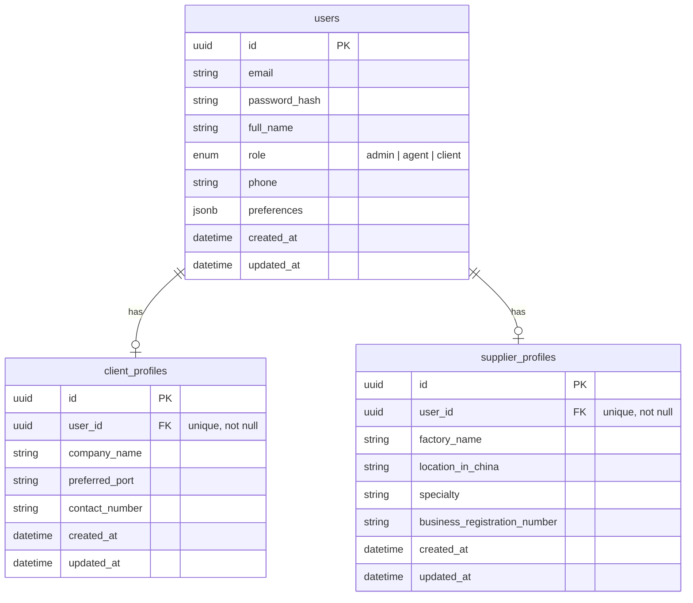
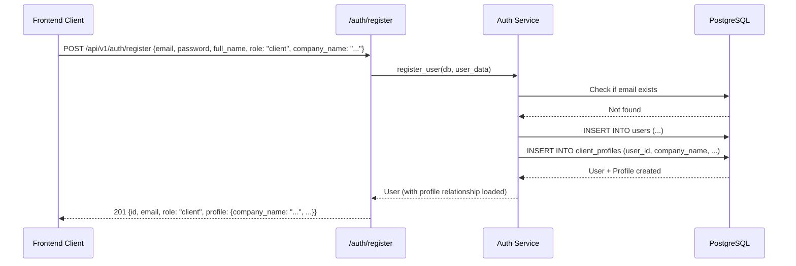
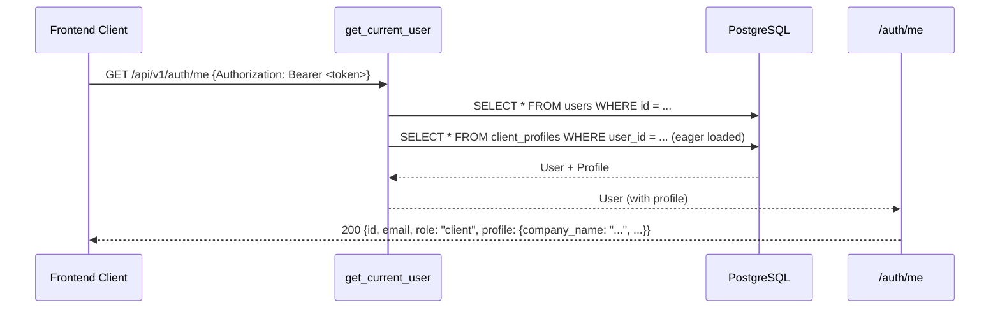

# B2B Marketplace MVP — Auth & User Profile Refactor

## Overview

Refactor the backend authentication system to support strict role-based user profiles for the B2B Marketplace pivot. Introduce dedicated `ClientProfile` and `SupplierProfile` tables with one-to-one relationships to the existing `User` model, update registration to create profiles automatically, and expose profile data via `/auth/me`.

---

## Architecture Diagram



---

## Detailed Tasks

### Task 1: Define Profile SQLAlchemy Models

**File:** [`app/modules/auth/models.py`](app/modules/auth/models.py)

Add two new ORM models **at the bottom of the file** (before the `__repr__` of `User`):

1. **`ClientProfile`**
   - `__tablename__` = `"client_profiles"`
   - `id` → UUID PK
   - `user_id` → UUID FK → `users.id`, **unique**, not null
   - `company_name` → String(255), not null
   - `preferred_port` → String(100), nullable
   - `contact_number` → String(50), nullable
   - `created_at`, `updated_at` → DateTime(timezone=True), server_default=now()

2. **`SupplierProfile`**
   - `__tablename__` = `"supplier_profiles"`
   - `id` → UUID PK
   - `user_id` → UUID FK → `users.id`, **unique**, not null
   - `factory_name` → String(255), not null
   - `location_in_china` → String(255), not null
   - `specialty` → String(255), nullable
   - `business_registration_number` → String(100), nullable
   - `created_at`, `updated_at` → DateTime(timezone=True), server_default=now()

Both models use string-based `relationship("User", back_populates="...")` to stay consistent with the existing cross-module relationship pattern.

**Relationship definitions on both models:**
```python
user = relationship("User", back_populates="client_profile")  # or supplier_profile
```

### Task 2: Update `User` Model with Back-Populates

**File:** [`app/modules/auth/models.py`](app/modules/auth/models.py)

Add two new relationship attributes to the `User` class:

```python
client_profile = relationship("ClientProfile", back_populates="user", uselist=False)
supplier_profile = relationship("SupplierProfile", back_populates="user", uselist=False)
```

`uselist=False` enforces the one-to-one constraint at the ORM level (the DB unique constraint on `user_id` enforces it at the DB level).

### Task 3: Create Profile Pydantic Schemas

**File:** [`app/modules/auth/schemas.py`](app/modules/auth/schemas.py)

Add these new schemas:

```python
class ClientProfileCreate(BaseModel):
    company_name: str = Field(..., max_length=255)
    preferred_port: Optional[str] = Field(None, max_length=100)
    contact_number: Optional[str] = Field(None, max_length=50)


class SupplierProfileCreate(BaseModel):
    factory_name: str = Field(..., max_length=255)
    location_in_china: str = Field(..., max_length=255)
    specialty: Optional[str] = Field(None, max_length=255)
    business_registration_number: Optional[str] = Field(None, max_length=100)
```

And response models:

```python
class ClientProfileResponse(BaseModel):
    company_name: str
    preferred_port: Optional[str] = None
    contact_number: Optional[str] = None
    model_config = {"from_attributes": True}


class SupplierProfileResponse(BaseModel):
    factory_name: str
    location_in_china: str
    specialty: Optional[str] = None
    business_registration_number: Optional[str] = None
    model_config = {"from_attributes": True}
```

### Task 4: Update `UserCreate` Schema

**File:** [`app/modules/auth/schemas.py`](app/modules/auth/schemas.py)

Modify `UserCreate` to accept profile data. Use a flat-field approach where the profile fields sit alongside the core user fields. This is cleaner for OpenAPI docs and avoids discriminated union complexity:

```python
class UserCreate(BaseModel):
    email: EmailStr = Field(..., examples=["agent@example.com"])
    password: str = Field(..., min_length=8, max_length=128, examples=["secure_password"])
    full_name: str = Field(..., min_length=1, max_length=255, examples=["Ahmed Al-Masri"])
    phone: Optional[str] = Field(None, max_length=50, examples=["+962791234567"])
    role: str = Field(..., description="User role: client | agent | admin")
    # Client profile fields
    company_name: Optional[str] = Field(None, max_length=255)
    preferred_port: Optional[str] = Field(None, max_length=100)
    contact_number: Optional[str] = Field(None, max_length=50)
    # Supplier profile fields
    factory_name: Optional[str] = Field(None, max_length=255)
    location_in_china: Optional[str] = Field(None, max_length=255)
    specialty: Optional[str] = Field(None, max_length=255)
    business_registration_number: Optional[str] = Field(None, max_length=100)
```

### Task 5: Update `UserResponse` Schema

**File:** [`app/modules/auth/schemas.py`](app/modules/auth/schemas.py)

Modify `UserResponse` to include an optional nested profile field:

```python
class UserResponse(BaseModel):
    id: UUID
    email: str
    full_name: str
    role: str
    phone: Optional[str] = None
    is_active: bool
    created_at: datetime
    profile: Optional[dict] = None  # Contains either ClientProfileResponse or SupplierProfileResponse data
    model_config = {"from_attributes": True}
```

The `profile` field will be populated conditionally based on the user's role when serializing the response.

### Task 6: Update `register_user` Service

**File:** [`app/modules/auth/service.py`](app/modules/auth/service.py)

Modify `register_user` to:

1. Accept the full `UserCreate` payload (with profile fields)
2. After creating the `User`, check the `role`:
   - If `role == UserRole.CLIENT`: create a `ClientProfile` with the provided profile fields
   - If `role == UserRole.AGENT`: create a `SupplierProfile` with the provided profile fields
   - If `role == UserRole.ADMIN`: no profile needed
3. Flush the session after creating the profile
4. Refresh the user (which will now eagerly load the profile relationship if configured)

**New helper function:**
```python
async def _create_user_profile(db: AsyncSession, user: User, user_data: UserCreate) -> None:
    """Create the appropriate profile for the user based on their role."""
    if user.role == UserRole.CLIENT:
        profile = ClientProfile(
            user_id=user.id,
            company_name=user_data.company_name,
            preferred_port=user_data.preferred_port,
            contact_number=user_data.contact_number,
        )
        db.add(profile)
    elif user.role == UserRole.AGENT:
        profile = SupplierProfile(
            user_id=user.id,
            factory_name=user_data.factory_name,
            location_in_china=user_data.location_in_china,
            specialty=user_data.specialty,
            business_registration_number=user_data.business_registration_number,
        )
        db.add(profile)
    # Admin — no profile needed
```

**Validation logic to add:** If role is `client`, require `company_name`. If role is `agent`, require `factory_name` and `location_in_china`. Raise `ValidationError` if required profile fields are missing.

### Task 7: Update `/auth/me` Endpoint

**File:** [`app/modules/auth/router.py`](app/modules/auth/router.py)

Modify the `get_me` endpoint to eagerly load the user's profile and include it in the response:

```python
@router.get("/me", response_model=UserResponse)
async def get_me(current_user: User = Depends(get_current_user)):
    # Build profile dict based on role
    profile = None
    if current_user.role == UserRole.CLIENT and current_user.client_profile:
        profile = ClientProfileResponse.model_validate(current_user.client_profile).model_dump()
    elif current_user.role == UserRole.AGENT and current_user.supplier_profile:
        profile = SupplierProfileResponse.model_validate(current_user.supplier_profile).model_dump()
    
    user_data = UserResponse.model_validate(current_user).model_dump()
    user_data["profile"] = profile
    return UserResponse(**user_data)
```

Alternatively, use a `selectinload` in the `get_current_user` dependency to eagerly load the profile, avoiding the N+1 problem. Update [`app/modules/auth/dependencies.py`](app/modules/auth/dependencies.py) to optionally include an eager-load option.

### Task 8: Generate Alembic Migration

**File:** [`alembic/versions/005_add_user_profiles.py`](alembic/versions/005_add_user_profiles.py)

Create a new migration that:

1. Creates the `client_profiles` table:
   - `id` UUID PK
   - `user_id` UUID FK → `users.id`, **unique**, not null
   - `company_name` VARCHAR(255), not null
   - `preferred_port` VARCHAR(100), nullable
   - `contact_number` VARCHAR(50), nullable
   - `created_at` TIMESTAMP with timezone, server_default=now()
   - `updated_at` TIMESTAMP with timezone, server_default=now()

2. Creates the `supplier_profiles` table:
   - `id` UUID PK
   - `user_id` UUID FK → `users.id`, **unique**, not null
   - `factory_name` VARCHAR(255), not null
   - `location_in_china` VARCHAR(255), not null
   - `specialty` VARCHAR(255), nullable
   - `business_registration_number` VARCHAR(100), nullable
   - `created_at` TIMESTAMP with timezone, server_default=now()
   - `updated_at` TIMESTAMP with timezone, server_default=now()

3. Indexes: unique index on both `user_id` columns (already enforced by unique constraint)

**Important:** Check down revision. The last migration is `004_add_clearance_discount_to_pricing_category.py` — so this should be `005`.

### Task 9: Update Seed Script

**File:** [`scripts/seed_demo_users.py`](scripts/seed_demo_users.py)

After creating the `client@example.com` user, create a `ClientProfile` with sample data. After creating the `agent@example.com` user, create a `SupplierProfile` with sample data.

Profile data for demo users:

| User | Profile Type | Sample Data |
|------|-------------|-------------|
| client@example.com | ClientProfile | company_name="شركة المستقبل", preferred_port="Aqaba", contact_number="+962793333333" |
| agent@example.com | SupplierProfile | factory_name="Future Factory Ltd", location_in_china="Guangzhou, Guangdong", specialty="Electronics & Home Appliances", business_registration_number="CN-GZ-2024-8842" |

### Task 10: Update Tests

**File:** [`tests/test_auth/test_auth_api.py`](tests/test_auth/test_auth_api.py)

1. Update `registered_user` fixture to register with role `agent` (supplier) and profile data
2. Add new test cases:
   - `test_register_client_with_profile`: Register as client, verify `ClientProfile` is created and returned in `/auth/me`
   - `test_register_agent_with_profile`: Register as agent/supplier, verify `SupplierProfile` is created and returned in `/auth/me`
   - `test_register_client_missing_required_fields`: Client registration without `company_name` should fail with 422
   - `test_register_agent_missing_required_fields`: Agent registration without `factory_name` should fail with 422
   - `test_get_me_with_profile`: After login, `/auth/me` should return the correct profile data
3. Update `conftest.py` fixtures to include profile data when registering test users

---

## Data Flow: Registration



## Data Flow: Get Profile



## Relationship Mapping Summary

| Model | Table | FK | Relationship on User | Relationship on Profile |
|-------|-------|----|---------------------|------------------------|
| ClientProfile | client_profiles | user_id → users.id | `client_profile` (uselist=False) | `user` → User |
| SupplierProfile | supplier_profiles | user_id → users.id | `supplier_profile` (uselist=False) | `user` → User |

Both FKs have `unique=True` constraint to enforce one-to-one at the database level. The `uselist=False` on the `User` side enforces it at the ORM level.

---

## Files Modified Summary

| # | File | Action |
|---|------|--------|
| 1 | [`app/modules/auth/models.py`](app/modules/auth/models.py) | Add `ClientProfile`, `SupplierProfile` models; add relationships to `User` |
| 2 | [`app/modules/auth/schemas.py`](app/modules/auth/schemas.py) | Add profile create/response schemas; update `UserCreate`, `UserResponse` |
| 3 | [`app/modules/auth/service.py`](app/modules/auth/service.py) | Add `_create_user_profile`; update `register_user` |
| 4 | [`app/modules/auth/router.py`](app/modules/auth/router.py) | Update `/auth/me` to include profile |
| 5 | [`app/modules/auth/dependencies.py`](app/modules/auth/dependencies.py) | Optionally add eager loading for profiles |
| 6 | [`alembic/versions/005_add_user_profiles.py`](alembic/versions/005_add_user_profiles.py) | New migration (new file) |
| 7 | [`scripts/seed_demo_users.py`](scripts/seed_demo_users.py) | Add profile creation for demo agent & client |
| 8 | [`tests/test_auth/test_auth_api.py`](tests/test_auth/test_auth_api.py) | Add profile creation/retrieval tests |
| 9 | [`tests/conftest.py`](tests/conftest.py) | Update fixtures with profile data |
