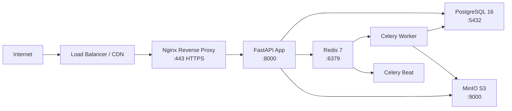

# Deployment Preparation Plan

## Status Quo Analysis

### ✅ Already Production-Ready

| Artifact | Status | Details |
|----------|--------|---------|
| `Dockerfile` | ✅ Ready | Multi-stage build, non-root user, WeasyPrint deps, slim-bookworm base |
| `docker-compose.yml` | ✅ Exists | 7 services: postgres, redis, api, celery_worker, celery_beat, minio, chromadb |
| `.env.example` | ✅ Complete | All 20+ env vars documented with examples |
| `app/config.py` | ✅ Ready | Pydantic Settings with validation, computed URLs, env_file loading |
| `app/main.py` | ✅ Ready | Full app factory, middleware stack, Sentry, health check, Prometheus |
| `.gitignore` | ✅ Good | Covers Python, IDE, Docker, testing, OS files |
| `CI/CD (.github/workflows/ci.yml)` | ✅ Exists | GitHub Actions with PostgreSQL 16 service container |
| `Alembic migrations` | ✅ Exists | Initial schema migration ready |
| All 172 tests | ✅ Passing | Unit + integration tests green |

### ❌ Missing for Production

| # | Missing Item | Why It Matters |
|---|--------------|----------------|
| 1 | `docker-compose.prod.yml` | Dev compose has `--reload`, no resource limits, no log rotation |
| 2 | Nginx reverse proxy | SSL termination, static file serving, rate limiting at edge |
| 3 | SSL certificates | Let's Encrypt + auto-renewal via certbot or Traefik |
| 4 | Entrypoint script | Must run `alembic upgrade head` before `uvicorn` starts |
| 5 | `.dockerignore` | Prevents bloated images (venv, .git, __pycache__, etc.) |
| 6 | Docker healthcheck | API service missing healthcheck in compose |
| 7 | Resource limits | CPU/memory limits prevent noisy-neighbor in production |
| 8 | `deployment.md` | Step-by-step deployment guide for the ops team |

---

## Proposed Architecture — Production Topology



---

## Implementation Steps

### Step 1: Create `.dockerignore`

Exclude from Docker build context:
- `venv/`, `.venv/`, `__pycache__/`, `.pytest_cache/`, `.mypy_cache/`, `.ruff_cache/`
- `.git/`, `.github/`, `.vscode/`, `.idea/`
- `.env`, `.env.local`, `.env.production`
- `test.db`, `.coverage`, `htmlcov/`, `.report`
- `chroma_data/`, `minio_data/`, `*.log`
- `README.md`, `plans/`, `gemini-code-*.md`, `ai-sourcing-agent-notion.md`

### Step 2: Create Entrypoint Script `scripts/entrypoint.sh`

```bash
#!/bin/bash
# Run database migrations
alembic upgrade head

# Start the application
exec uvicorn app.main:app --host 0.0.0.0 --port 8000 --workers 4
```

Must be executable (`chmod +x`).

### Step 3: Create `docker-compose.prod.yml`

Production overrides:
- **api**: Remove `--reload`, add `--workers 4`, add `healthcheck`, add resource limits (`cpus: '2'`, `memory: 1g`), add `restart: always`, no volume mounts (use image)
- **celery_worker**: Add `--without-gossip --without-mingle --without-heartbeat`, resource limits
- **celery_beat**: Resource limits
- **All services**: `restart: always`, logging driver `json-file` with rotation

### Step 4: Add Nginx Service

New service in compose with:
- `nginx:alpine` image
- Custom `nginx.conf` proxying to `api:8000`
- SSL certificate volume mounts
- Rate limiting at edge
- Static file serving for `/static`

### Step 5: Add Healthcheck to API Service

```yaml
healthcheck:
  test: ["CMD", "curl", "-f", "http://localhost:8000/health"]
  interval: 30s
  timeout: 10s
  retries: 3
  start_period: 15s
```

### Step 6: Create `deployment.md`

Documentation covering:
1. Prerequisites (Docker, Docker Compose, domain, DNS)
2. Environment setup (copy .env.example → .env, generate secrets)
3. SSL certificate setup (Let's Encrypt)
4. Deployment commands (`docker compose -f docker-compose.prod.yml up -d`)
5. Verification steps (health check, API test, seed data)
6. Monitoring (Prometheus metrics, Sentry, logs)
7. Backup strategy (PostgreSQL pg_dump, MinIO backup)
8. Rollback procedure

### Step 7: Verify CI/CD Pipeline

Ensure GitHub Actions CI workflow passes with the current codebase after all changes.

---

## Files to Create/Modify

| Action | File | Description |
|--------|------|-------------|
| Create | `.dockerignore` | Exclude build-context bloat |
| Create | `scripts/entrypoint.sh` | Run migrations then start app |
| Create | `docker-compose.prod.yml` | Production overrides |
| Create | `nginx/nginx.conf` | Reverse proxy config |
| Create | `nginx/Dockerfile` | Nginx with custom config |
| Create | `deployment.md` | Step-by-step deployment guide |
| Modify | `docker-compose.yml` | Add healthcheck to api service |
