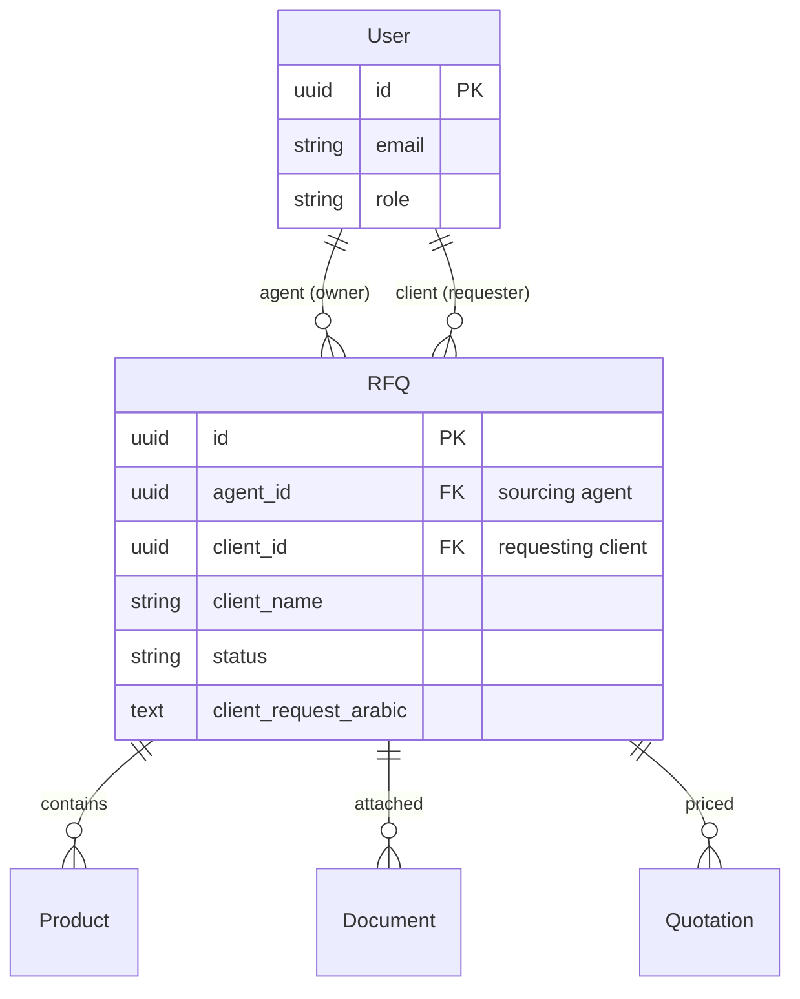

# Enterprise SaaS Refactoring — Architecture Plan

## Current State Analysis

### Backend (FastAPI)
| Aspect | Current State | Problem |
|--------|--------------|---------|
| RFQ Model | `agent_id` only, no `client_id` | Clients stored as `agent_id` — semantically incorrect, breaks data isolation |
| Data Scoping | `list_rfqs` filters by `agent_id` for all non-admins | Clients see RFQs by `agent_id` match (coincidental); no unassigned RFQ concept for agents |
| `get_rfq` endpoint | No ownership check — any user can view any RFQ | Data leak across domains |
| Documents `list_docs` | No scoping at all | Any authenticated user can list docs for any RFQ |
| Quotations `list_quotes` | Filters by `agent_id` | No client visibility |
| Input Validation | No client-specific restrictions | A client could theoretically send `translated_query_chinese` |

### Frontend (React)
| Aspect | Current State | Problem |
|--------|--------------|---------|
| Layout | Single `AppLayout` switches sidebar by role | Not truly isolated; shared Topbar, potential cross-role UI leaks |
| Router | Single router tree with `RoleGuard` wrappers | Admin routes not truly hidden; no `/admin/login` |
| Auth Pages | Demo role-selector cards | Needs professional tab/toggle design |
| Admin Access | Same login page as everyone | Should be at `/admin/login` for true isolation |

---

## Phase 1: Backend Data Model — Add `client_id` to RFQ

### Rationale
True domain isolation requires a proper `client_id` foreign key. Currently, when a client creates an RFQ, their ID is stored in the `agent_id` column — this is semantically wrong and prevents proper scoping.

### Changes

**`app/modules/intake/models.py`** — Add `client_id` column:
```python
client_id = Column(
    UUID(as_uuid=True), ForeignKey("users.id"), nullable=True, index=True
)
# Relationship
client = relationship("app.modules.auth.models.User", foreign_keys=[client_id])
```

**`alembic/versions/002_add_client_id.py`** — Migration script.

**`app/modules/intake/service.py`** — Update `create_rfq`:
- Accept optional `client_id` parameter
- When a client creates: `client_id = current_user.id`, `agent_id = current_user.id`
- When an agent creates: `client_id = specified client`, `agent_id = current_user.id`

### Mermaid: Data Model After Change



---

## Phase 2: Backend Data Scoping — Role-Based Query Isolation

### RFQ List Endpoint (`/api/v1/intake/rfqs`)

```python
async def list_rfqs_endpoint(...):
    match current_user.role:
        case "admin":
            scope_filter = {}  # full access
        case "agent":
            scope_filter = {
                "agent_id": current_user.id,
                # OR unassigned open RFQs
                "_or": {"agent_id": None, "status": "open"}
            }
        case "client":
            scope_filter = {"client_id": current_user.id}
```

### RFQ Detail Endpoint (`/api/v1/intake/rfqs/{id}`)
Add ownership check after fetching:
- Admin: always allowed
- Agent: allowed if `rfq.agent_id == current_user.id`
- Client: allowed if `rfq.client_id == current_user.id`
- Otherwise: 404 (not found, to avoid leaking existence)

### Documents List (`/api/v1/documents/rfq/{rfq_id}`)
Add scope check — verify the authenticated user has access to the parent RFQ before returning documents.

### Quotations List (`/api/v1/quotes`)
Add client scoping:
- Client: `quotation.rfq.client_id == current_user.id`
- Agent: `quotation.rfq.agent_id == current_user.id` (current behavior)
- Admin: full access

---

## Phase 3: Backend Strict Role Dependencies

### Audit all 3 routers for complete role coverage

| Endpoint | Current | Required |
|----------|---------|----------|
| `POST /intake/translate` | `require_agent_or_admin` | ✅ OK |
| `POST /intake/rfqs` | `get_current_user` | ✅ OK (all roles can create) |
| `GET /intake/rfqs` | `get_current_user` | ✅ OK (but scoping needs fix) |
| `GET /intake/rfqs/{id}` | `get_current_user` | ✅ OK (but ownership check needed) |
| `PUT /intake/rfqs/{id}/status` | `require_agent_or_admin` | ✅ OK |
| `POST /intake/rfqs/{id}/products` | `require_agent_or_admin` | ✅ OK |
| `POST /documents/upload` | `require_agent_or_admin` | ✅ OK |
| `GET /documents/rfq/{rfq_id}` | `get_current_user` | ⚠️ Needs scope check |
| `GET /documents/{id}` | `get_current_user` | ⚠️ Needs scope check |
| `DELETE /documents/{id}` | `require_agent_or_admin` | ✅ OK |
| `POST /quotes` | `require_agent_or_admin` | ✅ OK |
| `GET /quotes` | `get_current_user` | ⚠️ Needs client scope |
| `POST /quotes/generate` | `require_agent_or_admin` | ✅ OK |

### Input Validation for Client Requests

Create a `ClientRFQCreate` Pydantic schema that only exposes:
- `client_name`
- `client_phone`
- `client_request_arabic`
- `destination_port`
- `target_currency`

Reject `translated_query_chinese`, `extracted_entities` at the schema level.

---

## Phase 4: Frontend — Professional Authentication Flow

### Login Page Redesign

```mermaid
flowchart LR
    A[Login Page] --> B{Tab Selector}
    B --> C["عميل مستورد"]
    B --> D["وكيل مورد"]
    B --> E["مدير النظام"]
    C --> F[client@example.com prefill]
    D --> G[agent@example.com prefill]
    E --> H[admin@example.com prefill]
    F --> I[Login Payload: role=client]
    G --> J[Login Payload: role=agent]
    H --> K[Login Payload: role=admin]
```

**Design**: Modern tab group with icons + subtle animations. Each tab shows a brief description of what that role can do.

### Register Page Redesign
Same tab group: Client / Agent. Admin registration is not exposed publicly (admins are created via seed script or CLI only).

---

## Phase 5: Frontend — Isolated Layout Architecture

### Three Separate Layout Components

**`ClientLayout`** — Minimalistic, e-commerce style
- Clean top navbar with: logo, notifications bell, user avatar dropdown
- Bottom tab navigation on mobile, side rail on desktop
- Pages: Dashboard (Submit Request + My Requests), Settings

**`AgentLayout`** — Operations center
- Full sidebar: Dashboard, RFQs, Documents, Pricing, Quotes, Settings
- Topbar with status indicators and quick actions
- Pages: Full access to operations

**`AgentLayout`** component sketch:
```
┌─────────────────────────────────────────┐
│ ┌────────┐ ┌──────────────────────────┐ │
│ │        │ │ Topbar: Stats + User      │ │
│ │        │ │───────────────────────────│ │
│ │ Agent  │ │                           │ │
│ │ Sidebar│ │   <Outlet />              │ │
│ │        │ │   (Page Content)          │ │
│ │        │ │                           │ │
│ └────────┘ └──────────────────────────┘ │
└─────────────────────────────────────────┘
```

**`AdminLayout`** — Data-dense analytical
- Compact sidebar with monitoring-focused navigation
- Pages: Dashboard (AI costs, system stats), Pricing Rules, Settings

### Route Structure After Change

```
/                              → Redirect to /dashboard
/auth/login                    → LoginPage (role-agnostic)
/auth/register                 → RegisterPage (client/agent only)

/client/*                      → ClientLayout
  /client/dashboard            → ClientDashboard
  /client/rfq                  → My RFQs list
  /client/settings             → SettingsPage

/agent/*                       → AgentLayout
  /agent/dashboard             → AgentDashboard
  /agent/rfq                   → RFQListPage
  /agent/rfq/create            → RFQCreatePage
  /agent/rfq/:id               → RFQDetailPage
  /agent/documents/upload      → DocumentUploadPage
  /agent/documents/:id         → DocumentDetailPage
  /agent/pricing/calculate     → PricingCalcPage
  /agent/quotes                → QuotationListPage
  /agent/quotes/:id            → QuotationDetailPage
  /agent/settings              → SettingsPage

/admin/login                   → AdminLoginPage (separate entry)
/admin/*                       → AdminLayout
  /admin/dashboard             → AdminDashboard
  /admin/pricing/rules         → PricingRulesPage
  /admin/settings              → SettingsPage
```

---

## Phase 6: Frontend — Router Restructuring

### Implementation

Create modular router factories:
- `createClientRoutes()` — returns route configs for `/client/*`
- `createAgentRoutes()` — returns route configs for `/agent/*`
- `createAdminRoutes()` — returns route configs for `/admin/*`

The main router loads the appropriate factory based on the user's role from Zustand store.

### Strict Redirect Rules

1. **Unauthenticated** → `/auth/login`
2. **Client** trying to access `/agent/*` or `/admin/*` → redirect to `/client/dashboard`
3. **Agent** trying to access `/admin/*` → redirect to `/agent/dashboard`
4. **Admin** trying to access `/agent/*` or `/client/*` → redirect to `/admin/dashboard`
5. After login → redirect to role-specific dashboard

---

## Execution Order

| # | Task | Files Affected | Risk |
|---|------|---------------|------|
| 1 | Add `client_id` to RFQ model + migration | `models.py`, new migration | High (schema change) |
| 2 | Update `create_rfq` service for `client_id` | `service.py` | Medium |
| 3 | Add data scoping to RFQ list/detail endpoints | `router.py`, `service.py` | Medium |
| 4 | Add data scoping to Documents endpoints | `router.py`, `service.py` | Medium |
| 5 | Add data scoping to Quotations endpoints | `router.py`, `service.py` | Medium |
| 6 | Create `ClientRFQCreate` schema for input validation | `schemas.py` | Low |
| 7 | Redesign LoginPage with tab toggle | `LoginPage.tsx` | Low |
| 8 | Redesign RegisterPage with tab toggle | `RegisterPage.tsx` | Low |
| 9 | Create `ClientLayout` component | New file | Low |
| 10 | Create `AgentLayout` component | New file | Low (extract from AppLayout) |
| 11 | Create `AdminLayout` component | New file | Low |
| 12 | Create `AdminLoginPage` at `/admin/login` | New file | Low |
| 13 | Restructure router with role-based route factories | `router.tsx` | High (routing changes) |
| 14 | Create route factories for each role | New files | Medium |
| 15 | Update ProtectedRoute for role-based redirects | `ProtectedRoute.tsx` | Medium |
| 16 | Audit all backend routes for complete role coverage | All router files | Medium |
