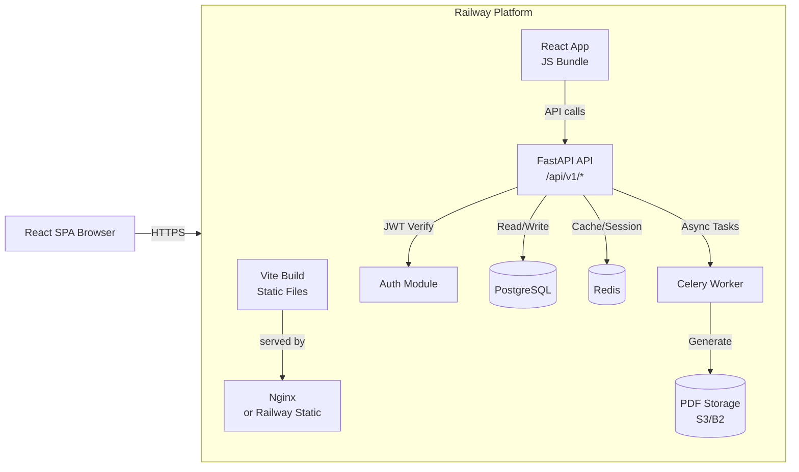
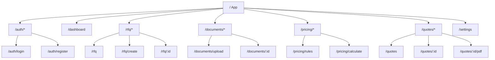
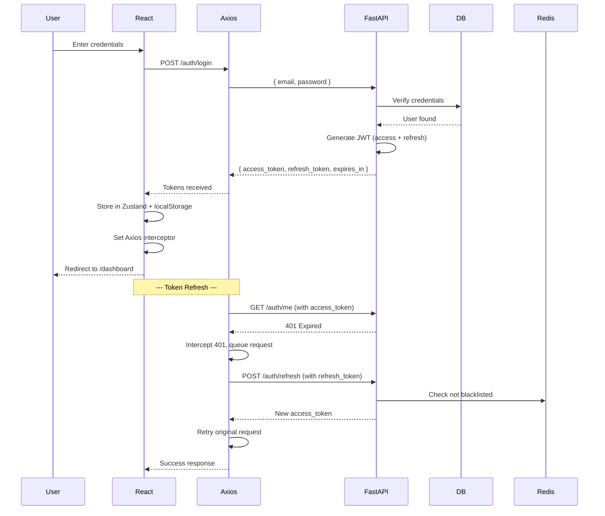
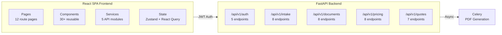

# AI-Sourcing Hub — Frontend Architecture Plan

## 1. PHP Recommendation

**Short answer: لا, PHP is NOT recommended** for this project.

**Detailed analysis:**

Your system already has a complete, production-ready backend:

| Concern | Handled by FastAPI | PHP would add |
|---------|-------------------|---------------|
| REST API | 20+ endpoints fully built | Redundant API layer |
| Auth (JWT) | Access/refresh tokens, blacklisting | Duplicate auth logic |
| PDF generation | Jinja2 + WeasyPrint | Yet another PDF approach |
| Rate limiting | Redis-backed sliding window | Nothing |
| CORS / Security | Middleware stack | Nothing |
| Async operations | Native async/await | Sync-only by default (Laravel queues = complexity) |
| Deployment | Docker on Railway | Another runtime to maintain |

Adding PHP would mean:

- **Two backend codebases** to maintain (FastAPI + PHP/Laravel)
- **Latency penalty** — request goes React → PHP → FastAPI instead of React → FastAPI
- **Duplicated auth logic** — JWT would need to be verified in both PHP and FastAPI
- **No architectural benefit** — PHP serves no role that FastAPI doesn't already perform better

**If you want PHP simply for an admin dashboard**: FastAPI already has role-based auth (`agent`, `admin`) with a `require_role` dependency. A React admin panel can call the same API with admin JWT.

**Recommendation**: Pure React SPA (Single Page Application) communicating directly with the FastAPI REST API. This is the standard modern architecture for API-backend systems.

---

## 2. System Architecture Overview



The React SPA is built by Vite into static files (HTML, JS, CSS), which are served by Railway's static file serving or a lightweight nginx. The SPA then communicates with the FastAPI backend via REST API calls using JWT authentication.

---

## 3. Technology Stack

| Category | Choice | Rationale |
|----------|--------|-----------|
| **Framework** | React 18 + TypeScript | Type safety, ecosystem maturity |
| **Build Tool** | Vite 5 | Fast HMR, optimized builds |
| **Routing** | React Router v6.4+ | Data loaders, nested routes |
| **Server State** | TanStack React Query v5 | Caching, refetch, optimistic updates |
| **Client State** | Zustand | Lightweight auth state, no boilerplate |
| **HTTP Client** | Axios | Interceptors for JWT refresh, request/response typing |
| **Forms** | react-hook-form + zod | Performant forms, schema validation matching backend |
| **Styling** | TailwindCSS v3 + RTL | Utility-first, first-class RTL support |
| **UI Components** | shadcn/ui (Radix primitives) | Accessible, customizable, Tailwind-native |
| **Icons** | lucide-react | Clean, consistent icon set |
| **Notifications** | react-hot-toast | Lightweight toast system |
| **PDF Preview** | @react-pdf/renderer | View quotations in-browser before download |
| **Charts** | recharts | Dashboard analytics (optional) |
| **Testing** | Vitest + React Testing Library | Fast, Vite-native testing |

---

## 4. Project Structure

```
frontend/
├── index.html
├── vite.config.ts
├── tailwind.config.ts
├── tsconfig.json
├── package.json
├── .env.example
├── .env                          # VITE_API_URL=http://localhost:8000/api/v1
│
├── public/
│   ├── favicon.ico
│   └── manifest.json             # PWA manifest (optional)
│
├── src/
│   ├── main.tsx                  # Entry point
│   ├── App.tsx                   # Root component with router
│   ├── index.css                 # Tailwind imports + RTL base
│   │
│   ├── lib/                      # Core utilities
│   │   ├── api.ts                # Axios instance + interceptors
│   │   ├── auth.ts               # Token storage helpers
│   │   └── utils.ts              # General utilities
│   │
│   ├── hooks/                    # Custom React hooks
│   │   ├── useAuth.ts            # Auth state hook (Zustand wrapper)
│   │   ├── useMediaQuery.ts      # Responsive breakpoints
│   │   └── useDebounce.ts        # Search debouncing
│   │
│   ├── stores/                   # Zustand stores
│   │   └── authStore.ts          # Auth state (user, tokens, role)
│   │
│   ├── types/                    # TypeScript interfaces mirroring backend
│   │   ├── auth.ts               # UserCreate, UserLogin, TokenResponse, User
│   │   ├── intake.ts             # TranslateRequest/Response, RFQ, Product
│   │   ├── documents.ts          # DocumentUploadResponse, ProductItem, etc.
│   │   ├── pricing.ts            # PricingRule, CalculateRequest/Response
│   │   └── quotes.ts             # Quotation, QuotationLineItem, etc.
│   │
│   ├── schemas/                  # Zod validation schemas (mirror backend)
│   │   ├── auth.ts
│   │   ├── intake.ts
│   │   ├── documents.ts
│   │   ├── pricing.ts
│   │   └── quotes.ts
│   │
│   ├── services/                 # API service functions (one per module)
│   │   ├── authService.ts        # login, register, refresh, logout, getMe
│   │   ├── intakeService.ts      # translate, createRFQ, getRFQs, addProduct
│   │   ├── documentsService.ts   # upload, getDoc, getItems, updateItems
│   │   ├── pricingService.ts     # getRules, createRule, calculate
│   │   └── quotesService.ts      # create, list, get, generate, finalize
│   │
│   ├── components/               # Reusable UI components
│   │   ├── ui/                   # shadcn/ui primitives (button, input, card, etc.)
│   │   ├── layout/
│   │   │   ├── AppLayout.tsx     # Shell: sidebar + topbar + main content
│   │   │   ├── Sidebar.tsx       # Navigation sidebar
│   │   │   └── Topbar.tsx        # User menu, notifications, language toggle
│   │   ├── auth/
│   │   │   ├── ProtectedRoute.tsx    # Redirect if not authenticated
│   │   │   └── RoleGuard.tsx         # Restrict by user role
│   │   ├── rfq/
│   │   │   ├── RFQCard.tsx           # RFQ summary card
│   │   │   ├── RFQStatusBadge.tsx    # Status indicator
│   │   │   └── ProductTable.tsx      # Products in an RFQ
│   │   ├── documents/
│   │   │   ├── UploadDropzone.tsx    # Drag-and-drop file upload
│   │   │   ├── DocumentList.tsx      # Document table
│   │   │   └── ItemsEditor.tsx       # Editable product items grid
│   │   ├── pricing/
│   │   │   ├── PricingRuleForm.tsx   # Create/edit pricing rule
│   │   │   ├── PricingRulesTable.tsx # List of rules
│   │   │   └── PriceCalculator.tsx   # Interactive calculator
│   │   └── quotes/
│   │       ├── QuotationTable.tsx    # List of quotations
│   │       ├── QuotationDetail.tsx   # Single quotation view
│   │       └── QuotationPDF.tsx      # PDF preview iframe/embed
│   │
│   ├── pages/                    # Route-level pages
│   │   ├── auth/
│   │   │   ├── LoginPage.tsx
│   │   │   └── RegisterPage.tsx
│   │   ├── dashboard/
│   │   │   └── DashboardPage.tsx     # Overview cards + charts
│   │   ├── rfq/
│   │   │   ├── RFQListPage.tsx       # List all RFQs
│   │   │   ├── RFQCreatePage.tsx     # New RFQ form
│   │   │   └── RFQDetailPage.tsx     # View single RFQ + products
│   │   ├── documents/
│   │   │   ├── DocumentUploadPage.tsx
│   │   │   └── DocumentDetailPage.tsx
│   │   ├── pricing/
│   │   │   ├── PricingRulesPage.tsx  # Admin: manage rules
│   │   │   └── PricingCalcPage.tsx   # Calculate pricing
│   │   ├── quotes/
│   │   │   ├── QuotationListPage.tsx
│   │   │   ├── QuotationDetailPage.tsx
│   │   │   └── QuotationPDFPage.tsx  # Embedded PDF view
│   │   └── settings/
│   │       └── SettingsPage.tsx      # User profile, preferences
│   │
│   ├── router/
│   │   └── router.tsx            # Route definitions
│   │
│   └── constants/
│       ├── routes.ts             # Route path constants
│       └── api.ts                # API endpoint constants
│
├── tests/
│   ├── setup.ts                  # Vitest setup
│   ├── components/               # Component tests
│   ├── hooks/                    # Hook tests
│   └── pages/                    # Page/integration tests
│
└── Dockerfile                    # Multi-stage build for production
```

---

## 5. Route Map



| Route | Page Component | Auth Required | Role Required |
|-------|---------------|---------------|---------------|
| `/auth/login` | `LoginPage` | No | - |
| `/auth/register` | `RegisterPage` | No | - |
| `/dashboard` | `DashboardPage` | Yes | agent, admin |
| `/rfq` | `RFQListPage` | Yes | agent, admin |
| `/rfq/create` | `RFQCreatePage` | Yes | agent, admin |
| `/rfq/:id` | `RFQDetailPage` | Yes | agent, admin |
| `/documents/upload` | `DocumentUploadPage` | Yes | agent, admin |
| `/documents/:id` | `DocumentDetailPage` | Yes | agent, admin |
| `/pricing/rules` | `PricingRulesPage` | Yes | admin only |
| `/pricing/calculate` | `PricingCalcPage` | Yes | agent, admin |
| `/quotes` | `QuotationListPage` | Yes | agent, admin |
| `/quotes/:id` | `QuotationDetailPage` | Yes | agent, admin |
| `/quotes/:id/pdf` | `QuotationPDFPage` | Yes | agent, admin |
| `/settings` | `SettingsPage` | Yes | agent, admin |

---

## 6. Authentication Flow



### JWT Interceptor Strategy (in `lib/api.ts`)

```typescript
// Pseudocode for the Axios interceptor
api.interceptors.response.use(
  (response) => response,
  async (error) => {
    if (error.response?.status === 401 && !error.config._retry) {
      error.config._retry = true;
      const newToken = await refreshAccessToken();
      error.config.headers.Authorization = `Bearer ${newToken}`;
      return api(error.config);
    }
    return Promise.reject(error);
  }
);
```

Key points:

- **Access token**: Short-lived (15-30 min), stored in Zustand (memory)
- **Refresh token**: Long-lived (7 days), stored in localStorage
- **Axios interceptor**: Automatically catches 401, refreshes, retries
- **Logout**: Calls `POST /auth/logout` which blacklists refresh token in Redis
- **Protected routes**: `ProtectedRoute` wrapper checks auth store, redirects to `/auth/login` if no token

---

## 7. Data Flow & API Integration

### React Query Pattern

Every API call uses TanStack React Query for caching, refetching, and optimistic updates:

```typescript
// services/intakeService.ts
export const intakeService = {
  listRFQs: (params: PaginationParams) =>
    api.get<RFQListResponse>('/intake/rfqs', { params }).then(r => r.data),

  getRFQ: (id: string) =>
    api.get<RFQResponse>(`/intake/rfqs/${id}`).then(r => r.data),

  createRFQ: (data: RFQCreate) =>
    api.post<RFQResponse>('/intake/rfqs', data).then(r => r.data),
};

// hooks/useRFQs.ts (example custom hook)
export function useRFQs(params: PaginationParams) {
  return useQuery({
    queryKey: ['rfqs', params],
    queryFn: () => intakeService.listRFQs(params),
  });
}
```

### Cache Invalidation Strategy

| Mutation | Invalidates |
|----------|-------------|
| Create RFQ | `['rfqs']` |
| Update RFQ status | `['rfqs', id]`, `['rfqs']` |
| Upload document | `['documents', rfqId]` |
| Update document items | `['documents', id, 'items']` |
| Create pricing rule | `['pricing-rules']` |
| Calculate pricing | No cache (fresh calculation each time) |
| Create quotation | `['quotes']` |
| Generate PDF | `['quotes', id]` |
| Finalize quotation | `['quotes', id]`, `['quotes']` |

---

## 8. Page Descriptions & Wireframes

### 8.1 Dashboard (`/dashboard`)

**Purpose**: Entry point after login. Gives a quick overview of system state.

**Components**:
- Stats cards: Active RFQs, Pending Documents, Draft Quotes, Finalized Quotes
- Recent activity feed (last 5 RFQs)
- Quick-action buttons: New RFQ, Upload Document, Calculate Pricing
- Chart: RFQs by status (pie/donut) — last 30 days

**API calls**:
- `GET /intake/rfqs?limit=5&status=pending` — recent RFQs
- `GET /documents/list?status=pending` — pending documents count
- `GET /quotes?status=draft` — draft quotes count

### 8.2 Login / Register (`/auth/login`, `/auth/register`)

**Purpose**: Authenticate or create account.

**Components**:
- Login form: email, password, submit button
- Register form: email, password, full_name, phone, role (agent/admin) — role defaults to agent for self-registration
- Redirect to dashboard on success
- Error display for invalid credentials / duplicate email

**API calls**:
- `POST /auth/login` → `{ access_token, refresh_token }`
- `POST /auth/register` → `UserResponse`

### 8.3 RFQ List (`/rfq`)

**Purpose**: Browse all RFQs with pagination, search, and filters.

**Components**:
- Search bar (by client name)
- Status filter dropdown (all, pending, processing, quoted, completed, cancelled)
- Paginated table with columns: RFQ #, Client Name, Status, Created Date, Products Count, Actions
- Status badge with color coding
- Click row → navigate to RFQ detail

**API calls**:
- `GET /intake/rfqs?page=1&limit=20&status=pending&search=...`

### 8.4 RFQ Create (`/rfq/create`)

**Purpose**: Create a new RFQ from scratch (without translation).

**Components**:
- Form: client_name, client_phone, client_request_arabic, destination_port, target_currency
- Optional: translated_query_chinese, extracted_entities (JSON)
- Submit → redirect to RFQ detail

**API calls**:
- `POST /intake/rfqs`

### 8.5 RFQ Detail (`/rfq/:id`)

**Purpose**: View full RFQ details, manage products, update status.

**Components**:
- RFQ info card (client, dates, status, currency)
- Products table with add/edit/delete
- Status transition buttons (based on current status)
- Related documents section (links to uploaded documents)
- Action: Create Quotation from this RFQ

**API calls**:
- `GET /intake/rfqs/{id}`
- `GET /intake/rfqs/{id}/products`
- `POST /intake/rfqs/{id}/products` (add product)
- `PUT /intake/rfqs/{id}/status` (update status)
- `GET /documents/list/rfq/{rfq_id}` (related documents)

### 8.6 Document Upload (`/documents/upload`)

**Purpose**: Upload supplier documents (catalog PDFs, product images) for AI processing.

**Components**:
- RFQ selector dropdown (which RFQ this document belongs to)
- Drag-and-drop file upload zone (accepts PDF, PNG, JPG, TIFF)
- Upload progress indicator
- After upload: auto-redirect to document detail

**API calls**:
- `POST /documents/upload` (multipart form data)

### 8.7 Document Detail (`/documents/:id`)

**Purpose**: View document, check AI processing status, review/edit extracted items.

**Components**:
- Document preview (image or PDF embed)
- Processing status indicator (pending → processing → completed / failed)
- If completed: editable items table (product_name, model_number, unit_price_rmb, moq, etc.)
- "Reprocess" button (re-runs AI vision extraction)
- Items editor with inline edit and save

**API calls**:
- `GET /documents/{id}`
- `GET /documents/{id}/status`
- `GET /documents/{id}/items`
- `PUT /documents/{id}/items`
- `POST /documents/{id}/process` (trigger AI processing)

### 8.8 Pricing Rules (`/pricing/rules`)

**Purpose**: Admin-only page to manage pricing rules.

**Components**:
- Table listing all rules with name, type, value, priority, active status
- Create new rule button → modal form
- Edit rule (inline or modal)
- Delete rule (with confirmation)
- Toggle active/inactive

**API calls**:
- `GET /pricing/rules`
- `POST /pricing/rules`
- `GET /pricing/rules/{id}`
- `PUT /pricing/rules/{id}`
- `DELETE /pricing/rules/{id}`

### 8.9 Pricing Calculator (`/pricing/calculate`)

**Purpose**: Interactive pricing calculator for a specific RFQ.

**Components**:
- RFQ selector → loads products from that RFQ
- Target currency input (default: from RFQ)
- Destination port input (default: from RFQ)
- Products table with quantity override, unit_price override
- "Calculate" button → results section
- Results: per-line breakdown + total summary
- "Create Quotation" button → populates quotation form

**API calls**:
- `POST /pricing/calculate` → `CalculatePriceResponse`

### 8.10 Quotation List (`/quotes`)

**Purpose**: Browse all quotations.

**Components**:
- Search and filter (by status: draft, finalized, sent)
- Table: Quote #, Client, RFQ ID, Total Amount, Status, Created Date
- Actions: View, Generate PDF, Finalize

**API calls**:
- `GET /quotes?status=...&limit=...`

### 8.11 Quotation Detail (`/quotes/:id`)

**Purpose**: View full quotation with line items.

**Components**:
- Quotation header: number, client, dates, status
- Line items table: product, quantity, unit prices, fees, subtotals, totals
- Total summary at bottom
- Action buttons: Generate PDF, Finalize, Download PDF

**API calls**:
- `GET /quotes/{id}`
- `PUT /quotes/{id}/status`
- `POST /quotes/{id}/finalize`

### 8.12 Quotation PDF (`/quotes/:id/pdf`)

**Purpose**: View/download the generated PDF.

**Components**:
- If PDF exists: embedded PDF viewer or redirect to presigned URL
- If PDF not yet generated: show message + "Generate" button

**API calls**:
- `GET /quotes/{id}/pdf` → 307 redirect to presigned S3 URL
- `POST /quotes/generate` → starts async Celery task

---

## 9. RTL & Arabic Support

This system targets MENA markets (Egypt, Saudi Arabia, UAE, etc.), so **Arabic-first design is critical**.

### TailwindCSS RTL Setup

```typescript
// tailwind.config.ts
export default {
  future: {
    hoverOnlyWhenSupported: true,
  },
  content: ['./index.html', './src/**/*.{ts,tsx}'],
  theme: {
    extend: {
      fontFamily: {
        sans: ['Cairo', 'system-ui', 'sans-serif'], // Arabic-friendly font
      },
    },
  },
  plugins: [require('tailwindcss-rtl')], // Adds rtl: variants
};
```

### Key RTL Considerations

- **Layout**: Sidebar on the right, content on the left (mirror of LTR)
- **Text alignment**: All user-generated content (Arabic text) is right-aligned
- **Icons**: Use `lucide-react` which auto-flips arrow/chevron icons based on `dir` attribute
- **Forms**: Labels on the right, inputs aligned accordingly
- **Date formatting**: Use `Intl.DateTimeFormat('ar-EG')` for Arabic dates
- **Numbers**: Keep numerals as Western (Arabic-Indic numerals cause parsing issues in some systems)
- **Direction toggling**: Store preferred direction in user settings (default: RTL for Arabic users)

### Font Strategy

- Primary: **Cairo** (Google Fonts, Arabic-optimized)
- Fallback: system-ui for Latin characters
- Load via CSS `@import` or `<link>` in `index.html`

---

## 10. State Management Architecture

```
┌──────────────────────────────────────────────────┐
│                  Zustand Store                    │
│  ┌────────────────────────────────────────────┐  │
│  │           authStore                         │  │
│  │  - user: User | null                        │  │
│  │  - accessToken: string | null               │  │
│  │  - refreshToken: string | null              │  │
│  │  - isAuthenticated: boolean                 │  │
│  │  - role: 'agent' | 'admin' | null           │  │
│  │  - login(email, password)                   │  │
│  │  - logout()                                 │  │
│  │  - refreshToken()                           │  │
│  └────────────────────────────────────────────┘  │
└──────────────────────────────────────────────────┘

┌──────────────────────────────────────────────────┐
│              TanStack React Query                │
│  ┌──────────┐ ┌──────────┐ ┌──────────┐         │
│  │ ['rfqs'] │ │ ['docs'] │ │['quotes']│  ...    │
│  │          │ │          │ │          │         │
│  │ cached   │ │ cached   │ │ cached   │         │
│  │ server   │ │ server   │ │ server   │         │
│  │ data     │ │ data     │ │ data     │         │
│  └──────────┘ └──────────┘ └──────────┘         │
└──────────────────────────────────────────────────┘
```

**Rule**: Server state (API data) → React Query. Client state (auth, UI preferences) → Zustand.

---

## 11. TypeScript Types (API Contract)

Generated from the existing Pydantic schemas. These must match exactly:

```typescript
// types/auth.ts
export interface UserCreate {
  email: string;
  password: string;
  full_name: string;
  phone?: string;
  role?: 'agent' | 'admin';
}

export interface UserLogin {
  email: string;
  password: string;
}

export interface TokenResponse {
  access_token: string;
  refresh_token: string;
  token_type: string;
  expires_in: number;
}

export interface User {
  id: string;
  email: string;
  full_name: string;
  role: 'agent' | 'admin';
  phone?: string;
  is_active: boolean;
  created_at: string;
}
```

```typescript
// types/intake.ts
export interface TranslateRequest {
  raw_text: string; // 1-5000 chars
}

export interface TranslateResponse {
  request_id: string;
  chinese_query: string;
  entities: Record<string, string>;
  confidence: number;
}

export interface RFQCreate {
  client_name: string;
  client_phone?: string;
  client_request_arabic: string;
  translated_query_chinese?: string;
  extracted_entities?: Record<string, string>;
  destination_port?: string;
  target_currency?: string;
}

export interface RFQ {
  id: string;
  client_name: string;
  client_phone?: string;
  client_request_arabic: string;
  translated_query_chinese?: string;
  extracted_entities?: Record<string, string>;
  destination_port?: string;
  target_currency: string;
  status: string;
  created_by: string;
  created_at: string;
  updated_at: string;
}
```

```typescript
// types/documents.ts
export interface DocumentUploadResponse {
  id: string; // UUID
  file_name: string;
  content_type: string;
  file_size_bytes: number;
  status: string;
  created_at: string;
}

export interface ProductItem {
  product_name: string;
  model_number?: string;
  unit_price_rmb?: number;
  moq?: number;
  weight_kg?: number;
  dimensions?: string;
  material?: string;
}

export interface ItemsUpdateRequest {
  items: ProductItem[];
}
```

```typescript
// types/pricing.ts
export interface PricingRuleCreate {
  name: string;
  description?: string;
  category: string;
  rule_type: 'percentage' | 'fixed' | 'formula';
  value: number;
  currency?: string;
  conditions?: Record<string, any>;
  priority: number;
  is_active?: boolean;
}

export interface PriceProductInput {
  product_id: string;
  name: string;
  quantity: number;
  unit_price_cny: number;
}

export interface CalculatePriceResponse {
  rfq_id: string;
  target_currency: string;
  destination_port: string;
  exchange_rate: number;
  line_items: LineItemResult[];
  total_cny: number;
  total_converted: number;
  grand_total: number;
  currency: string;
}

export interface LineItemResult {
  product_id: string;
  product_name: string;
  quantity: number;
  unit_price_cny: number;
  exchange_rate: number;
  unit_price_converted: number;
  freight_cost: number;
  customs_duty: number;
  clearance_fee: number;
  commission: number;
  subtotal: number;
  discount: number;
  total: number;
}
```

```typescript
// types/quotes.ts
export interface QuotationLineItem {
  product_id: string;
  product_name: string;
  quantity: number;
  unit_price_cny: number;
  unit_price_converted: number;
  exchange_rate: number;
  freight_cost: number;
  customs_duty: number;
  commission: number;
  subtotal: number;
  discount: number;
  total: number;
}

export interface Quotation {
  id: string;
  quotation_number: string;
  rfq_id: string;
  client_name: string;
  status: string;
  line_items: QuotationLineItem[];
  total_cny: number;
  total_converted: number;
  grand_total: number;
  currency: string;
  exchange_rate: number;
  valid_until: string;
  notes?: string;
  created_by: string;
  created_at: string;
  updated_at: string;
}
```

---

## 12. Component Library (shadcn/ui)

Use [shadcn/ui](https://ui.shadcn.com/) for all base components. These are copy-paste components built on Radix UI primitives, styled with TailwindCSS, and fully accessible.

| Component | Usage |
|-----------|-------|
| `Button` | All actions |
| `Input` | Form fields |
| `Card` | Dashboard stat cards, detail panels |
| `Table` | Data tables (RFQs, products, quotes) |
| `Badge` | Status indicators |
| `Dialog` | Modals for create/edit forms |
| `Select` | Dropdowns (status filter, currency) |
| `DropdownMenu` | User menu, actions per row |
| `Tabs` | Sectioned detail pages |
| `Pagination` | Paginated lists |
| `Toast` | Success/error notifications |
| `Skeleton` | Loading states |
| `Progress` | Upload progress |
| `Alert` | Error/info messages |
| `Form` | Form wrapper with react-hook-form |

---

## 13. Implementation Phases

### Phase 1: Project Scaffolding & Auth

| Step | Details |
|------|---------|
| 1.1 | Initialize Vite + React + TypeScript project |
| 1.2 | Configure TailwindCSS with RTL plugin |
| 1.3 | Install shadcn/ui base components |
| 1.4 | Set up Axios instance with JWT interceptor |
| 1.5 | Set up Zustand auth store |
| 1.6 | Implement `lib/api.ts`, `lib/auth.ts` |
| 1.7 | Create `services/authService.ts` |
| 1.8 | Build `LoginPage` + `RegisterPage` |
| 1.9 | Build `ProtectedRoute` + `RoleGuard` |
| 1.10 | Build `AppLayout`, `Sidebar`, `Topbar` |
| 1.11 | Set up React Router with all route shells |

**Deliverable**: User can register, login, see sidebar, and get redirected. Logout works. All route shells render placeholders.

### Phase 2: RFQ Management

| Step | Details |
|------|---------|
| 2.1 | Create `types/intake.ts` |
| 2.2 | Create `services/intakeService.ts` |
| 2.3 | Build `RFQListPage` with search, filter, pagination |
| 2.4 | Build `RFQCard` / `RFQStatusBadge` components |
| 2.5 | Build `RFQCreatePage` with form validation |
| 2.6 | Build `RFQDetailPage` with info card |
| 2.7 | Build `ProductTable` + add/edit product |
| 2.8 | Implement status transition buttons |

**Deliverable**: Full CRUD for RFQs and products. Search and filter work.

### Phase 3: Document Management & AI Processing

| Step | Details |
|------|---------|
| 3.1 | Create `types/documents.ts` |
| 3.2 | Create `services/documentsService.ts` |
| 3.3 | Build `UploadDropzone` component |
| 3.4 | Build `DocumentUploadPage` with RFQ selector |
| 3.5 | Build `DocumentDetailPage` with status polling |
| 3.6 | Build `ItemsEditor` for extracted product items |
| 3.7 | Implement "Reprocess" button |

**Deliverable**: Upload documents, view AI extraction progress, review and edit items.

### Phase 4: Pricing Engine

| Step | Details |
|------|---------|
| 4.1 | Create `types/pricing.ts` |
| 4.2 | Create `services/pricingService.ts` |
| 4.3 | Build `PricingRulesPage` (admin table + CRUD) |
| 4.4 | Build `PricingRuleForm` (create/edit modal) |
| 4.5 | Build `PricingCalcPage` with product selector |
| 4.6 | Build results display with per-line breakdown |

**Deliverable**: Admin can manage pricing rules. Any agent can calculate pricing for an RFQ.

### Phase 5: Quotations & PDF

| Step | Details |
|------|---------|
| 5.1 | Create `types/quotes.ts` |
| 5.2 | Create `services/quotesService.ts` |
| 5.3 | Build `QuotationListPage` with filters |
| 5.4 | Build `QuotationDetailPage` with line items |
| 5.5 | Build "Create Quotation from RFQ" flow |
| 5.6 | Build "Generate PDF" button → async task |
| 5.7 | Build "Finalize" button |
| 5.8 | Build `QuotationPDFPage` with embedded viewer |

**Deliverable**: Full quotation lifecycle: create → calculate → generate PDF → finalize.

### Phase 6: Dashboard & Polish

| Step | Details |
|------|---------|
| 6.1 | Build `DashboardPage` with stat cards |
| 6.2 | Add recent activity feed |
| 6.3 | Add quick-action buttons |
| 6.4 | Optional: charts (recharts) |
| 6.5 | Loading states (skeletons) everywhere |
| 6.6 | Error boundaries per page |
| 6.7 | Empty states for all lists |
| 6.8 | RTL testing and polish |
| 6.9 | Responsive design (mobile sidebar) |

**Deliverable**: Complete, polished application.

### Phase 7: Testing & Deployment

| Step | Details |
|------|---------|
| 7.1 | Component unit tests (Vitest + RTL) |
| 7.2 | Integration tests for key flows |
| 7.3 | Build Dockerfile for frontend |
| 7.4 | Docker multi-stage build: node build → nginx serve |
| 7.5 | Update `docker-compose.prod.yml` with frontend service |
| 7.6 | Update nginx config to serve frontend static files |
| 7.7 | CORS configuration review |

**Deliverable**: Production-ready frontend deployed alongside API.

---

## 14. Deployment Architecture

For Railway deployment (current platform), two approaches:

### Option A: Railway Static + API (Recommended)

```
Railway Project
├── Frontend Service (Static)
│   └── Vite build → served by Railway's static hosting
├── API Service (already deployed)
├── Celery Worker
├── Celery Beat
├── PostgreSQL
└── Redis
```

- Build command: `cd frontend && npm install && npm run build`
- Output directory: `frontend/dist`
- No nginx needed for frontend
- API url from environment variable `VITE_API_URL`

### Option B: Combined Docker (if nginx desired)

```
railway.json
┌──────────────────────────────────────────┐
│ Build: docker build -f Dockerfile .      │
│ Start: nginx -g 'daemon off;'            │
│ ┌────────────┐  ┌───────────────────┐   │
│ │ nginx      │→│ /api/* → FastAPI   │   │
│ │ serves     │  │ / → index.html    │   │
│ │ static     │  │ (static files)    │   │
│ └────────────┘  └───────────────────┘   │
└──────────────────────────────────────────┘
```

---

## 15. Environment Variables

```bash
# .env (frontend)
VITE_API_URL=https://your-api.railway.app/api/v1
VITE_APP_NAME=AI-Sourcing Hub
VITE_DEFAULT_LOCALE=ar
```

---

## 16. Key Design Decisions

1. **Why React Query over Redux?** Server state caching, automatic refetch, optimistic updates, and cache invalidation reduce boilerplate by 70% compared to Redux.

2. **Why Zustand over Context API?** Zustand avoids re-render issues (Context re-renders all consumers), has simpler async actions, and persists to localStorage with one plugin.

3. **Why shadcn/ui over Material UI?** Material UI is heavy (500KB+), hard to customize, and has poor RTL support. shadcn/ui is lightweight, fully customizable via Tailwind, and RTL works naturally.

4. **Why no i18n library?** For an MVP targeting Arabic-speaking users, a simple direction toggle + Arabic UI text is sufficient. i18next can be added later for multi-language support.

5. **Why @react-pdf/renderer for preview?** The PDF is generated server-side by FastAPI/WeasyPrint. The frontend only needs to show a link/embed to the presigned URL. `@react-pdf/renderer` is optional if we simply redirect to the S3 URL.

6. **Why separate services layer?** Keeps API call logic separate from React Query hooks. Services can be tested independently, and hooks stay thin.

---

## 17. Summary



**Total estimated files**: ~60 files across 7 phases.

**Key architectural principles**:
- React SPA → FastAPI REST API (no PHP middleware needed)
- Arabic-first RTL design from day one
- TypeScript types mirroring Pydantic schemas
- React Query for server state, Zustand for client state
- shadcn/ui for accessible, customizable components
- JWT interceptors for seamless auth refresh
