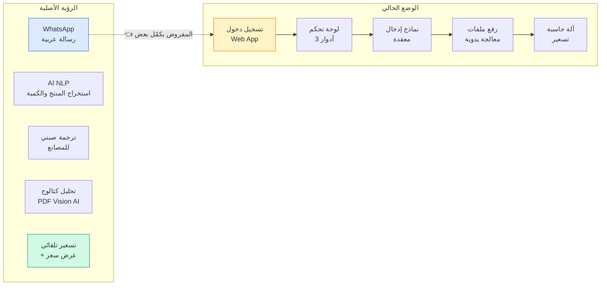
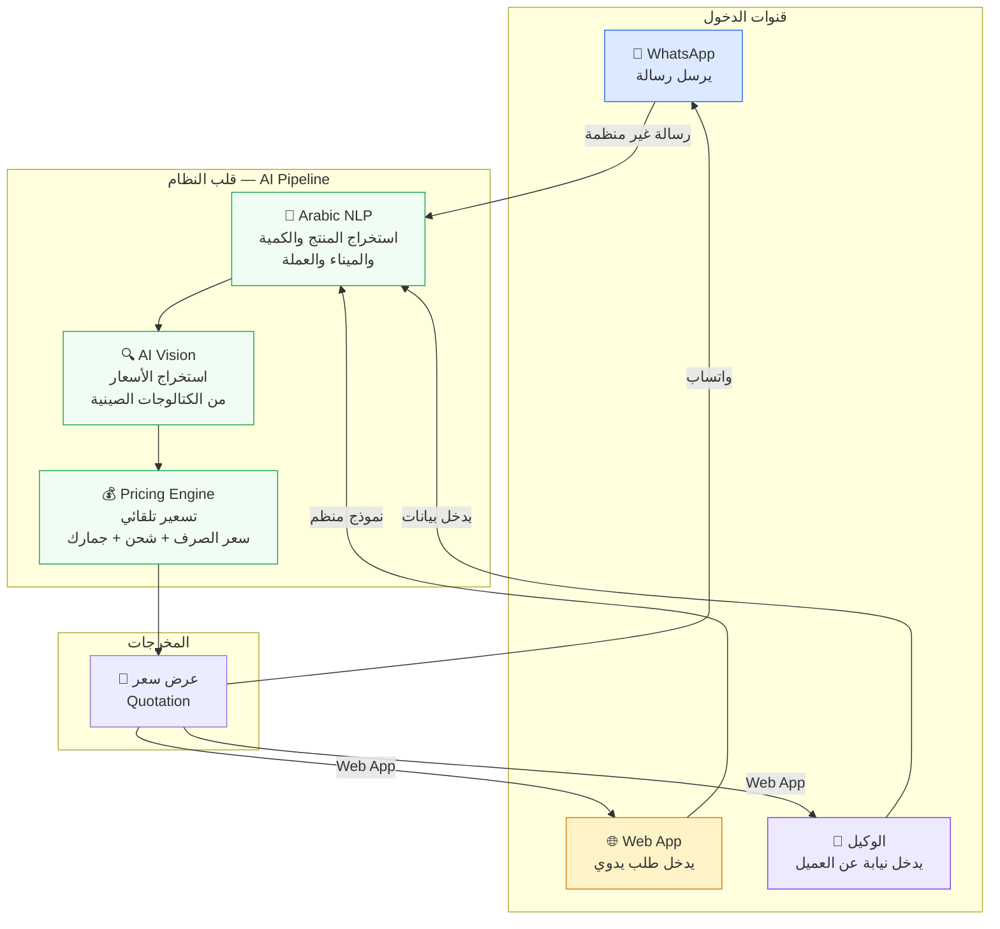

# تحليل الانحراف عن الهدف الأصلي — Project Drift Analysis

## 📋 الرؤية الأصلية (من Notion)

> **"نسهل التجارة بين الصين والشرق الأوسط بالذكاء الاصطناعي — We bridge China and the Middle East with AI-powered sourcing intelligence."**

### الـ MVP Pipeline
```
رسالة واتساب بالعربي  →  NLP عربي  →  ترجمة صيني  →  تحليل كتالوج PDF  →  تسعير ديناميكي  →  عرض سعر
```

### المشاكل الحقيقية من الميدان (User Research)

| المستخدم | المشكلة | المرحلة المسببة للتأخير |
|----------|---------|------------------------|
| **وكيل sourcing في الصين** | "بضيع وقت كبير في ترجمة طلبات الواتساب من العربي للصيني" | الترجمة |
| **تاجر محلي في الشرق الأوسط** | "ما بقدر أتأكد من أسعار المصانع لأن الكتالوجات كلها صيني" | التفاوض مع المصانع |
| **مكتب شحن** | "حسابات الشحن والجمارك والعمولة تأخذ مني ساعات كل أسبوع" | التسعير والحسابات |

### المهام P0-Critical (لم تُبن بعد)
1. ✅ ~~WhatsApp Arabic NLP Parsing~~ ❌ **غير منفذ**
2. ✅ ~~PDF Table Extraction using Vision AI~~ ❌ **منفذ جزئيًا (يحتاج مفاتيح API)**
3. ✅ ~~Dynamic Pricing Engine~~ ❌ **منفذ ولكن معقد أكثر من اللازم**

---

## 🔍 تحليل الانحراف



### 1. 🚫 الميزات الأساسية المفقودة (P0-Critical)

| الميزة | الحالة | التأثير |
|--------|--------|---------|
| **التكامل مع WhatsApp** | ❌ غير موجود | قناة الدخول الأهم مفقودة |
| **معالجة اللغة العربية (NLP)** | ❌ غير موجود | لا يوجد تحليل للرسائل العربية غير المنظمة |
| **ترجمة عربي → صيني** | ❌ غير مكتمل | ليس موجهًا للمستخدم النهائي |
| **معالجة PDF بالذكاء الاصطناعي** | ⚠️ يحتاج API keys | الكود موجود ولكن يحتاج تفعيل |

### 2. 💥 هندسة زائدة في غير محلها

التطبيق بني كـ **نظام ERP كامل** (3 أدوار، لوحات تحكم، CRUD معقد) قبل أن يكون التدفق الأساسي للذكاء الاصطناعي شغالًا.

المشكلة ليست في وجود Web App — **Web App إضافة رائعة** وتكمل الواتساب. المشكلة أن:
- **الـ AI pipeline** (NLP + Vision + تسعير تلقائي) غير مكتمل
- **تجربة المستخدم** معقدة جدًا مقارنة بما يحتاجه المستخدم

### 3. 🔀 تجربة المستخدم تحتاج إعادة تصميم

| الجانب | المشكلة |
|--------|---------|
| عدد الخطوات من البداية إلى عرض السعر | ~9 خطوات (كثيرة جدًا) |
| الـ Web App للعميل | معقد — يحتاج تسجيل ونماذج لطلب بسيط |
| الـ Web App للوكيل | 5+ صفحات للتنقل لإتمام عملية واحدة |
| عدم وجود ربط مع الواتساب | القناتين منفصلتين تمامًا |

---

## ✅ التصحيح — القنوات المتعددة (Multi-Channel)

بدلاً من "إزالة" أو "استبدال"، الحل هو **الدمج**:



### قنوات الدخول — كلها مطلوبة ولا تلغي بعضها

| القناة | المستخدم | الميزة |
|--------|----------|--------|
| **📱 WhatsApp** | التاجر العربي | يرسل رسالة عادية بالعامية، يستلم عرض سعر بدون فتح أي تطبيق |
| **🌐 Web App (عميل)** | تاجر يحب النماذج | يدخل طلب منظم، يرفع صور، يتابع الحالة |
| **👤 Web App (وكيل)** | الوكيل في الصين | يدخل الطلب نيابة عن التاجر (تاجر ما عنده وقت أو ما يعرف يستخدم التكنولوجيا) |

---

## 🧭 خطة إعادة التوجيه — Course Correction Plan

### الـ Golden Path (المسار الذهبي)

```
📱 التاجر يرسل واتساب: "بدي 500 كرتون صابون زيت زيتون لميناء العقبة"
    ↓
🤖 AI يستخرج: product=صابون زيت زيتون, qty=500, port=العقبة
    ↓
📄 AI يبحث في الكتالوجات أو يطلب من الوكيل صور
    ↓
💰 AI يحسب: سعر مصنع + شحن + جمارك + عمولة = عرض سعر نهائي
    ↓
📱 عرض السعر يصل التاجر على واتساب + متاح في Web App
```

### الأولويات — Todo List

| الأولوية | المهمة | الوصف |
|----------|--------|-------|
| **P0** | 🟢 تكامل WhatsApp API | استقبال رسائل وإرسال ردود عبر Meta/Twilio API |
| **P0** | 🟢 Arabic NLP Pipeline | تحليل الرسائل العربية غير المنظمة → JSON منظم |
| **P0** | 🟢 تفعيل AI Vision | تشغيل معالجة PDF/صور الكتالوجات (OpenRouter/Together AI) |
| **P1** | 🟡 تبسيط UX | دمج القنوات وتقليل عدد الخطوات |
| **P1** | 🟡 تسعير تلقائي | ربط Pricing Engine بالـ Pipeline دون تدخل يدوي |
| **P2** | 🔵 الاحتفاظ بالـ Web App | تحسين الواجهة الحالية وجعلها مكمّلة للواتساب |
