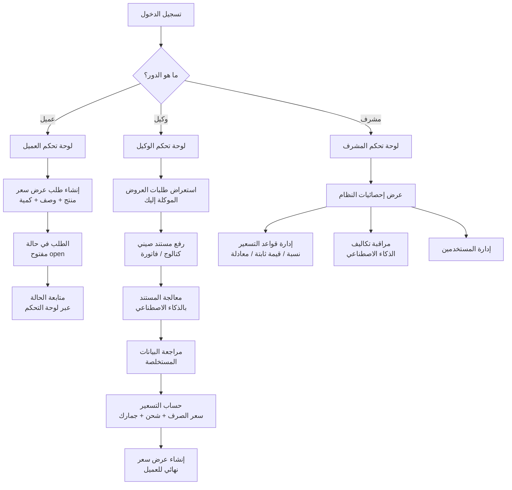
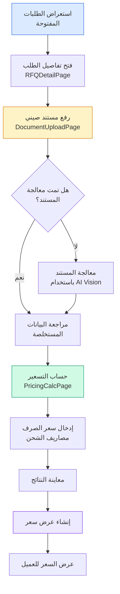
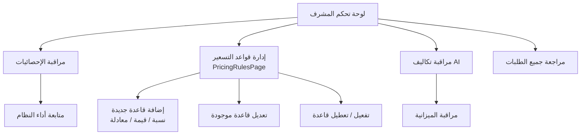
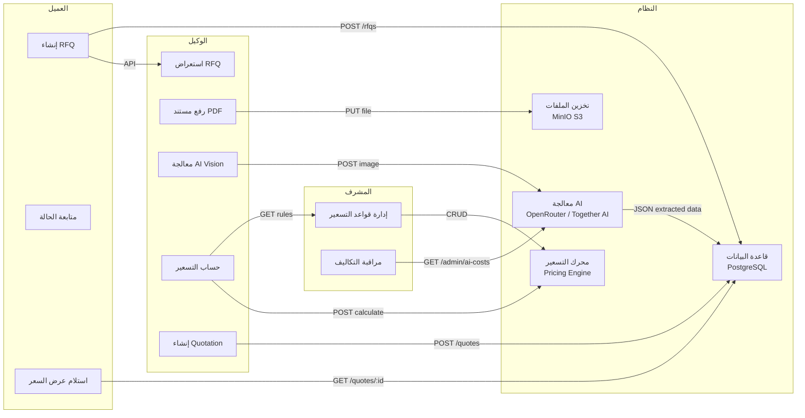

# آلية عمل النظام — من وجهة نظر المستخدم

## نظرة عامة على الأدوار

النظام يحتوي على **3 أدوار رئيسية**، لكل دور صلاحيات وواجهة مختلفة تمامًا:

| الدور | الوصف | صلاحية الدخول |
|-------|-------|---------------|
| **عميل (Client)** | تاجر من الشرق الأوسط يبحث عن منتجات من الصين | إنشاء طلبات عروض، متابعة الحالة، عرض عروض الأسعار |
| **وكيل (Agent)** | وسيط/مشتري في الصين يدير الطلبات ويتواصل مع الموردين | إدارة الطلبات، رفع المستندات، حساب التسعير، إنشاء عروض الأسعار |
| **مشرف (Admin)** | مدير النظام | إدارة جميع الطلبات، قواعد التسعير، مراقبة التكاليف، المستخدمين |

---

## سير العمل الكامل



---

## 1. رحلة العميل (Client)

### 1.1 التسجيل وتسجيل الدخول
- يفتح الصفحة الرئيسية → [`/auth/login`](frontend/src/router/router.tsx:40)
- يختار علامة التبويب **"عميل"** في [`LoginPage`](frontend/src/pages/auth/LoginPage.tsx:48)
- يسجل الدخول باستخدام البريد الإلكتروني وكلمة المرور (أو يسجل حساب جديد عبر [`/auth/register`](frontend/src/router/router.tsx:44))

### 1.2 لوحة التحكم
- بعد تسجيل الدخول، يُوجه تلقائيًا إلى [`/dashboard`](frontend/src/router/routeFactories.tsx:24)
- يظهر [`ClientDashboard`](frontend/src/pages/dashboard/ClientDashboard.tsx:32) بقسمين رئيسيين:

#### أ. إنشاء طلب عرض سعر جديد

- يملأ نموذج الطلب: اسم المنتج، الوصف، الكمية، ميناء الوصول
- يمكن إرفاق صورة توضيحية للمنتج
- بعد الإرسال، تظهر رسالة نجاح والطلب ينتظر الوكيل

#### ب. متابعة طلباتي
- يظهر جدول بجميع طلبات العميل مع حالتها:
  - **مفتوح (open)**: قيد المراجعة من قبل الوكيل
  - **قيد المعالجة (processing)**: الوكيل يعمل على الطلب
  - **تم التسعير (quoted)**: تم إعداد عرض سعر
  - **مغلق (closed)**: تمت المعاملة
  - **ملغي (cancelled)**: ألغي الطلب

### 1.3 عرض تفاصيل الطلب وعروض الأسعار
- ينقر على أي طلب لفتح [`RFQDetailPage`](frontend/src/pages/rfq/RFQDetailPage.tsx:27)
- يعرض تفاصيل الطلب والمنتجات المرتبطة به
- إذا تم التسعير، يظهر عرض السعر النهائي مع بنود التكلفة

---

## 2. رحلة الوكيل (Agent)

### 2.1 تسجيل الدخول
- يختار علامة التبويب **"وكيل"** في [`LoginPage`](frontend/src/pages/auth/LoginPage.tsx:48)
- بيانات الدخول التجريبية: `agent@example.com` / `password123`

### 2.2 لوحة التحكم
يظهر [`AgentDashboard`](frontend/src/pages/dashboard/AgentDashboard.tsx:33) مع:
- **إحصائيات سريعة**: الطلبات المفتوحة، قيد المعالجة، الإجمالي
- **إجراءات سريعة**: طلبات العروض، رفع مستند، حساب التسعير، عروض الأسعار
- **جدول الطلبات الموكلة**: مع فلترة حسب الحالة

### 2.3 سير العمل الكامل للوكيل



#### أ. إدارة طلبات العروض
- يفتح [`RFQListPage`](frontend/src/pages/rfq/RFQListPage.tsx:24) لاستعراض جميع الطلبات
- يستخدم أزرار الفلترة: الكل، مفتوح، قيد المعالجة، تم التسعير، مغلق، ملغي
- ينقر على أي طلب لفتح [`RFQDetailPage`](frontend/src/pages/rfq/RFQDetailPage.tsx:27) لمشاهدة التفاصيل والمنتجات

#### ب. رفع المستندات الصينية
- من [`DocumentUploadPage`](frontend/src/pages/documents/DocumentUploadPage.tsx:8):
  1. يختار طلب عرض السعر المرتبط من القائمة المنسدلة
  2. يرفع ملف PDF (كتالوج صيني، فاتورة، أو مستند مواصفات)
  3. النظام يقوم بـ:
     - رفع الملف إلى MinIO (تخزين S3)
     - تسجيل المستند في قاعدة البيانات بحالة `uploaded`
     - تحويل صفحات PDF إلى صور

#### ج. معالجة المستند بالذكاء الاصطناعي
- في [`DocumentDetailPage`](frontend/src/pages/documents/DocumentDetailPage.tsx:68):
  1. يضغط **"بدء معالجة المستند"**
  2. النظام يقوم بـ:
     - إرسال صورة المستند إلى **OpenRouter** (Gemini 2.0 Flash) أو **Together AI** (Qwen2.5-VL-72B)
     - استخراج بيانات المنتجات: الاسم، الموديل، السعر، الوزن
     - حفظ النتائج في قاعدة البيانات كـ `DocumentItem`
  3. يعرض النتائج في جدول: المنتج، الموديل، السعر (يوان صيني)، الوزن

#### د. حساب التسعير
- في [`PricingCalcPage`](frontend/src/pages/pricing/PricingCalcPage.tsx:22):
  1. **الخطوة 1**: اختيار طلب عرض السعر من القائمة المنسدلة
  2. **الخطوة 2**: اختيار عملة الهدف (مثل JOD دينار أردني، USD دولار)
  3. **الخطوة 3**: إدخال ميناء الوصول
  4. **الخطوة 4**: تعديل الكميات وأسعار الوحدة (يوان صيني) لكل منتج
  5. **الخطوة 5**: الضغط على **"حساب التسعير"**
  6. النظام يقوم بتطبيق **قواعد التسعير**:
     - سعر الصرف (من اليوان إلى العملة الهدف)
     - تكلفة الشحن
     - الجمارك والتخليص
     - العمولة
     - الخصومات
     - الضريبة
  7. يعرض النتائج: جدول تفصيلي ببنود التكلفة لكل منتج، الإجمالي

#### هـ. إنشاء عرض السعر
- بعد حساب التسعير، يضغط **"إنشاء عرض سعر"**
- يتم إنشاء عرض سعر بحالة `draft` مرتبط بـ RFQ
- يمكن مشاهدته في [`QuotationListPage`](frontend/src/pages/quotes/QuotationListPage.tsx:25)
- وفتح التفاصيل في [`QuotationDetailPage`](frontend/src/pages/quotes/QuotationDetailPage.tsx:26)

---

## 3. رحلة المشرف (Admin)

### 3.1 تسجيل الدخول
- مسار مخصص: [`/admin/login`](frontend/src/router/router.tsx:48) ← [`AdminLoginPage`](frontend/src/pages/auth/AdminLoginPage.tsx:14)
- تصميم أرجواني مميز للوحة تحكم المشرف
- بيانات الدخول التجريبية: `admin@example.com` / `password123`

### 3.2 لوحة التحكم
يظهر [`AdminDashboard`](frontend/src/pages/dashboard/AdminDashboard.tsx:28) مع:
- **إحصائيات النظام**: إجمالي طلبات العروض، عروض الأسعار، المستخدمين، قواعد التسعير
- **تكاليف الذكاء الاصطناعي**: إجمالي التكلفة، عدد الاستدعاءات، آخر 24 ساعة
- **قواعد التسعير النشطة**: معاينة سريعة

### 3.3 المهام الإدارية



#### أ. إدارة قواعد التسعير
- في [`PricingRulesPage`](frontend/src/pages/pricing/PricingRulesPage.tsx:1):
  - **عرض جميع القواعد**: مع فلترة حسب الفئة والحالة
  - **إضافة قاعدة جديدة**: نافذة منبثقة (modal) تحتوي:
    - الاسم والوصف
    - الفئة: سعر الصرف، الشحن، الجمارك، التخليص، العمولة، الخصم، الضريبة
    - النوع: نسبة مئوية (%)، قيمة ثابتة، معادلة
    - القيمة الرقمية
    - العملة (للقيم الثابتة)
    - الأولوية (ترتيب التطبيق)
    - حالة التفعيل
  - **تعديل قاعدة**: نفس النموذج مع بيانات موجودة
  - **حذف قاعدة**: مع تأكيد الحذف
  - **تفعيل/تعطيل**: زر تبديل سريع

#### ب. المراقبة
- متابعة تكاليف استدعاءات الذكاء الاصطناعي
- مراجعة إحصائيات النظام الكلية
- الإشراف على جميع طلبات العروض وعروض الأسعار

---

## 4. الصفحات المشتركة بين الأدوار

| الصفحة | المسار | الأدوار المسموحة | الوظيفة |
|--------|--------|------------------|---------|
| [`RFQListPage`](frontend/src/pages/rfq/RFQListPage.tsx) | `/rfq` | جميع الأدوار | عرض جميع طلبات العروض مع فلترة |
| [`RFQDetailPage`](frontend/src/pages/rfq/RFQDetailPage.tsx) | `/rfq/:id` | جميع الأدوار | تفاصيل الطلب والمنتجات وعروض الأسعار |
| [`QuotationListPage`](frontend/src/pages/quotes/QuotationListPage.tsx) | `/quotes` | جميع الأدوار | قائمة عروض الأسعار |
| [`QuotationDetailPage`](frontend/src/pages/quotes/QuotationDetailPage.tsx) | `/quotes/:id` | جميع الأدوار | تفاصيل عرض السعر |
| [`SettingsPage`](frontend/src/router/routeFactories.tsx:94) | `/settings` | جميع الأدوار | إعدادات المستخدم |

| الصفحة | المسار | الأدوار المسموحة | الوظيفة |
|--------|--------|------------------|---------|
| [`RFQCreatePage`](frontend/src/pages/rfq/RFQCreatePage.tsx) | `/rfq/create` | وكيل، مشرف | إنشاء طلب عرض سعر (يدوي) |
| [`DocumentUploadPage`](frontend/src/pages/documents/DocumentUploadPage.tsx) | `/documents/upload` | وكيل، مشرف | رفع مستند صيني |
| [`DocumentDetailPage`](frontend/src/pages/documents/DocumentDetailPage.tsx) | `/documents/:id` | وكيل، مشرف | تفاصيل المستند ومعالجته |
| [`PricingCalcPage`](frontend/src/pages/pricing/PricingCalcPage.tsx) | `/pricing/calculate` | وكيل، مشرف | حساب التسعير |
| [`PricingRulesPage`](frontend/src/pages/pricing/PricingRulesPage.tsx) | `/pricing/rules` | مشرف فقط | إدارة قواعد التسعير |

---

## 5. تدفق البيانات بين الأدوار



---

## 6. حالات الطلب (RFQ) ودورة الحياة

```
مفتوح (open) ← → قيد المعالجة (processing) ← → تم التسعير (quoted)
                                                      ↓
                                                  مغلق (closed)
                                                      ↓
                                                  ملغي (cancelled)
```

- **open**: الوكيل يستعرض الطلب ويبدأ العمل
- **processing**: جاري رفع المستندات ومعالجتها
- **quoted**: تم إنشاء عرض سعر نهائي
- **closed**: تمت الموافقة وإغلاق الطلب
- **cancelled**: ألغي الطلب من قبل أي طرف

---

## 7. ملاحظات مهمة

### متطلبات تقنية للتشغيل الكامل
- **معالجة المستندات (AI Vision)**: تحتاج إلى متغيرات البيئة:
  - `OPENROUTER_API_KEY` أو `TOGETHER_API_KEY`
- **بدون هذه المفاتيح**: يمكن رفع المستندات ولكن معالجتها ستفشل (timeout)

### تحسينات مقترحة لتجربة المستخدم
1. إضافة شاشة تحميل (Skeleton Loading) أثناء تحميل البيانات
2. إضافة إشعارات نجاح بعد إنشاء الطلبات ورفع المستندات
3. تحسين القائمة المنسدلة لاختيار RFQ في رفع المستندات (بحث)
4. تنسيق الأرقام والعملات تلقائيًا
5. إضافة رابط مباشر لصفحة التسعير من صفحة تفاصيل المستند
