# 🏗️ AI-Sourcing Hub — التوثيق الفني الكامل للمشروع

<div dir="rtl">

---

## 📋 فهرس المحتويات

1. [نظرة عامة عن المشروع](#نظرة-عامة-عن-المشروع)
2. [المعمارية العامة للنظام (System Architecture)](#المعمارية-العامة-للنظام)
3. [هيكل الملفات (Directory Tree) مع وصف كل ملف](#هيكل-الملفات)
4. [معمارية قاعدة البيانات (Database Architecture)](#معمارية-قاعدة-البيانات)
5. [معمارية النماذج (Data Models)](#معمارية-النماذج)
6. [النظام الخلفي (Backend Architecture)](#النظام-الخلفي)
7. [خريطة APIs و Endpoints](#خريطة-apIs)
8. [نظام التسعير (Pricing System)](#نظام-التسعير)
9. [نظام معالجة المستندات (Document Pipeline)](#نظام-معالجة-المستندات)
10. [نظام المطابقة الذكية (Matching Engine)](#نظام-المطابقة-الذكية)
11. [نظام الدردشة والتفاوض (Chat System)](#نظام-الدردشة-والتفاوض)
12. [الواجهة الأمامية (Frontend Architecture)](#الواجهة-الأمامية)
13. [البنية التحتية والنشر (Infrastructure & Deployment)](#البنية-التحتية)
14. [المصادقة والأمان (Authentication & Security)](#المصادقة-والأمان)
15. [تتبع الطلبات (Order Tracking)](#تتبع-الطلبات)

---

## نظرة عامة عن المشروع

**AI-Sourcing Hub** هو منصة **B2B** متكاملة لأتمتة التوريد والاستيراد بين الصين ومنطقة الشرق الأوسط وشمال أفريقيا (MENA). المنصة تتيح للمستوردين (العملاء) تقديم طلبات عروض أسعار (RFQs) والبحث في كتالوج المنتجات العالمي، وللموردين (الوكلاء) إدارة عروض الأسعار والتفاوض وتتبع الشحنات.

### التقنيات المستخدمة

| الطبقة | التقنية |
|--------|---------|
| **الواجهة الأمامية** | React 18 + TypeScript + Vite + Tailwind CSS |
| **النظام الخلفي** | Python 3.12 + FastAPI |
| **قاعدة البيانات** | PostgreSQL 16 + asyncpg |
| **التخزين المؤقت** | Redis 7 |
| **نظام المهام** | Celery + Redis Broker |
| **التخزين الكائني** | MinIO (S3-compatible) |
| **قاعدة متجهات** | ChromaDB |
| **البحث النصي** | PostgreSQL GIN + tsvector |
| **إنشاء PDF** | Jinja2 + WeasyPrint |
| **التعريب** | react-i18next (AR/EN/ZH) |
| **الحاويات** | Docker + Docker Compose |

### تدفق العمل الأساسي

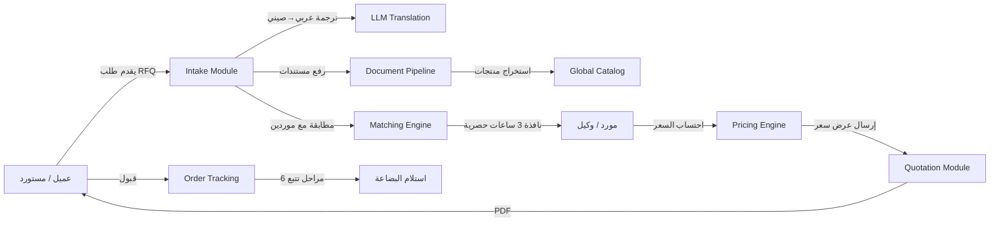

---

## المعمارية العامة للنظام

النظام مبني على معمارية **Modular Monolith** (الوحدة المتجانسة المعيارية) حيث يتم تقسيم التطبيق الخلفي (FastAPI) إلى وحدات منفصلة منطقياً مع فصل واضح للمسؤوليات، مع إمكانية تحويل أي وحدة إلى Microservice منفصل مستقبلاً.

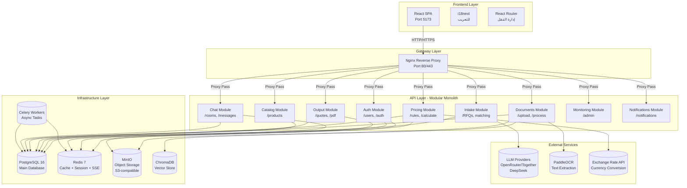

### تدفق الـ Middleware

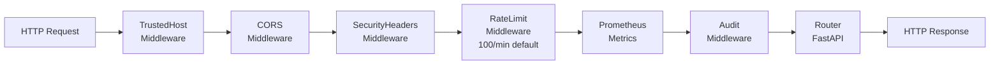

---

## هيكل الملفات

```
ai-sourcing-hub/
│
├── 📁 app/                          # 🌐 التطبيق الخلفي — FastAPI
│   ├── __init__.py
│   ├── config.py                    # ⚙️ الإعدادات المركزية (Pydantic Settings)
│   ├── main.py                      # 🚀 نقطة الدخول — مصنع التطبيق (Application Factory)
│   │
│   ├── 📁 modules/                  # 🧩 الوحدات الوظيفية
│   │   ├── 📁 auth/                 # 🔐 وحدة المصادقة
│   │   │   ├── __init__.py
│   │   │   ├── models.py            # نموذج User + ClientProfile + SupplierProfile
│   │   │   ├── schemas.py           # Pydantic schemas للطلب والاستجابة
│   │   │   ├── router.py            # المسارات: /api/v1/auth/*
│   │   │   ├── service.py           # منطق الأعمال: تسجيل، دخول، تحديث
│   │   │   └── dependencies.py      # التوابع: get_current_user, require_admin, إلخ
│   │   │
│   │   ├── 📁 intake/               # 📥 وحدة إدخال طلبات RFQ
│   │   │   ├── __init__.py
│   │   │   ├── models.py            # RFQ, Product, RFQMatch
│   │   │   ├── schemas.py           # Pydantic schemas
│   │   │   ├── router.py            # المسارات: /api/v1/intake/*
│   │   │   ├── service.py           # منطق الأعمال
│   │   │   ├── llm_client.py        # عميل LLM للترجمة والاستخراج
│   │   │   ├── matcher.py           # خوارزمية المطابقة الذكية
│   │   │   ├── prompt_templates.py  # قوالب الـ prompts للـ LLM
│   │   │   └── tasks.py             # مهام Celery
│   │   │
│   │   ├── 📁 catalog/              # 🏪 وحدة الكتالوج العالمي
│   │   │   ├── __init__.py
│   │   │   ├── models.py            # CatalogProduct + GIN index للبحث
│   │   │   ├── schemas.py           # Pydantic schemas
│   │   │   ├── router.py            # المسارات: /api/v1/catalog/*
│   │   │   └── service.py           # منطق البحث والمراجعة
│   │   │
│   │   ├── 📁 documents/            # 📄 وحدة معالجة المستندات
│   │   │   ├── __init__.py
│   │   │   ├── models.py            # Document (PDF/Image/Excel/Other)
│   │   │   ├── schemas.py           # Pydantic schemas
│   │   │   ├── router.py            # المسارات: /api/v1/documents/*
│   │   │   ├── service.py           # منطق الرفع والاستخراج
│   │   │   ├── tasks.py             # مهام Celery لـ OCR
│   │   │   ├── ocr_client.py        # عميل PaddleOCR
│   │   │   └── json_repair.py       # إصلاح JSON التالف من LLM
│   │   │
│   │   ├── 📁 pricing/              # 💰 وحدة التسعير
│   │   │   ├── __init__.py
│   │   │   ├── models.py            # PricingRule, HSCodeFeeSchedule, QuotationLineItem
│   │   │   ├── schemas.py           # Pydantic schemas
│   │   │   ├── router.py            # المسارات: /api/v1/pricing/*
│   │   │   ├── service.py           # منطق التسعير
│   │   │   ├── engine.py            # 🧮 محرك التسعير الأساسي (10 خطوات)
│   │   │   ├── formula.py           # محرك الصيغ المخصصة
│   │   │   ├── cache.py             # تخزين مؤقت لقواعد التسعير
│   │   │   └── tasks.py             # مهام Celery
│   │   │
│   │   ├── 📁 output/               # 📊 وحدة عروض الأسعار
│   │   │   ├── __init__.py
│   │   │   ├── models.py            # Quotation, TrackingEvent
│   │   │   ├── schemas.py           # Pydantic schemas
│   │   │   ├── router.py            # المسارات: /api/v1/quotes/*
│   │   │   ├── service.py           # منطج إنشاء وتوليد PDF
│   │   │   ├── tasks.py             # مهام Celery
│   │   │   └── 📁 templates/        # قوالب HTML لـ PDF
│   │   │       ├── __init__.py
│   │   │       ├── quotation.html   # قالب عرض السعر
│   │   │       └── styles.css       # أنماط CSS للـ PDF
│   │   │
│   │   ├── 📁 chat/                 # 💬 وحدة الدردشة والتفاوض
│   │   │   ├── __init__.py
│   │   │   ├── models.py            # ChatRoom, Message
│   │   │   ├── schemas.py           # Pydantic schemas
│   │   │   ├── router.py            # المسارات: /api/v1/chat/*
│   │   │   └── service.py           # منطق الغرف والترجمة الفورية
│   │   │
│   │   ├── 📁 notifications/        # 🔔 وحدة الإشعارات
│   │   │   ├── __init__.py
│   │   │   ├── models.py            # إشعارات
│   │   │   ├── router.py            # المسارات: /api/v1/notifications/*
│   │   │   └── service.py           # إرسال الإشعارات عبر SSE
│   │   │
│   │   └── 📁 monitoring/           # 📈 وحدة المراقبة
│   │       ├── __init__.py
│   │       ├── models.py            # سجلات المراقبة
│   │       └── router.py            # المسارات: /api/v1/admin/*
│   │
│   ├── 📁 shared/                   # 🔧 البنية المشتركة
│   │   ├── __init__.py
│   │   ├── database.py              # طبقة قاعدة البيانات (async engine + session)
│   │   ├── redis_client.py          # عميل Redis
│   │   ├── celery_app.py            # تطبيق Celery
│   │   ├── storage.py               # التخزين الكائني (MinIO/S3)
│   │   ├── notifications.py         # إشعارات SSE
│   │   ├── pagination.py            # التصفح
│   │   ├── circuit_breaker.py       # Circuit Breaker لمقدمي LLM
│   │   ├── rate_limiter.py          # تحديد المعدل
│   │   ├── security_middleware.py    # وسيط الأمان
│   │   ├── error_handlers.py        # معالجة الأخطاء
│   │   ├── exceptions.py            # الاستثناءات المخصصة
│   │   ├── logging.py               # التسجيل المهيكل
│   │   ├── metrics.py               # مقاييس Prometheus
│   │   ├── ai_cost_tracker.py       # تتبع تكلفة AI
│   │   └── categories.py            # تصنيفات المنتجات
│   │
│   └── 📁 static/                   # ملفات ثابتة
│
├── 📁 frontend/                     # 🎨 الواجهة الأمامية — React SPA
│   ├── index.html                   # نقطة الدخول
│   ├── package.json                 # تبعيات npm
│   ├── vite.config.ts               # إعدادات Vite
│   ├── vitest.config.ts             # إعدادات الاختبارات
│   ├── tsconfig.json                # إعدادات TypeScript
│   ├── tailwind.config.ts           # إعدادات Tailwind CSS
│   ├── postcss.config.js            # إعدادات PostCSS
│   └── 📁 src/                      # الكود المصدري
│       ├── main.tsx                 # نقطة الدخول
│       ├── App.tsx                  # المكون الرئيسي
│       ├── index.css                # الأنماط العامة
│       │
│       ├── 📁 components/           # المكونات
│       │   ├── layout/              # مكونات التخطيط
│       │   │   ├── AppLayout.tsx    # التخطيط العام (موجه بالأدوار)
│       │   │   ├── AdminLayout.tsx  # تخطيط المشرف
│       │   │   ├── AgentLayout.tsx  # تخطيط الوكيل
│       │   │   ├── ClientLayout.tsx # تخطيط العميل
│       │   │   ├── TopBar.tsx       # الشريط العلوي
│       │   │   ├── Sidebar.tsx      # القائمة الجانبية
│       │   │   ├── BottomNav.tsx    # التنقل السفلي (جوال)
│       │   │   ├── MobileDrawer.tsx # القائمة المنزلقة (جوال)
│       │   │   └── LanguageSwitcher.tsx # مغير اللغة
│       │   │
│       │   ├── auth/                # مكونات المصادقة
│       │   │   ├── ProtectedRoute.tsx # حماية المسارات
│       │   │   └── RoleGuard.tsx    # حماية الأدوار
│       │   │
│       │   └── ui/                  # مكونات واجهة مشتركة
│       │       ├── Skeleton.tsx     # هيكل عظمي (Skeleton loading)
│       │       ├── EmptyState.tsx   # حالة فارغة
│       │       ├── StatusPill.tsx   # حبة الحالة
│       │       ├── StatCard.tsx     # بطاقة إحصائية
│       │       ├── ReelTile.tsx     # بلاطة الـ Reel
│       │       └── LineRow.tsx      # صف منتج
│       │
│       ├── 📁 pages/                # الصفحات
│       │   ├── 📁 auth/             # صفحات المصادقة
│       │   ├── 📁 dashboard/        # لوحات التحكم (حسب الدور)
│       │   ├── 📁 catalog/          # صفحات الكتالوج
│       │   ├── 📁 quotes/           # صفحات عروض الأسعار
│       │   ├── 📁 pricing/          # صفحات التسعير
│       │   ├── 📁 documents/        # صفحات المستندات
│       │   ├── 📁 orders/           # صفحات الطلبات والتتبع
│       │   ├── 📁 chat/             # صفحات الدردشة
│       │   ├── 📁 reels/            # صفحات الـ Reels
│       │   ├── 📁 profile/          # صفحات الملف الشخصي
│       │   └── 📁 settings/         # صفحة الإعدادات
│       │
│       ├── 📁 router/               # إدارة التوجيه
│       │   ├── router.tsx           # تعريف المسارات (3-tier RBAC)
│       │   └── routeFactories.tsx   # مصانع المسارات المشتركة
│       │
│       ├── 📁 services/             # خدمات API
│       │   ├── authService.ts
│       │   ├── catalogService.ts
│       │   ├── chatService.ts
│       │   ├── documentService.ts
│       │   ├── intakeService.ts
│       │   ├── monitoringService.ts
│       │   ├── orderTrackingService.ts
│       │   ├── pricingService.ts
│       │   └── quotationService.ts
│       │
│       ├── 📁 stores/               # إدارة الحالة (Zustand)
│       │   ├── authStore.ts         # حالة المصادقة
│       │   └── uiStore.ts           # حالة الواجهة
│       │
│       ├── 📁 hooks/                # Hooks مخصصة
│       │   ├── useAuth.ts           # خطاف المصادقة
│       │   ├── useMediaQuery.ts     # خطاف الاستعلام الإعلامي
│       │   └── useNotifications.ts  # خطاف الإشعارات
│       │
│       ├── 📁 lib/                  # مكتبات مساعدة
│       │   ├── api.ts               # عميل HTTP (axios)
│       │   ├── auth.ts              # مساعدات المصادقة
│       │   ├── i18n.ts              # إعداد التعريب
│       │   ├── tokens.ts            # إدارة التوكنات
│       │   └── utils.ts             # دوال مساعدة
│       │
│       ├── 📁 locales/              # ملفات التعريب
│       │   ├── ar/common.json       # العربية
│       │   ├── en/common.json       # الإنجليزية
│       │   └── zh/common.json       # الصينية
│       │
│       ├── 📁 constants/            # الثوابت
│       │   ├── api.ts               # ثوابت API
│       │   ├── routes.ts            # ثوابت المسارات
│       │   ├── categories.ts        # تصنيفات المنتجات
│       │   └── pricingFormula.ts    # صيغ التسعير
│       │
│       ├── 📁 types/                # أنواع TypeScript
│       │   ├── auth.ts
│       │   ├── catalog.ts
│       │   ├── chat.ts
│       │   ├── documents.ts
│       │   ├── intake.ts
│       │   ├── orders.ts
│       │   ├── pricing.ts
│       │   └── quotes.ts
│       │
│       └── 📁 test/                 # إعدادات الاختبارات
│           └── msw/                 # Mock Service Worker
│
├── 📁 alembic/                      # 📦 ترحيلات قاعدة البيانات
│   ├── env.py                       # بيئة Alembic
│   ├── script.py.mako               # قالب البرامج النصية
│   └── 📁 versions/                 # ملفات الترحيل
│       ├── 001_initial_schema.py    # الإنشاء الأولي
│       ├── 002_add_client_id_to_rfqs.py
│       ├── 003_make_agent_id_nullable.py
│       ├── 004_add_clearance_discount.py
│       ├── 005_add_user_profiles.py
│       ├── 006_add_catalog_products.py
│       ├── 007_add_tracking_status.py
│       ├── 008_add_verification_status.py
│       ├── 009_add_chat_tables.py
│       ├── 010_add_rfq_match_tables.py
│       ├── 011_add_rfq_exclusive_deadline_index.py
│       ├── 012_add_catalog_product_review_status.py
│       ├── 013_make_quotation_line_item_product_nullable.py
│       ├── 014_add_catalog_product_id_to_line_items.py
│       ├── 015_add_hs_code_fee_schedules.py
│       └── 016_add_pricing_formula_and_vat020.py
│
├── 📁 tests/                        # 🧪 اختبارات Python
│   ├── conftest.py                  # إعدادات الاختبار
│   ├── test_config.py               # اختبار الإعدادات
│   ├── test_auth/                   # اختبارات المصادقة
│   ├── test_documents/              # اختبارات المستندات
│   ├── test_intake/                 # اختبارات الـ RFQ
│   ├── test_integration/            # اختبارات التكامل
│   ├── integration/                 # اختبارات تكامل إضافية
│   └── security/                    # اختبارات الأمان
│
├── 📁 e2e/                          # 🧪 اختبارات End-to-End (Playwright)
│   ├── package.json
│   └── tests/
│       ├── e2e_full_customer_journey.spec.ts  # رحلة العميل الكاملة
│       ├── e2e_exclusive_to_public_transition.spec.ts
│       ├── e2e_quote_pdf_download.spec.ts
│       ├── e2e_register_full_cycle.spec.ts
│       ├── e2e_auth_full_cycle.spec.ts
│       ├── e2e_live_chat_two_tabs.spec.ts
│       ├── ui_no_match_found.spec.ts
│       ├── ui_settings_stub_warning.spec.ts
│       ├── a11y_scan.spec.ts
│       ├── chat_slow_network.spec.ts
│       └── 📁 lifecycle/            # اختبارات دورة الحياة
│
├── 📁 scripts/                      # 📜 سكريبتات مساعدة
│   ├── seed_demo_users.py           # بذر مستخدمين تجريبيين
│   ├── seed_demo_rfqs.py            # بذر RFQs تجريبية
│   ├── seed_demo_agent.py           # بذر وكيل تجريبي
│   ├── seed_catalog_products.py     # بذر منتجات الكتالوج
│   ├── seed_hs_code_schedules.py    # بذر جداول HS Code
│   ├── seed_pricing_rules.py        # بذر قواعد التسعير
│   ├── populate_chroma.py           # تعبئة ChromaDB
│   ├── scratch_catalog_data.py      # مسح بيانات الكتالوج
│   ├── backup.sh                    # سكريبت النسخ الاحتياطي
│   └── entrypoint.sh                # نقطة دخول Docker
│
├── docker-compose.yml               # 🐳 تركيبة Docker (تطوير)
├── docker-compose.prod.yml          # تركيبة Docker (إنتاج)
├── docker-compose.test.yml          # تركيبة Docker (اختبارات)
├── Dockerfile                       # ملف Docker
├── nginx/                           # إعدادات Nginx
├── pyproject.toml                   # إعدادات Python
├── requirements.txt                 # تبعيات Python
├── package.json                     # تبعيات Node.js
├── alembic.ini                      # إعدادات Alembic
├── .env.example                     # مثال للمتغيرات البيئية
├── CLAUDE.md                        # تعليمات Claude
└── README.md                        # التوثيق العام
```

---

## معمارية قاعدة البيانات

```mermaid
erDiagram
    USERS ||--o{ RFQS : "agent_id"
    USERS ||--o{ RFQS : "client_id"
    USERS ||--o{ DOCUMENTS : "uploaded_by"
    USERS ||--o{ QUOTATIONS : "agent_id"
    USERS ||--o{ CHAT_ROOMS : "as client or supplier"
    USERS ||--o{ CATALOG_PRODUCTS : "supplier_id"
    USERS |o--o| CLIENT_PROFILES : "has"
    USERS |o--o| SUPPLIER_PROFILES : "has"

    RFQS ||--o{ PRODUCTS : "has"
    RFQS ||--o{ DOCUMENTS : "has"
    RFQS ||--o{ QUOTATIONS : "has"
    RFQS ||--o{ RFQ_MATCHES : "has"

    QUOTATIONS ||--o{ QUOTATION_LINE_ITEMS : "has"
    QUOTATIONS ||--o{ TRACKING_EVENTS : "has"

    DOCUMENTS ||--o{ CATALOG_PRODUCTS : "source"

    CHAT_ROOMS ||--o{ MESSAGES : "has"

    PRODUCTS ||--o{ QUOTATION_LINE_ITEMS : "has"

    CATALOG_PRODUCTS ||--o{ QUOTATION_LINE_ITEMS : "has"

    USERS {
        uuid id PK
        string email UK
        string password_hash
        string full_name
        enum role "admin | agent | client"
        string phone
        boolean is_active
        jsonb preferences
        datetime created_at
        datetime updated_at
    }

    RFQS {
        uuid id PK
        uuid agent_id FK "nullable"
        uuid client_id FK "nullable"
        string client_name
        string client_phone
        text client_request_arabic
        text translated_query_chinese
        enum status "open | processing | quoted | closed | cancelled"
        jsonb extracted_entities
        string destination_port
        string target_currency
        jsonb matched_supplier_ids
        datetime exclusive_deadline
        boolean is_public
        datetime created_at
        datetime updated_at
    }

    PRODUCTS {
        uuid id PK
        uuid rfq_id FK
        string name
        text specifications
        int quantity
        float target_price
        enum status "pending | quoted"
        jsonb extracted_metadata
        datetime created_at
    }

    DOCUMENTS {
        uuid id PK
        uuid rfq_id FK
        uuid uploaded_by_id FK
        string file_name
        string file_path "MinIO object key"
        int file_size_bytes
        string content_type
        enum doc_type "pdf | image | excel | other"
        enum status "uploaded | processing | extracted | failed"
        text extracted_text
        jsonb extracted_entities
        text error_message
        datetime created_at
        datetime updated_at
    }

    CATALOG_PRODUCTS {
        uuid id PK
        uuid document_id FK
        uuid supplier_id FK
        string product_name
        string model_number
        float unit_price_rmb "CNY"
        int moq
        float weight_kg
        string dimensions
        string material
        string category
        string hs_code
        enum review_status "pending | approved | rejected"
        tsvector search_vector "GIN index"
        datetime created_at
        datetime updated_at
    }

    QUOTATIONS {
        uuid id PK
        uuid rfq_id FK
        uuid agent_id FK
        string quotation_number UK
        enum status "draft | finalized | sent | accepted | rejected | expired"
        enum tracking_status "6 stages"
        string target_currency
        float exchange_rate_used
        float subtotal
        float freight_total
        float customs_total
        float commission_total
        float discount_total
        float vat_total
        float grand_total
        text payment_terms
        text delivery_terms
        int validity_days
        text notes
        string pdf_path "MinIO object key"
        datetime pdf_generated_at
        datetime created_at
        datetime updated_at
    }

    QUOTATION_LINE_ITEMS {
        uuid id PK
        uuid quotation_id FK
        uuid product_id FK "nullable"
        uuid catalog_product_id FK "nullable"
        string product_name
        int quantity
        float unit_price_cny
        float unit_price_converted
        float exchange_rate_used
        float freight_cost
        float customs_duty
        float commission
        float subtotal
        float discount
        float total
        datetime created_at
    }

    PRICING_RULES {
        uuid id PK
        string name
        text description
        enum category "exchange_rate | freight | customs | clearance | commission | discount | moq_discount | tax | margin | other"
        string rule_type "percentage | fixed | formula"
        float value
        text formula
        string currency
        jsonb conditions
        int priority
        boolean is_active
        enum status "active | inactive"
        int version
        datetime created_at
        datetime updated_at
    }

    HS_CODE_FEE_SCHEDULES {
        uuid id PK
        string hs_code UK
        string description
        float duty_rate_001 "% on CIF"
        float service_flat_fee_301 "flat JOD"
        float service_percent_070 "% on CIF"
        boolean requires_license
        float penalty_rate_018 "% on CIF"
        float vat_rate_020 "per-HS override"
        boolean is_verified
        text source_note
        datetime created_at
        datetime updated_at
    }

    RFQ_MATCHES {
        uuid id PK
        uuid rfq_id FK
        uuid supplier_id FK
        float match_score "0.0-1.0"
        text match_reason
        datetime response_deadline
        datetime responded_at
        enum status "pending | responded | expired | declined"
        datetime created_at
    }

    CHAT_ROOMS {
        uuid id PK
        uuid client_id FK
        uuid supplier_id FK
        uuid rfq_id FK "nullable"
        enum status "active | closed"
        datetime created_at
        datetime updated_at
    }

    MESSAGES {
        uuid id PK
        uuid room_id FK
        uuid sender_id FK
        text content "translated"
        text original_content
        string source_lang
        string target_lang
        boolean is_translated
        datetime created_at
    }

    TRACKING_EVENTS {
        uuid id PK
        uuid quotation_id FK
        enum from_status
        enum to_status
        text notes
        uuid changed_by_id FK
        datetime created_at
    }

    CLIENT_PROFILES {
        uuid id PK
        uuid user_id FK UK
        string company_name
        string preferred_port
        string contact_number
        datetime created_at
    }

    SUPPLIER_PROFILES {
        uuid id PK
        uuid user_id FK UK
        string factory_name
        string location_in_china
        string specialty
        string factory_address
        enum verification_status
        datetime created_at
    }
```

### ملخص الجداول الأساسية

| الجدول | الوحدة | الوصف |
|--------|--------|-------|
| `users` | Auth | المستخدمون (عملاء، وكلاء، مشرفون) |
| `client_profiles` | Auth | ملفات العملاء (شركة، ميناء مفضل) |
| `supplier_profiles` | Auth | ملفات الموردين (مصنع، موقع في الصين) |
| `rfqs` | Intake | طلبات عروض الأسعار |
| `products` | Intake | المنتج داخل طلب RFQ |
| `rfq_matches` | Intake | سجلات مطابقة الموردين مع النافذة الحصرية |
| `documents` | Documents | المستندات المرفوعة |
| `catalog_products` | Catalog | منتجات الكتالوج العالمي مع بحث نصي كامل |
| `pricing_rules` | Pricing | قواعد التسعير (16 قاعدة) |
| `hs_code_fee_schedules` | Pricing | جداول رسوم النظام المنسق HS Code |
| `quotations` | Output | عروض الأسعار |
| `quotation_line_items` | Pricing | بنود عرض السعر |
| `tracking_events` | Output | سجل أحداث التتبع |
| `chat_rooms` | Chat | غرف الدردشة |
| `messages` | Chat | الرسائل مع الترجمة |
| `ai_cost_log` | Monitoring | سجل تكاليف الذكاء الاصطناعي |

---

## النظام الخلفي

### هيكل الوحدة النمطية (Modular Monolith)

كل وحدة في النظام الخلفي تتبع نفس النمط المعماري:

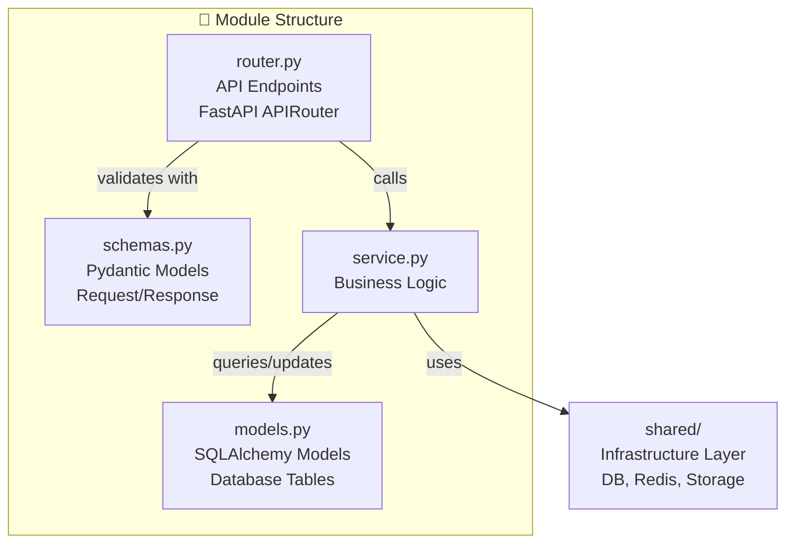

### خريطة APIs

#### 🔐 المصادقة — `/api/v1/auth`

| الطريقة | المسار | الوصف | الصلاحية |
|---------|--------|-------|----------|
| `POST` | `/register` | تسجيل مستخدم جديد (Client/Agent) | عام |
| `POST` | `/login` | تسجيل الدخول ← JWT tokens | عام |
| `POST` | `/refresh` | تحديث access token | عام + Refresh Token |
| `GET` | `/me` | الملف الشخصي الحالي | مصادق |
| `PATCH` | `/me` | تحديث الملف الشخصي | مصادق |
| `POST` | `/logout` | تسجيل الخروج (إبطال token) | مصادق |

#### 📥 طلبات العروض — `/api/v1/intake`

| الطريقة | المسار | الوصف | الصلاحية |
|---------|--------|-------|----------|
| `POST` | `/translate` | ترجمة عربي→صيني + استخراج كيانات | وكيل/مشرف |
| `POST` | `/rfqs` | إنشاء RFQ جديد | جميع |
| `GET` | `/rfqs` | قائمة RFQs (حسب الدور) | جميع |
| `GET` | `/rfqs/{id}` | تفاصيل RFQ | جميع (ملكية) |
| `PUT` | `/rfqs/{id}/status` | تحديث حالة RFQ | وكيل/مشرف |
| `POST` | `/rfqs/{id}/products` | إضافة منتج إلى RFQ | وكيل/مشرف |
| `GET` | `/rfqs/{id}/products` | قائمة منتجات RFQ | جميع |
| `POST` | `/rfqs/{id}/match` | تشغيل خوارزمية المطابقة | وكيل/مشرف |
| `GET` | `/rfqs/matched` | RFQs المتطابقة للمورد | وكيل |
| `GET` | `/rfqs/public` | RFQs العامة (انتهت النافذة) | جميع |
| `POST` | `/matches/{id}/claim` | الرد على مطابقة حصرية | وكيل |
| `POST` | `/rfqs/batch` | جلب RFQs متعددة دفعة واحدة | جميع |
| `POST` | `/rfqs/products/batch` | جلب منتجات RFQs دفعة واحدة | جميع |

#### 🏪 الكتالوج — `/api/v1/catalog`

| الطريقة | المسار | الوصف | الصلاحية |
|---------|--------|-------|----------|
| `GET` | `/products` | تصفح الكتالوج العام مع بحث وتصفية | عميل/وكيل/مشرف |
| `GET` | `/products/pending` | المنتجات المعلقة للمراجعة | وكيل/مشرف |
| `PATCH` | `/products/{id}/review` | مراجعة (قبول/رفض) منتج | وكيل/مشرف |
| `GET` | `/products/admin` | الكتالوج الكامل (مشرف) | مشرف |

#### 📄 المستندات — `/api/v1/documents`

| الطريقة | المسار | الوصف | الصلاحية |
|---------|--------|-------|----------|
| `POST` | `/upload` | رفع مستند إلى RFQ | وكيل/مشرف |
| `GET` | `/rfq/{rfq_id}` | قائمة مستندات RFQ | جميع |
| `GET` | `/{id}` | تفاصيل مستند | جميع |
| `DELETE` | `/{id}` | حذف مستند | وكيل/مشرف |
| `POST` | `/{id}/process` | تشغيل معالجة Vision | وكيل/مشرف |
| `GET` | `/{id}/status` | استعلام حالة المعالجة | جميع |
| `GET` | `/{id}/items` | العناصر المستخرجة | جميع |
| `PUT` | `/{id}/items` | تعديل العناصر المستخرجة | وكيل/مشرف |

#### 💰 التسعير — `/api/v1/pricing`

| الطريقة | المسار | الوصف | الصلاحية |
|---------|--------|-------|----------|
| `GET` | `/rules` | قائمة قواعد التسعير | وكيل/مشرف |
| `POST` | `/rules` | إنشاء قاعدة تسعير جديدة | مشرف |
| `GET` | `/rules/{id}` | تفاصيل قاعدة تسعير | وكيل/مشرف |
| `PUT` | `/rules/{id}` | تحديث قاعدة تسعير | مشرف |
| `DELETE` | `/rules/{id}` | حذف قاعدة تسعير | مشرف |
| `GET` | `/rules/{id}/history` | سجل تغييرات القاعدة | وكيل/مشرف |
| `GET` | `/hs-codes` | قائمة جداول HS Code | وكيل/مشرف |
| `POST` | `/hs-codes` | إنشاء جدول HS Code | مشرف |
| `PUT` | `/hs-codes/{code}` | تحديث جدول HS Code | مشرف |
| `DELETE` | `/hs-codes/{code}` | حذف جدول HS Code | مشرف |
| `POST` | `/calculate` | حساب التسعير الكامل | وكيل/مشرف |
| `POST` | `/estimate` | تقدير سريع (marketplace) | جميع |
| `POST` | `/exchange-rates/refresh` | تحديث أسعار الصرف | مشرف |

#### 📊 عروض الأسعار — `/api/v1/quotes`

| الطريقة | المسار | الوصف | الصلاحية |
|---------|--------|-------|----------|
| `POST` | `/` | إنشاء عرض سعر | وكيل/مشرف |
| `GET` | `/` | قائمة عروض الأسعار | جميع |
| `POST` | `/generate` | إنشاء عرض + PDF | وكيل/مشرف |
| `GET` | `/{id}` | تفاصيل عرض السعر | جميع |
| `PUT` | `/{id}/status` | تحديث حالة العرض | وكيل/مشرف |
| `POST` | `/{id}/pdf` | توليد PDF | وكيل/مشرف |
| `GET` | `/{id}/pdf` | تحميل PDF (رابط مؤقت) | جميع |
| `POST` | `/{id}/finalize` | إنهاء عرض السعر | وكيل/مشرف |
| `POST` | `/{id}/accept` | قبول عرض السعر (عميل) | عميل |
| `POST` | `/{id}/reject` | رفض عرض السعر (عميل) | عميل |
| `GET` | `/{id}/tracking` | حالة التتبع | جميع |
| `PUT` | `/{id}/tracking` | تحديث حالة التتبع | وكيل/مشرف |

#### 💬 الدردشة — `/api/v1/chat`

| الطريقة | المسار | الوصف | الصلاحية |
|---------|--------|-------|----------|
| `POST` | `/rooms` | إنشاء غرفة دردشة | عميل/مشرف |
| `GET` | `/rooms` | قائمة غرف المستخدم | جميع |
| `GET` | `/rooms/{id}` | تفاصيل الغرفة | عضو الغرفة |
| `GET` | `/rooms/{id}/messages` | رسائل الغرفة | عضو الغرفة |
| `POST` | `/rooms/{id}/messages` | إرسال رسالة (مع ترجمة) | عضو الغرفة |
| `GET` | `/rooms/{id}/stream` | بث SSE للرسائل الفورية | عضو الغرفة |

#### 🔔 الإشعارات — `/api/v1/notifications`

| الطريقة | المسار | الوصف | الصلاحية |
|---------|--------|-------|----------|
| `GET` | `/` | قائمة الإشعارات | جميع |
| `GET` | `/stream` | بث SSE للإشعارات | جميع |
| `POST` | `/{id}/read` | تعليم كمقروء | جميع |

#### 📈 المراقبة — `/api/v1/admin`

| الطريقة | المسار | الوصف | الصلاحية |
|---------|--------|-------|----------|
| `GET` | `/metrics` | مقاييس Prometheus | مشرف |
| `GET` | `/health` | فحص صحة النظام | عام |

#### 🔧 النظام — `/api/v1/system`

| الطريقة | المسار | الوصف |
|---------|--------|-------|
| `GET` | `/health` | فحص صحة جميع الخدمات (DB, Redis, MinIO, Celery, LLM) |
| `GET` | `/metrics` | مقاييس Prometheus |

---

## نظام التسعير

### خوارزمية التسعير (Landed Cost Algorithm)

نظام التسعير هو **محرك التسعير الأساسي** المكون من 10 خطوات لحساب التكلفة الكاملة للاستيراد:

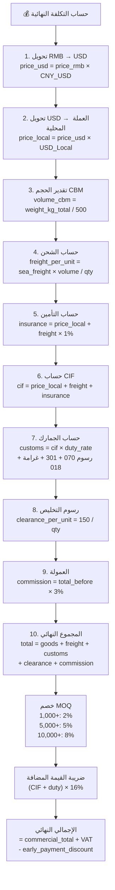

### قواعد التسعير الـ 16

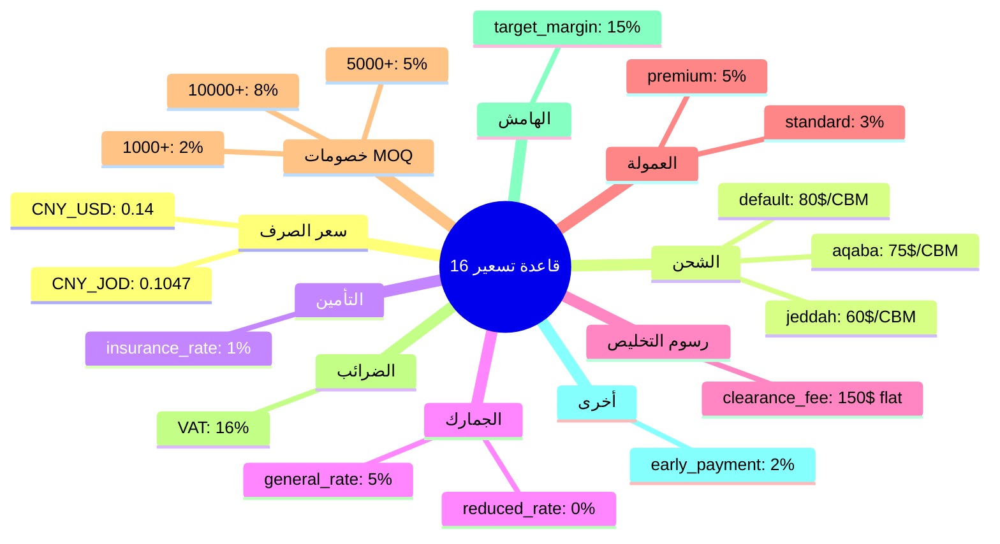

### هيكل الـ HS Code Fee Schedule

عند توفير كود النظام المنسق (HS Code) للمنتج، يستخدم المحرك جدول رسوم مكون من 5 بنود (محاكاة JCAP الحقيقية):

| الرمز | الحقل | الوصف |
|-------|-------|-------|
| 001 | `duty_rate_001` | الرسوم الجمركية (% على CIF) |
| 301 | `service_flat_fee_301` | رسوم خدمة ثابتة (دينار أردني) |
| 070 | `service_percent_070` | رسوم خدمة نسبية (% على CIF) |
| 018 | `penalty_rate_018` | غرامة استيراد شرطية (% على CIF) |
| 020 | `vat_rate_020` | نسبة ضريبة القيمة المضافة المخصصة للكود |

---

## نظام معالجة المستندات

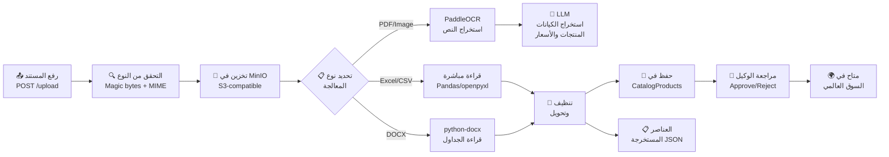

### أنواع المستندات المدعومة

| النوع | الامتدادات | طريقة المعالجة |
|-------|-------------|-----------------|
| PDF | `.pdf` | PaddleOCR → LLM Extraction |
| صور | `.jpg`, `.jpeg`, `.png`, `.gif` | PaddleOCR → LLM Extraction |
| Excel | `.xls`, `.xlsx` | Pandas/openpyxl → Direct Parsing |
| Word | `.docx` | python-docx → Table Extraction |
| CSV | `.csv` | Pandas → Direct Parsing |
| TSV | `.tsv` | Pandas → Direct Parsing |
| نص | `.txt` | LLM Extraction |

---

## نظام المطابقة الذكية

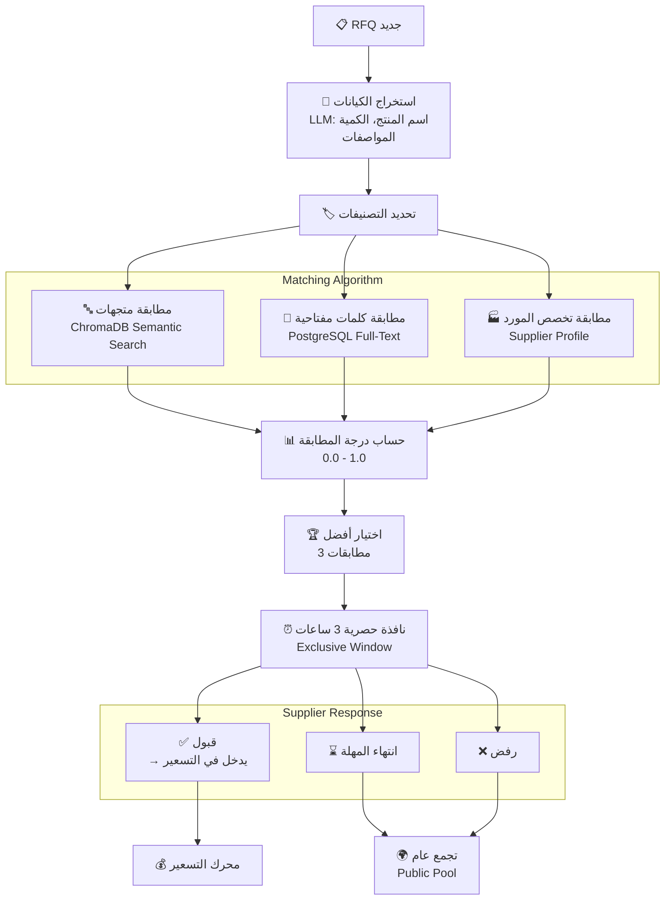

---

## نظام الدردشة والتفاوض

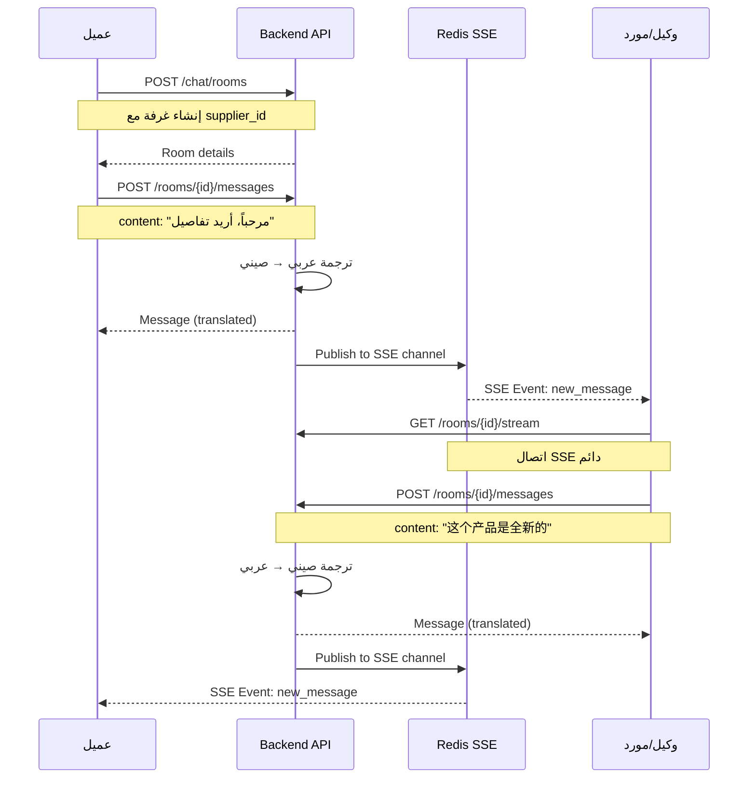

---

## تتبع الطلبات (Order Tracking)

عند قبول عرض السعر، ينتقل الطلب إلى مرحلة التتبع عبر **6 مراحل**:

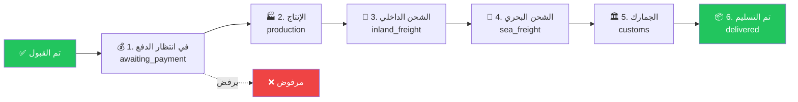

---

## الواجهة الأمامية

### هيكل التوجيه (3-tier RBAC)

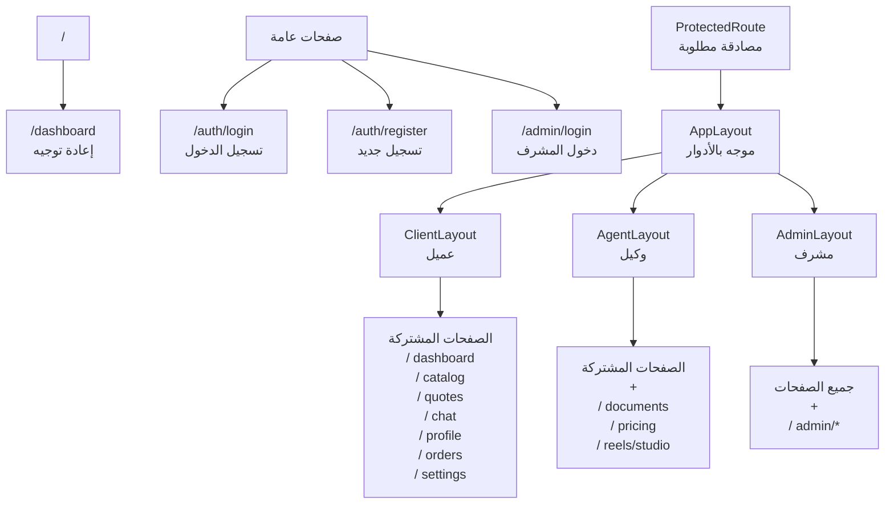

### تدفق البيانات (Data Flow)

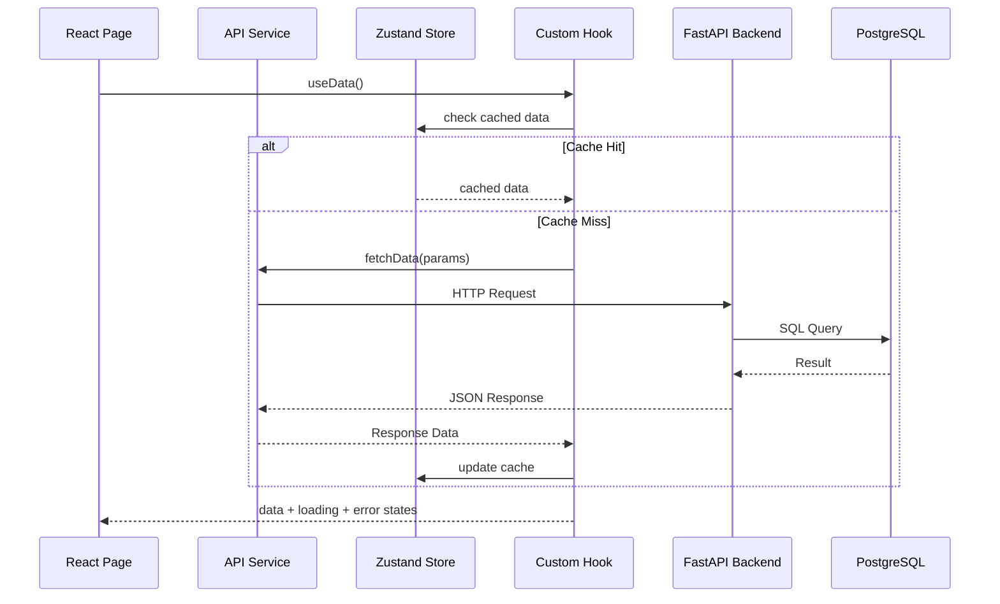

### التنقل المتجاوب (Responsive Navigation)

| الشاشة | التنقل |
|--------|--------|
| **Desktop** (≥1024px) | Sidebar ثابت + TopBar |
| **Tablet** (768-1023px) | Sidebar مطوي + TopBar |
| **Mobile** (<768px) | BottomNav + Drawer منزلق |

### دعم اللغات (i18n)

| اللغة | الكود | اتجاه الكتابة |
|-------|-------|---------------|
| العربية | `ar` | RTL |
| الإنجليزية | `en` | LTR |
| الصينية | `zh` | LTR |

---

## المصادقة والأمان

### تدفق JWT

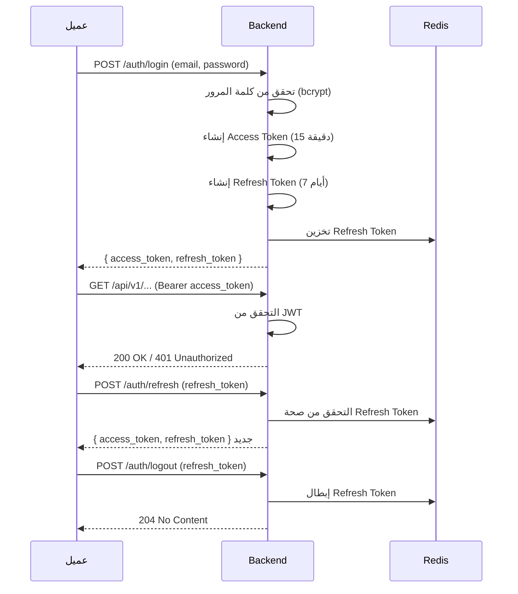

### نظام الصلاحيات (RBAC)

| الدور | الوصف | الصلاحيات |
|-------|-------|-----------|
| `admin` | مشرف النظام | جميع الصلاحيات، إدارة القواعد، مراجعة الكتالوج الكامل |
| `agent` | وكيل/مورد | إنشاء وإدارة RFQs، رفع مستندات، تسعير، إرسال عروض |
| `client` | عميل/مستورد | تقديم RFQs، عرض عروض الأسعار، قبول/رفض، دردشة |

### وسائط الأمان

| الوسيط (Middleware) | الوظيفة |
|---------------------|---------|
| `TrustedHostMiddleware` | تقييد المضيفين المسموحين |
| `CORSMiddleware` | سياسة المشاركة بين الأصول |
| `SecurityHeadersMiddleware` | إضافة headers أمنية (CSP, XSS, إلخ) |
| `RateLimitMiddleware` | تحديد معدل الطلبات (100/دقيقة عام) |
| `PrometheusMiddleware` | قياس الأداء |
| `AuditMiddleware` | تسجيل التدقيق |

---

## البنية التحتية

### بنية Docker Compose

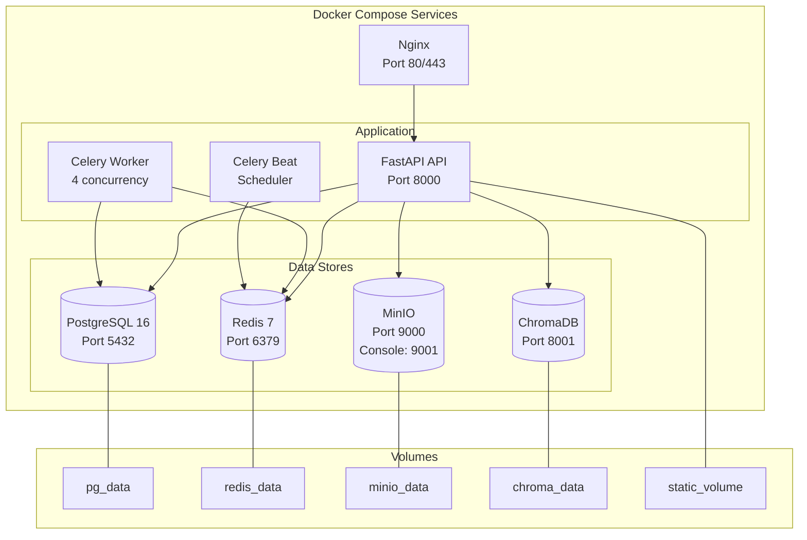

### متغيرات البيئة الأساسية

| المتغير | الوصف |
|---------|-------|
| `DB_PASSWORD` | كلمة مرور PostgreSQL |
| `REDIS_PASSWORD` | كلمة مرور Redis |
| `JWT_SECRET` | مفتاح JWT (32+ حرف) |
| `SENTRY_DSN` | رابط Sentry (اختياري) |
| `TOGETHER_API_KEY` | مفتاح Together AI |
| `OPENROUTER_API_KEY` | مفتاح OpenRouter |
| `DEEPSEEK_API_KEY` | مفتاح DeepSeek |
| `S3_ENDPOINT` | نقطة نهاية S3 (Supabase/Backblaze) |
| `S3_ACCESS_KEY` | مفتاح وصول S3 |
| `S3_SECRET_KEY` | المفتاح السري S3 |

### مراحل النشر

| البيئة | المنصة | Celery |
|--------|--------|--------|
| **تطوير** | Docker Compose محلي | مفعّل |
| **إنتاج** | Railway / VPS مع Docker | مفعّل |
| **HF Spaces** | Hugging Face Spaces (حاوية واحدة) | معطّل (معالجة inline) |

---

## خلاصة

**AI-Sourcing Hub** هو نظام متكامل لأتمتة التوريد مع:

- 🧩 **معمارية Modular Monolith** مع وحدات منفصلة وقابلة للتوسع
- 🔐 **نظام صلاحيات 3-tier** (عميل، وكيل، مشرف) مع عزل كامل للبيانات
- 💰 **محرك تسعير ذكي** بحساب التكلفة النهائية الكاملة (10 خطوات)
- 📄 **معالجة مستندات ذكية** مع OCR واستخراج منتجات بواسطة LLM
- 🔗 **مطابقة تلقائية** بين طلبات العملاء والموردين
- 💬 **دردشة مع ترجمة فورية** (عربي ↔ صيني)
- 📊 **تتبع طلبات** بست مراحل مع سجل أحداث كامل
- 🌐 **دعم 3 لغات** (عربي، إنجليزي، صيني)
- 🐳 **نشر بحاويات Docker** مع قابلية للتوسع

---

> 📝 **ملاحظة:** هذا التوثيق يغطي الإصدار 1.0.0 من المشروع. للمزيد من التفاصيل، راجع ملفات المصدر في المسارات المذكورة أعلاه.

</div>
