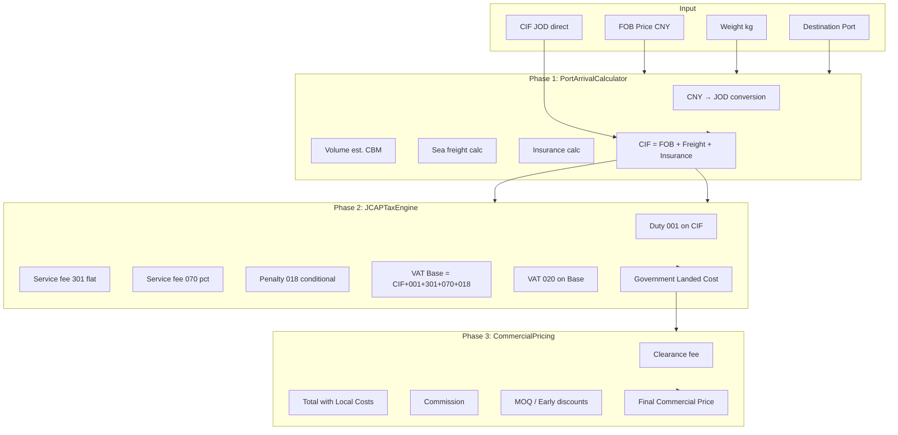

# JCAP/ASYCUDA Landed Cost Engine — Refactoring Plan

## Table of Contents

1. [Current State Analysis](#1-current-state-analysis)
2. [The 5 Bugs Identified](#2-the-5-bugs-identified)
3. [The 3-Phase Pipeline Design](#3-the-3-phase-pipeline-design)
4. [File-by-File Change List](#4-file-by-file-change-list)
5. [New Fields to Add](#5-new-fields-to-add)
6. [Frontend Changes Required](#6-frontend-changes-required)
7. [Test Strategy](#7-test-strategy)
8. [Verification Test Case Walkthrough](#8-verification-test-case-walkthrough)
9. [Migration Plan](#9-migration-plan)

---

## 1. Current State Analysis

### Architecture Overview

The current pricing engine lives in [`app/modules/pricing/engine.py`](app/modules/pricing/engine.py) as a monolithic `PricingEngine` class with two public methods:

- [`calculate_landed_cost()`](app/modules/pricing/engine.py:228) — Per-product calculation (RMB → USD → JOD, freight, insurance, CIF, duty, clearance, commission)
- [`calculate()`](app/modules/pricing/engine.py:455) — Multi-product aggregation (sums totals, computes VAT, applies discounts/custom rules)

### Data Flow

```
PriceProductInput (CNY price, weight, HS code)
       │
       ▼
PricingEngine.calculate()
       │
       ├──► calculate_landed_cost() per product
       │       ├── Step 1-2: CNY → USD → JOD (exchange rate chain)
       │       ├── Step 3-4: Volume estimation → sea freight
       │       ├── Step 5-6: Insurance → CIF
       │       ├── Step 7: Customs duty + HS code fees (001/070/301/018)
       │       ├── Step 8-9: Clearance + Commission
       │       └── Step 10: Total per unit
       │
       ├──► Aggregation (sums, VAT, 301 flat fee)
       ├──► MOQ discount
       ├──► Custom rules (percentage/fixed/formula)
       ├──► Early payment discount
       └──► Target margin check
```

### Current Data Model

| Table | Purpose | Key Fields |
|-------|---------|------------|
| [`pricing_rules`](app/modules/pricing/models.py:52) | 16 configurable rules (rates, fees) | `name`, `category`, `rule_type`, `value`, `formula` |
| [`hs_code_fee_schedules`](app/modules/pricing/models.py:98) | Per-HS-code JCAP fee lines | `hs_code`, `duty_rate_001`, `service_flat_fee_301`, `service_percent_070`, `penalty_rate_018`, `vat_rate_020` |
| [`quotation_line_items`](app/modules/pricing/models.py:127) | Persisted calculation results | `freight_cost`, `customs_duty`, `commission`, `subtotal`, `discount`, `total` |

### Key Observations

1. **No clean phase separation** — Government tax computation (duty, VAT, service fees) is interleaved with commercial pricing (commission, clearance, discounts) in a single linear algorithm.
2. **VAT computation is fragmented** — Per-line VAT base is computed inside the loop, but 301 flat-fee VAT is added outside with different rate logic.
3. **Commission base ambiguity** — Commission is computed on a partial base that excludes VAT and the 301 flat fee, diverging from JCAP's expected Total-with-Local-Costs base.
4. **Always assumes RMB source** — There's no path to accept CIF-in-JOD directly, which is what the JCAP system actually works with.
5. **Hard-coded flow** — The 10-step algorithm mixes government and commercial line items; there's no way to reorder or customize phases.

---

## 2. The 5 Bugs Identified

### Bug 1: 301 Flat Fee VAT Uses Global Rate Instead of Per-HS `vat_rate_020`

**Location:** [`app/modules/pricing/engine.py:569-570`](app/modules/pricing/engine.py:569)

```python
if vat_base_includes_fees and service_flat_301_total:
    vat_total += service_flat_301_total * global_vat_rate
```

**Problem:** The 301 flat service fee gets VAT applied at `global_vat_rate` (default 16%) instead of the per-HS code `vat_rate_020` (e.g., 4% from the test case). This overcharges VAT on the 301 fee when `vat_rate_020 < global_vat_rate`.

**Impact:** In the verification test case, 301 fee = 50 JOD, `vat_rate_020` = 4%, `global_vat_rate` = 16%.
- Current: `50 × 0.16 = 8 JOD` (wrong)
- Expected: `50 × 0.04 = 2 JOD` (correct)
- **Difference: +6 JOD overcharge**

**Root Cause:** The 301 fee is handled as a shipment-level surcharge *outside* the per-line VAT loop (line 552-561), and the global rate is hard-coded as the fallback rather than using each line item's HS-specific rate.

---

### Bug 2: Commission Computed on Wrong Base (Excludes VAT & 301)

**Location:** [`app/modules/pricing/engine.py:398-407`](app/modules/pricing/engine.py:398)

```python
total_before_commission = (
    price_local
    + freight_per_unit
    + customs_per_unit
    + clearance_per_unit
    + service_percent_per_unit
    + penalty_per_unit
)
commission_per_unit = total_before_commission * commission_pct
```

**Problem:** The commission base excludes both the 301 flat fee and more importantly VAT itself. In the JCAP-compliant 3-phase model, Phase 3 computes commission on "Total with Local Costs" (government landed cost + clearance), which *includes* VAT.

**Impact:** In the verification test case:
- Expected commission base: 1294 JOD (Govt Landed Cost 1144 + Clearance 150)
- Expected commission: `1294 × 0.03 = 38.82 JOD`
- Current engine computes commission pre-VAT and without 301 fee inclusion
- **Result: Commission is under-computed relative to the correct JCAP commercial model**

**Root Cause:** The monolithic algorithm doesn't separate government tax computation from commercial pricing, so the natural ordering (taxes first, then commercial markup) is inverted.

---

### Bug 3: Penalty 018 Logic Skips When `requires_license` is Missing/None

**Location:** [`app/modules/pricing/engine.py:374-375`](app/modules/pricing/engine.py:374)

```python
if hs_entry.get("requires_license") and not has_license:
    penalty_per_unit = cif_per_unit * (hs_entry["penalty_rate_018"] / 100.0)
```

**Problem:** If `hs_entry` exists but `requires_license` is `None` (not set, not `False`), the penalty is never computed — even if `penalty_rate_018 > 0`. In JCAP, 018 is a conditional import penalty that should apply when:
1. `penalty_rate_018 > 0` (importer hasn't provided the certificate)
2. `has_license = False`

The current code gates on `requires_license` being truthy, which means an unset flag (`None`) bypasses the penalty entirely.

**Impact:** If an HS code row has `requires_license = NULL` (not set) but `penalty_rate_018 = 2.5%`, no penalty is applied — even when the importer has no license.

**Root Cause:** The condition uses Python truthiness on a nullable boolean column. It should explicitly check `penalty_rate_018 > 0 AND NOT has_license`.

---

### Bug 4: `vat_base_includes_fees` Toggle Causes Inconsistent VAT Treatment

**Location:** [`app/modules/pricing/engine.py:495,552-570`](app/modules/pricing/engine.py:495)

```python
vat_base_includes_fees = self._get_rule_value("vat_base_includes_fees", 1.0) >= 0.5
```

```python
# Line 552-554: Per-line VAT base
base_line = (lc["cif_per_unit"] + lc["customs_per_unit"]) * product.quantity
if vat_base_includes_fees:
    base_line += line_item.service_percent_070 + line_item.penalty_018

# Line 569-570: 301 flat fee VAT (separate, uses global rate)
if vat_base_includes_fees and service_flat_301_total:
    vat_total += service_flat_301_total * global_vat_rate
```

**Problem:** The `vat_base_includes_fees` toggle controls whether 070/018/301 are included in the VAT base. However:
1. JCAP mandates that 070, 018, and 301 are ALL part of the VAT base — the toggle shouldn't exist as a configurable option.
2. The toggle only adds 070/018 to the *per-line* base, but handles 301 *separately* with the wrong rate.
3. If toggled OFF, the VAT base would be just CIF + duty, which is incomplete per JCAP rules.

**Impact:** An admin could accidentally turn this off (creating a rule named `vat_base_includes_fees` with value 0), producing an incorrect VAT computation that doesn't match JCAP's official formula.

---

### Bug 5: No Clean CIF Input Path — Always Assumes RMB → USD → JOD Chain

**Location:** [`app/modules/pricing/engine.py:291-324`](app/modules/pricing/engine.py:291)

```python
# Step 1: Convert RMB → USD
cny_to_usd = self._get_rule_value("exchange_rate_cny_usd", 0.14)
price_usd = price_rmb * cny_to_usd

# Step 2: Convert USD → JOD
cny_to_jod = self._get_rule_value("exchange_rate_cny_jod", 0.077)
usd_to_jod = cny_to_jod / cny_to_usd
price_local = price_usd * usd_to_jod
```

**Problem:** The engine always starts from a CNY price and converts through USD to get to JOD. This two-hop conversion introduces:
1. **Precision loss** — Rounding at each hop (4 decimal places in `price_usd`, then more in `price_local`).
2. **No direct CIF input** — JCAP works with CIF value at the destination port (already in JOD). The refactored engine needs to accept `cif_value_jod` directly.
3. **Exchange rate coupling** — If the exchange rate is stale, every cost downstream (duty, VAT, all fees) is off by the same factor, when really only the FOB→CIF conversion should be FX-sensitive.

**Impact:** Agents can't enter a known CIF value directly. They're forced through the full RMB → USD → JOD conversion even when the CIF is already known.

---

## 3. The 3-Phase Pipeline Design

### Overview

The refactored engine decomposes the monolithic algorithm into three sequential, independently-testable phases that mirror how JCAP/ASYCUDA actually processes imports:

```
┌─────────────────────────────────────────────────────────────────────┐
│                    PHASE 1: Port Arrival Cost                       │
│                                                                     │
│  Input:  FOB price (CNY or JOD), freight, insurance, weight        │
│  Output: CIF value per unit + total at destination port             │
│                                                                     │
│  • Accepts CIF directly OR computes it from FOB + freight + ins.   │
│  • Handles CNY → JOD conversion (single hop, no USD intermediary)  │
│  • Volume estimation (CBM) and sea freight calculation              │
└─────────────────────────────────────────────────────────────────────┘
                           │
                           ▼
┌─────────────────────────────────────────────────────────────────────┐
│              PHASE 2: JCAP Customs & Tax Engine                     │
│                                                                     │
│  Input:  CIF value, HS code fee schedule, license flag             │
│  Output: Government Landed Cost (دينار)                             │
│                                                                     │
│  001 ──► Duty on CIF (ad valorem, rate from HS schedule)            │
│  301 ──► Service flat fee (per shipment, fixed JOD)                 │
│  070 ──► Service percent fee (% of CIF)                             │
│  018 ──► Conditional penalty (% of CIF, if no license)              │
│  020 ──► VAT on (CIF + 001 + 301 + 070 + 018)                      │
│                                                                     │
│  Government Landed Cost = CIF + 001 + 301 + 070 + 018 + 020        │
└─────────────────────────────────────────────────────────────────────┘
                           │
                           ▼
┌─────────────────────────────────────────────────────────────────────┐
│           PHASE 3: Commercial Pricing & Customer Invoice            │
│                                                                     │
│  Input:  Government Landed Cost, commercial fees, discounts         │
│  Output: Final Commercial Price (سعر البيع النهائي)                 │
│                                                                     │
│  • Add clearance fee (private broker/port fee)                      │
│  • Apply commission rate (% of Total with Local Costs)              │
│  • Apply MOQ discounts                                              │
│  • Apply early payment discounts                                    │
│  • Apply custom pricing rules (percentage/fixed/formula)            │
│  • Check target margin                                              │
│                                                                     │
│  Final Price = (GovtLandedCost + Clearance) × (1 + Commission)     │
│              - Discounts + CustomFees                               │
└─────────────────────────────────────────────────────────────────────┘
```

### Phase 1 Detail: PortArrivalCalculator

```python
class PortArrivalResult:
    cif_per_unit: float        # CIF value per unit in JOD
    cif_total: float           # Total CIF for all units
    fob_per_unit: float        # FOB value per unit (for reference)
    freight_per_unit: float    # Freight cost per unit
    insurance_per_unit: float  # Insurance cost per unit
    volume_cbm: float          # Estimated volume
    exchange_rate_used: float  # CNY→JOD rate if converted
    rules_applied: list[str]
```

**Key behaviors:**
- If `cif_value_jod` is provided directly, use it (skip FOB/freight/insurance calculation)
- If only `price_cny` is given, compute FOB in JOD, then add freight + insurance
- Accept optional `freight_cost_jod` and `insurance_cost_jod` overrides
- Single-hop CNY→JOD conversion (no USD intermediary)

### Phase 2 Detail: JCAPTaxEngine

```python
class JCAPTaxResult:
    duty_001: float            # Customs duty on CIF
    service_flat_301: float    # Flat service fee (per shipment)
    service_percent_070: float # Percent service fee on CIF
    penalty_018: float         # Conditional import penalty
    vat_020: float             # VAT on (CIF + 001 + 301 + 070 + 018)
    vat_rate_used: float       # Actual VAT rate applied
    government_landed_cost: float  # Sum: CIF + 001 + 301 + 070 + 018 + 020
    hs_code_matched: bool
    rules_applied: list[str]
```

**Key behaviors:**
- Pure function of (CIF, hs_entry, has_license) — no currency conversion
- 301 is a single per-shipment fee (max across all line items if multiple HS codes)
- VAT base = CIF + duty_001 + service_flat_301 + service_percent_070 + penalty_018
- VAT rate = `hs_entry.vat_rate_020` if set, else global `vat_rate` default
- Penalty 018: applies when `penalty_rate_018 > 0 AND NOT has_license`
- No configurable toggle for VAT base inclusion — 070/018/301 are always included (JCAP mandate)

### Phase 3 Detail: CommercialPricingEngine

```python
class CommercialPricingResult:
    clearance_fee: float       # Private broker/port fee
    commission: float          # Agent/platform commission
    moq_discount: float        # MOQ-based discount
    early_payment_discount: float  # Early payment discount
    custom_fees: float         # Admin-created pricing rules
    total_with_local_costs: float   # GovtLandedCost + clearance
    final_commercial_price: float   # Final price after commission + discounts
    rules_applied: list[str]
```

**Key behaviors:**
- `total_with_local_costs = government_landed_cost + clearance_fee`
- `commission = total_with_local_costs × commission_rate`
- `final_price = total_with_local_costs + commission - discounts + custom_fees`
- MOQ discounts computed on Phase 2 output, not raw prices

### Pipeline Coordinator

```python
class LandedCostPipeline:
    def execute(self, input: PipelineInput) -> PipelineResult:
        phase1 = PortArrivalCalculator().calculate(input)
        phase2 = JCAPTaxEngine().calculate(phase1.cif, input.hs_entries, input.has_license)
        phase3 = CommercialPricingEngine().calculate(
            phase2.government_landed_cost, input.commercial_params
        )
        return PipelineResult(phase1, phase2, phase3)
```

---

## 4. File-by-File Change List

### Backend Files

#### 1. [`app/modules/pricing/engine.py`](app/modules/pricing/engine.py) — **Major Rewrite**

| Change | Description |
|--------|-------------|
| **Remove** `PricingEngine.calculate_landed_cost()` | Replace with 3-phase pipeline |
| **Remove** `PricingEngine.calculate()` | Functionality distributed across phases |
| **Remove** `PricingEngine._apply_custom_rules()` | Move to Phase 3 |
| **Remove** `PricingEngine._calculate_moq_discount()` | Move to Phase 3 |
| **Remove** `PricingEngine._early_payment_discount()` | Move to Phase 3 |
| **Remove** `PricingEngine._target_margin()` | Move to Phase 3 (optional check) |
| **Remove** `PricingEngine.DEFAULTS` static dict | Replace with phase-specific defaults |
| **Add** `PortArrivalCalculator` class | Phase 1 implementation |
| **Add** `JCAPTaxEngine` class | Phase 2 implementation |
| **Add** `CommercialPricingEngine` class | Phase 3 implementation |
| **Add** `LandedCostPipeline` class | Coordinator that chains phases |
| **Add** `PipelineInput` dataclass | Unified input for all phases |
| **Add** `PipelineResult` dataclass | Unified output with phase breakdowns |
| **Keep** `estimate_volume_cbm()` | Static helper, still useful in Phase 1 |
| **Keep** `LineItemInput` dataclass | Extended with `cif_value_jod` optional field |
| **Remove** `PricingContext` | Replaced by phase-specific contexts |
| **Remove** `CustomRule` | Moved to Phase 3 |
| **Update** `LineItemResult` | New fields for 3-phase breakdown |

#### 2. [`app/modules/pricing/models.py`](app/modules/pricing/models.py) — **Add Fields**

| Change | Description |
|--------|-------------|
| **Add** `HSCodeFeeSchedule.exemption_certificate_type` | String field for certificate type (e.g., "conformity", "origin") |
| **Add** `HSCodeFeeSchedule.is_vat_exempt` | Boolean for VAT-exempt goods |
| **Add** `HSCodeFeeSchedule.insurance_mandatory` | Boolean flag if insurance declaration is mandatory |
| **Add** `QuotationLineItem.cif_value_jod` | Float — CIF value in JOD for this line |
| **Add** `QuotationLineItem.govt_landed_cost` | Float — Phase 2 result |
| **Add** `QuotationLineItem.service_flat_301` | Float — already exists in engine result but not in DB model |
| **Add** `QuotationLineItem.service_percent_070` | Float — same as above |
| **Add** `QuotationLineItem.penalty_018` | Float — same as above |
| **Add** `QuotationLineItem.insurance_cost` | Float — already returned by engine but not persisted |
| **Add** `QuotationLineItem.vat_rate_used` | Float — the actual VAT rate applied (per-HS or global) |

#### 3. [`app/modules/pricing/schemas.py`](app/modules/pricing/schemas.py) — **New Response Schemas**

| Change | Description |
|--------|-------------|
| **Add** `Phase1Result` schema | CIF calculation breakdown |
| **Add** `Phase2Result` schema | JCAP tax breakdown |
| **Add** `Phase3Result` schema | Commercial pricing breakdown |
| **Update** `CalculatePriceResponse` | Add `.phases` field with all 3 phase results |
| **Update** `LineItemResult` | Add `cif_value_jod`, `govt_landed_cost`, `vat_rate_used` |
| **Update** `PriceProductInput` | Add `cif_value_jod` optional field for direct CIF input |
| **Update** `QuickEstimateResponse` | Add phase breakdown fields |
| **Add** `PipelineCalculateRequest` | New request schema that accepts CIF directly |

#### 4. [`app/modules/pricing/service.py`](app/modules/pricing/service.py) — **Update Orchestration**

| Change | Description |
|--------|-------------|
| **Update** `calculate_price()` | Wire up `LandedCostPipeline` instead of `PricingEngine` |
| **Update** `_load_rules_for_engine()` | Split into phase-specific rule loading |
| **Add** `_load_phase2_rules()` | Load HS-code fee schedules + global tax defaults |
| **Add** `_load_phase3_rules()` | Load commission, clearance, discount rules |
| **Keep** `_load_hs_code_schedule()` | Still needed for Phase 2 |

#### 5. [`app/modules/pricing/router.py`](app/modules/pricing/router.py) — **Add Endpoints**

| Change | Description |
|--------|-------------|
| **Add** `POST /calculate/pipeline` | New endpoint for 3-phase calculation with phase-by-phase results |
| **Keep** existing `POST /calculate` | Backward compatibility (map old format to new pipeline) |
| **Keep** existing `POST /estimate` | Backward compatibility |
| **Update** docs/summary strings | Reflect 3-phase JCAP compliance |

#### 6. [`app/modules/pricing/__init__.py`](app/modules/pricing/__init__.py) — **Update Exports**

| Change | Description |
|--------|-------------|
| **Add** exports for new classes | `LandedCostPipeline`, `PortArrivalCalculator`, `JCAPTaxEngine`, `CommercialPricingEngine` |

#### 7. [`app/modules/output/models.py`](app/modules/output/models.py) — **Add Summary Fields**

| Change | Description |
|--------|-------------|
| **Add** `Quotation.govt_landed_cost` | Float — sum of phase 2 across all lines |
| **Add** `Quotation.insurance_total` | Float — insurance total (was missing) |
| **Add** `Quotation.service_fees_total` | Float — sum of 301+070+018 |

#### 8. [`app/modules/output/schemas.py`](app/modules/output/schemas.py) — **Update Response**

| Change | Description |
|--------|-------------|
| **Update** `QuotationLineItemSchema` | Add `cif_value_jod`, `govt_landed_cost`, `service_flat_301`, `service_percent_070`, `penalty_018`, `insurance_cost`, `vat_rate_used` |
| **Update** `QuotationLineItemResponse` | Same new fields |
| **Update** `QuotationResponse` | Add `govt_landed_cost`, `insurance_total`, `service_fees_total` |
| **Update** `QuotationCreate` | Accept new breakdown fields |
| **Update** `QuotationGenerateRequest` | Accept new fields |

#### 9. [`app/modules/output/service.py`](app/modules/output/service.py) — **Update PDF/Template Data**

| Change | Description |
|--------|-------------|
| **Update** `create_quotation()` | Persist new breakdown fields |
| **Update** `generate_quotation_pdf()` | Pass 3-phase breakdown to PDF template |
| **Update** template data dict | Include government landed cost breakdown |

#### 10. New Migration: `017_add_3phase_pricing_fields.py`

See Section 5 for full field list.

#### 11. New Migration: `018_fix_penalty_018_logic.py`

Optional data migration to fix existing HS codes where `requires_license` is NULL but `penalty_rate_018 > 0`.

### Frontend Files

| File | Change |
|------|--------|
| [`frontend/src/types/pricing.ts`](frontend/src/types/pricing.ts) | Add `Phase1Result`, `Phase2Result`, `Phase3Result`, `PipelineResult` interfaces |
| [`frontend/src/pages/pricing/PricingResultCard.tsx`](frontend/src/pages/pricing/PricingResultCard.tsx) | Add phase-breakdown sections: "تكلفة الوصول", "الجمارك والضرائب", "التسعير التجاري" |
| [`frontend/src/pages/pricing/PricingDetailBreakdown.tsx`](frontend/src/pages/pricing/PricingDetailBreakdown.tsx) | Add per-phase columns to product table |
| [`frontend/src/pages/pricing/localPricingFallback.ts`](frontend/src/pages/pricing/localPricingFallback.ts) | Update fallback to match 3-phase structure |
| [`frontend/src/services/pricingService.ts`](frontend/src/services/pricingService.ts) | Add `calculatePipeline()` method for new endpoint |
| [`frontend/src/pages/pricing/usePricingCalculator.ts`](frontend/src/pages/pricing/usePricingCalculator.ts) | Wire new pipeline API, maintain backward compat |
| [`frontend/src/pages/rfq/QuoteBuilderPage.tsx`](frontend/src/pages/rfq/QuoteBuilderPage.tsx) | Use new pipeline fields for cost breakdown display |
| [`frontend/src/pages/rfq/RFQEstimatePreview.tsx`](frontend/src/pages/rfq/RFQEstimatePreview.tsx) | Update to show 3-phase estimate |

---

## 5. New Fields to Add

### Database Migration Fields

| Table | Field | Type | Default | Description |
|-------|-------|------|---------|-------------|
| `hs_code_fee_schedules` | `exemption_certificate_type` | `String(50)` | `NULL` | Type of certificate required (e.g., "conformity", "origin") |
| `hs_code_fee_schedules` | `is_vat_exempt` | `Boolean` | `false` | Whether goods under this HS code are VAT-exempt |
| `hs_code_fee_schedules` | `insurance_mandatory` | `Boolean` | `false` | Whether insurance declaration is mandatory for this HS code |
| `quotation_line_items` | `cif_value_jod` | `Float` | `0.0` | CIF value in JOD for this line |
| `quotation_line_items` | `govt_landed_cost` | `Float` | `0.0` | Phase 2: government landed cost subtotal |
| `quotation_line_items` | `insurance_cost` | `Float` | `0.0` | Insurance cost (returned by engine but not persisted) |
| `quotation_line_items` | `service_flat_301` | `Float` | `0.0` | Service flat fee 301 (per-shipment, stored on first line) |
| `quotation_line_items` | `service_percent_070` | `Float` | `0.0` | Service percent fee 070 |
| `quotation_line_items` | `penalty_018` | `Float` | `0.0` | Conditional import penalty 018 |
| `quotation_line_items` | `vat_rate_used` | `Float` | `NULL` | Actual VAT rate applied (per-HS or global) |
| `quotations` | `govt_landed_cost` | `Float` | `0.0` | Sum of Phase 2 across all lines |
| `quotations` | `insurance_total` | `Float` | `0.0` | Sum of insurance across all lines |
| `quotations` | `service_fees_total` | `Float` | `0.0` | Sum of 301+070+018 across all lines |

### API Schema Fields

| Schema | New Fields | Description |
|--------|-----------|-------------|
| `PriceProductInput` | `cif_value_jod: Optional[float]` | Direct CIF input (bypasses Phase 1) |
| `PriceProductInput` | `freight_cost_jod: Optional[float]` | Freight override (if known) |
| `PriceProductInput` | `insurance_cost_jod: Optional[float]` | Insurance override (if known) |
| `CalculatePriceResponse` | `phases: PhaseBreakdown` | Complete 3-phase breakdown |
| `LineItemResult` | `cif_value_jod`, `govt_landed_cost`, `vat_rate_used` | Per-line phase results |
| New: `PhaseBreakdown` | `port_arrival: Phase1Result` | Phase 1 output |
| New: `PhaseBreakdown` | `customs_tax: Phase2Result` | Phase 2 output |
| New: `PhaseBreakdown` | `commercial: Phase3Result` | Phase 3 output |

---

## 6. Frontend Changes Required

### New Display Sections

The [`PricingResultCard`](frontend/src/pages/pricing/PricingResultCard.tsx) needs to be reorganized into three visual sections:

```
┌─────────────────────────────────────────────┐
│  التكلفة الواصلة المتوقعة (Estimated Landed) │
│                                             │
│  ┌─ المرحلة 1: تكلفة الوصول (Port Arrival) ┐│
│  │  سعر FOB                    xxx JOD     ││
│  │  + الشحن الدولي              xxx JOD     ││
│  │  + التأمين                   xxx JOD     ││
│  │  = CIF                       xxx JOD     ││
│  └──────────────────────────────────────────┘│
│                                             │
│  ┌─ المرحلة 2: الجمارك والضرائب (JCAP)    ┐│
│  │  رسم جمركي 001              xxx JOD     ││
│  │  بدل خدمات 301              xxx JOD     ││
│  │  رسم خدمات 070              xxx JOD     ││
│  │  غرامة استيراد 018          xxx JOD     ││
│  │  ضريبة مبيعات 020           xxx JOD     ││
│  │  = التكلفة الحكومية          xxx JOD     ││
│  └──────────────────────────────────────────┘│
│                                             │
│  ┌─ المرحلة 3: التسعير التجاري            ┐│
│  │  رسوم التخليص               xxx JOD     ││
│  │  عمولة المندوب              xxx JOD     ││
│  │  الخصومات                   -xxx JOD     ││
│  │  = السعر النهائي             xxx JOD     ││
│  └──────────────────────────────────────────┘│
└─────────────────────────────────────────────┘
```

### Component Changes Summary

| Component | Change |
|-----------|--------|
| [`PricingResultCard`](frontend/src/pages/pricing/PricingResultCard.tsx) | Split into 3 collapsible phase sections, add new formatting |
| [`PricingDetailBreakdown`](frontend/src/pages/pricing/PricingDetailBreakdown.tsx) | Add columns for CIF value, govt landed cost per product |
| [`PricingCalcPageDesktop`](frontend/src/pages/pricing/PricingCalcPageDesktop.tsx) | Widen result card, add phase tabs |
| [`PricingCalcPageMobile`](frontend/src/pages/pricing/PricingCalcPageMobile.tsx) | Phase sections stack vertically |
| [`localPricingFallback`](frontend/src/pages/pricing/localPricingFallback.ts) | Update to approximate 3-phase structure |
| [`usePricingCalculator`](frontend/src/pages/pricing/usePricingCalculator.ts) | Call new pipeline endpoint, handle backward compat |

---

## 7. Test Strategy

### Unit Tests

#### Phase 1: PortArrivalCalculator

| Test Case | Input | Expected Output |
|-----------|-------|-----------------|
| Direct CIF input | `cif_value_jod=1000` | `cif_per_unit=1000`, no conversion |
| CNY → JOD conversion | `price_cny=7500, exchange=0.1047` | `fob_jod=785.25` |
| Freight from weight | `weight_kg=2, qty=500` | Correct CBM → freight calculation |
| Insurance override | `insurance_cost_jod=50` | Insurance = 50, not computed |
| Zero weight fallback | `weight_kg=0, qty=1` | `volume_cbm=0.1` (minimum) |

#### Phase 2: JCAPTaxEngine

| Test Case | Input | Expected Output |
|-----------|-------|-----------------|
| Basic duty + VAT | `cif=1000, duty=5%, vat=16%` | duty=50, vat=168, govt_cost=1218 |
| With 301 flat fee | `cif=1000, duty=5%, 301=50` | duty=50, 301=50, vat_base=1100, vat=176 |
| With 070 percent fee | `cif=1000, 070=2%` | 070=20, vat_base=1020 |
| Penalty (no license) | `cif=1000, pen=2.5%, lic=false` | penalty=25, vat_base=1025 |
| No penalty (has license) | `cif=1000, pen=2.5%, lic=true` | penalty=0, vat_base=1000 |
| Per-HS vat_rate_020 | `cif=1000, vat_020=4%` | vat=40 (not 160) |
| Multiple HS codes | 2 products, different rates | Correct aggregation, 301 charged once |
| **Verification test** | See Section 8 | Full expected output |

#### Phase 3: CommercialPricingEngine

| Test Case | Input | Expected Output |
|-----------|-------|-----------------|
| Basic commission | `govt_cost=1144, clearance=150, comm=3%` | total=1294, comm=38.82, final=1332.82 |
| MOQ discount ≥1000 | `qty=1000` | 2% discount |
| MOQ discount ≥5000 | `qty=5000` | 5% discount |
| Custom rule (fixed) | `fixed_fee=25` | custom_fees=25 |
| Custom rule (percentage) | `pct=1%` | custom_fees=12.94 (1% of 1294) |
| Early payment discount | `early=2%` | discount=25.88 |

### Integration Tests

| Test | Description |
|------|-------------|
| `POST /pricing/calculate` | Full pipeline returns correct phase breakdown |
| `POST /pricing/estimate` | Quick estimate uses same pipeline |
| Backward compatibility | Old request format maps to pipeline correctly |
| `POST /quotes/generate` | Quotation persists all new phase fields |

### Verification Test Case

See Section 8 for the complete walkthrough.

---

## 8. Verification Test Case Walkthrough

### Input Parameters

| Parameter | Value | Notes |
|-----------|-------|-------|
| `price_cif_jod` | 1000 | Direct CIF input (Phase 1 bypass) |
| `duty_rate_001` | 0.05 | 5% ad valorem on CIF |
| `service_flat_fee_301` | 50 | Flat JOD, per shipment |
| `service_percent_070` | 0 | No percentage service fee |
| `penalty_rate_018` | 0.025 | 2.5% conditional penalty |
| `vat_rate_020` | 0.04 | 4% VAT (not the global 16%) |
| `has_license` | true | Has required license → no penalty |
| `clearance_fee_jod` | 150 | Private broker fee |
| `commission_rate` | 0.03 | 3% agent commission |
| `moq_discount` | 0 | No MOQ discount |

### Expected Pipeline Execution

```
PHASE 1: Port Arrival Cost
  CIF provided directly → 1000 JOD (skip FOB/freight/insurance calc)
  ─────────────────────────────────────────────
  Result: CIF = 1000 JOD

PHASE 2: JCAP Customs & Tax
  Duty 001:       1000 × 0.05      =   50 JOD
  Fee 301:        (flat)           =   50 JOD  
  Fee 070:        1000 × 0         =    0 JOD
  Penalty 018:    0 (has_license)  =    0 JOD
  VAT Base:       1000 + 50 + 50 + 0 + 0 = 1100 JOD
  VAT 020:        1100 × 0.04      =   44 JOD
  ─────────────────────────────────────────────
  Government Landed Cost = 1000 + 50 + 50 + 0 + 0 + 44 = 1144 JOD ✓

PHASE 3: Commercial Pricing
  Govt Landed Cost:                1144 JOD
  + Clearance Fee:                  150 JOD
  = Total with Local Costs:       1294 JOD
  Commission:     1294 × 0.03     =   38.82 JOD
  MOQ Discount:   0                =    0 JOD
  ─────────────────────────────────────────────
  Final Commercial Price: 1294 + 38.82 = 1332.82 JOD ✓
```

### Summary Assertions

| Metric | Expected | Current Engine | Fixed Engine |
|--------|----------|----------------|--------------|
| Duty (001) | 50 JOD | 50 JOD | 50 JOD |
| Fee (301) | 50 JOD | 50 JOD | 50 JOD |
| Penalty (018) | 0 JOD | 0 JOD | 0 JOD |
| VAT Base | 1100 JOD | 1050 JOD *(301 excluded from per-line base)* | 1100 JOD |
| VAT (020) | 44 JOD | ~50 JOD *(301 taxed at 16% not 4%)* | 44 JOD |
| Govt Landed Cost | 1144 JOD | N/A *(not computed as separate metric)* | 1144 JOD |
| Total w/ Local Costs | 1294 JOD | N/A | 1294 JOD |
| Commission | 38.82 JOD | *(wrong base)* | 38.82 JOD |
| Final Price | 1332.82 JOD | *(wrong)* | 1332.82 JOD |

---

## 9. Migration Plan

### Phase A: Extract Phase Separation (Backend)

1. Add new migration `017_add_3phase_pricing_fields.py`
2. Create [`JCAPTaxEngine`](app/modules/pricing/engine.py) class (Phase 2) — pure function, no currency conversion
3. Create [`PortArrivalCalculator`](app/modules/pricing/engine.py) class (Phase 1) — currency conversion + CIF computation
4. Create [`CommercialPricingEngine`](app/modules/pricing/engine.py) class (Phase 3)
5. Create [`LandedCostPipeline`](app/modules/pricing/engine.py) coordinator
6. Update [`service.py`](app/modules/pricing/service.py) to wire pipeline
7. Update [`schemas.py`](app/modules/pricing/schemas.py) with new response shapes
8. Update [`models.py`](app/modules/pricing/models.py) with new columns
9. Add new pipeline endpoint to [`router.py`](app/modules/pricing/router.py)

### Phase B: Backward Compatibility Layer

1. Keep old `POST /pricing/calculate` working — map old `PriceProductInput` → pipeline input
2. Keep old `POST /pricing/estimate` working — same mapping
3. Add deprecation notice to old endpoint docs

### Phase C: Frontend

1. Update [`types/pricing.ts`](frontend/src/types/pricing.ts) with new interfaces
2. Update [`PricingResultCard.tsx`](frontend/src/pages/pricing/PricingResultCard.tsx) with 3-phase display
3. Update [`PricingDetailBreakdown.tsx`](frontend/src/pages/pricing/PricingDetailBreakdown.tsx)
4. Update [`usePricingCalculator.ts`](frontend/src/pages/pricing/usePricingCalculator.ts)
5. Update [`localPricingFallback.ts`](frontend/src/pages/pricing/localPricingFallback.ts)
6. Update [`QuoteBuilderPage.tsx`](frontend/src/pages/rfq/QuoteBuilderPage.tsx)

### Phase D: Testing

1. Write unit tests for each phase in isolation
2. Write integration test for full pipeline
3. Write backward compatibility tests
4. Verify test case passes exactly

### Mermaid Migration Timeline

```mermaid
gantt
    title JCAP Pricing Refactor Timeline
    dateFormat  YYYY-MM-DD
    section Phase A - Backend Core
    Migration 017                   :a1, 1d
    JCAPTaxEngine (Phase 2)         :a2, 2d
    PortArrivalCalc (Phase 1)       :a3, 1d
    CommercialPricing (Phase 3)     :a4, 1d
    Pipeline + Service wiring       :a5, 1d
    section Phase B - Compat
    Backward compat layer           :b1, 1d
    section Phase C - Frontend
    TypeScript types                :c1, 1d
    ResultCard 3-phase display      :c2, 2d
    Calculator wiring               :c3, 1d
    section Phase D - Testing
    Unit tests (all 3 phases)       :d1, 2d
    Integration + verification      :d2, 1d
```

---

## Appendix: Data Flow Diagram



---

## Appendix: Key Design Decisions

1. **Why three separate classes instead of keeping one monolithic engine?**
   - Each phase maps to a distinct business domain (logistics, government tax, commercial pricing)
   - Independent testing and validation per phase
   - Clear separation of concerns — changes to JCAP tax rules don't affect commercial pricing logic
   - Each phase can be developed, deployed, and versioned independently

2. **Why remove `vat_base_includes_fees` toggle?**
   - JCAP mandates that 070, 018, and 301 are part of the VAT base
   - A configurable toggle creates risk of incorrect tax computation
   - If exemption is needed, it should be handled via `is_vat_exempt` on the HS code record

3. **Why accept CIF directly in Phase 1?**
   - JCAP/ASYCUDA processes declarations based on CIF value at destination
   - Agents often know the CIF value directly from the supplier's invoice
   - Avoids unnecessary double conversion (RMB → USD → JOD) when CIF is already known

4. **Backward compatibility strategy:**
   - Old endpoint still works, maps to pipeline internally
   - Old `PriceProductInput` (with `unit_price_cny`) triggers Phase 1 conversion
   - New `cif_value_jod` field on `PriceProductInput` bypasses Phase 1
   - Response includes new phase fields in addition to all old fields
