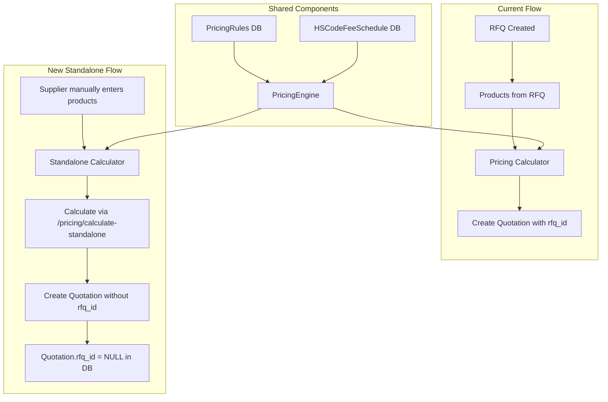

# 🔬 Standalone Calculator & Ad-Hoc Quotation — Constraint Analysis

> **Goal**: Enable suppliers/agents to send a quotation even when the product is NOT in their catalog, OR to have a standalone pricing calculator that works without any RFQ context — only depending on Pricing Rules and HS Code database.

---

## 1. Current Constraints (What Blocks Standalone Usage)

### 1.1 `Quotation` Model — RFQ Dependency

| Constraint | File | Line | Details |
|---|---|---|---|
| **`rfq_id` NOT NULL** | [`app/modules/output/models.py`](../app/modules/output/models.py:53) | 53-55 | `ForeignKey("rfqs.id"), nullable=False` — every quotation MUST link to an RFQ |
| **`agent_id` NOT NULL** | [`app/modules/output/models.py`](../app/modules/output/models.py:56) | 56-58 | `ForeignKey("users.id"), nullable=False` — always required (ok for standalone) |
| **`QuotationCreate.rfq_id` required** | [`app/modules/output/schemas.py`](../app/modules/output/schemas.py:53) | 53 | `rfq_id: str` — no default, no `Optional` |

### 1.2 `QuotationLineItem` Model — Already Partially Flexible

| Constraint | File | Line | Details |
|---|---|---|---|
| **`product_id` nullable** ✅ | [`app/modules/pricing/models.py`](../app/modules/pricing/models.py:151) | 151-153 | `nullable=True` — ALREADY supports ad-hoc products (migration 013) |
| **`catalog_product_id` nullable** ✅ | [`app/modules/pricing/models.py`](../app/modules/pricing/models.py:154) | 154-157 | `nullable=True` — ALREADY supports non-catalog products |
| **`quotation_id` NOT NULL** 🔒 | [`app/modules/pricing/models.py`](../app/modules/pricing/models.py:148) | 148-150 | Must link to a quotation — expected, no change needed |

### 1.3 `create_quotation()` Service — Hard RFQ Lookup

- [`app/modules/output/service.py`](../app/modules/output/service.py:112-121): Lines 112-121 perform a **hard `SELECT ... WHERE RFQ.id = ...`** and raise `NotFoundException` if the RFQ doesn't exist.
- This means you **cannot** create a quotation without a valid, pre-existing RFQ record in the database.

```python
# Line 112-121 — this blocks standalone quotation creation entirely
result = await db.execute(
    select(RFQ).where(RFQ.id == uuid.UUID(data.rfq_id))
)
rfq = result.scalar_one_or_none()
if not rfq:
    raise NotFoundException(resource="RFQ", resource_id=data.rfq_id)
```

### 1.4 Pricing Engine — Surprisingly Standalone-Ready ✅

The [`PricingEngine`](../app/modules/pricing/engine.py) is **already capable of ad-hoc calculation**:

- [`calculate()`](../app/modules/pricing/engine.py:463) takes `rfq_id` as a parameter but **only uses it as a label** in `PricingContext` and the response dict — it never queries the database for RFQ data.
- [`calculate_landed_cost()`](../app/modules/pricing/engine.py:253) is a **pure function** operating on: `price_rmb`, `weight_kg`, `quantity`, `destination_port`, `currency`, `hs_entry` — all ad-hoc values.
- [`LineItemInput`](../app/modules/pricing/engine.py:100) dataclass has `product_id: str` but it's just a string label — no real DB product needed.

**Proof**: The existing [`QuickEstimateRequest`](../app/modules/pricing/schemas.py:303) endpoint at `POST /pricing/estimate` already creates a fake `CalculatePriceRequest` with `rfq_id="estimate"` and `product_id="estimate"` and runs the engine successfully ([`app/modules/pricing/router.py`](../app/modules/pricing/router.py:286-302)).

### 1.5 `CalculatePriceRequest` Schema — RFQ Required

| Field | File | Line | Required? |
|---|---|---|---|
| `rfq_id` | [`app/modules/pricing/schemas.py`](../app/modules/pricing/schemas.py:213) | 213 | **Yes** — `rfq_id: str` |
| `products[].product_id` | [`app/modules/pricing/schemas.py`](../app/modules/pricing/schemas.py:184) | 184 | **Yes** — `product_id: str` |

The [`PriceProductInput`](../app/modules/pricing/schemas.py:181) requires `product_id` and `name` — but these are just labels in the engine, so they could be any arbitrary string.

### 1.6 Database Foreign Key Constraints

From initial migration [`001_initial_schema.py`](../alembic/versions/001_initial_schema.py:192-210):

```python
# quotation_line_items table (line 193-210)
sa.Column("product_id", postgresql.UUID(as_uuid=True), 
          sa.ForeignKey("products.id", ondelete="CASCADE"), nullable=False),  # ORIGINALLY NOT NULL
```

**Later migration [`013_make_quotation_line_item_product_nullable.py`](../alembic/versions/013_make_quotation_line_item_product_nullable.py) already made `product_id` nullable.** So the DB schema is already partially ready.

### 1.7 Frontend — Fully RFQ-Tied

| Component | File | Constraint |
|---|---|---|
| `usePricingCalculator` | [`frontend/src/pages/pricing/usePricingCalculator.ts`](../frontend/src/pages/pricing/usePricingCalculator.ts:38) | Requires `selectedRfqId` — user must pick an RFQ first |
| `buildProductsPayload()` | [`frontend/src/pages/pricing/usePricingCalculator.ts`](../frontend/src/pages/pricing/usePricingCalculator.ts:90) | Maps from `products` (fetched from RFQ) to payload — requires RFQ context |
| `createQuoteMutation` | [`frontend/src/pages/pricing/usePricingCalculator.ts`](../frontend/src/pages/pricing/usePricingCalculator.ts:158) | Passes `result.rfq_id` to `quotationService.create()` |
| Route | [`frontend/src/router/routeFactories.tsx`](../frontend/src/router/routeFactories.tsx:200) | `/agent/calculator` — only agents/admins, no standalone variant |
| `QuotationCreate` type | [`frontend/src/types/quotes.ts`](../frontend/src/types/quotes.ts:18) | `rfq_id: string` required |
| `CalculatePriceRequest` type | [`frontend/src/types/pricing.ts`](../frontend/src/types/pricing.ts:88) | `rfq_id: string` required |

---

## 2. Required Changes

### 2.1 Backend: Models

| File | Change | Impact |
|---|---|---|
| [`app/modules/output/models.py`](../app/modules/output/models.py:53) | Make `Quotation.rfq_id` **nullable** (`nullable=True`) | Allows quotations without an RFQ |
| New alembic migration | Alter `quotations.rfq_id` column to nullable | DB schema migration |

### 2.2 Backend: Schemas

| File | Change | Impact |
|---|---|---|
| [`app/modules/output/schemas.py`](../app/modules/output/schemas.py:53) | Make `QuotationCreate.rfq_id` **optional** (`Optional[str] = None`) | API accepts standalone quotes |
| [`app/modules/pricing/schemas.py`](../app/modules/pricing/schemas.py:213) | Make `CalculatePriceRequest.rfq_id` **optional** (`Optional[str] = None`) | API pricing without RFQ |
| [`app/modules/pricing/schemas.py`](../app/modules/pricing/schemas.py:184) | Make `PriceProductInput.product_id` **optional** (`Optional[str] = None`) | Allows ad-hoc products without real product IDs |
| Or: create new `StandaloneCalculateRequest` schema | Dedicated schema with no RFQ / product_id requirement | Cleaner separation |

### 2.3 Backend: Service Layer

| File | Change | Details |
|---|---|---|
| [`app/modules/output/service.py`](../app/modules/output/service.py:112-121) | Make RFQ lookup conditional | Only verify RFQ if `data.rfq_id` is provided |
| [`app/modules/output/service.py`](../app/modules/output/service.py:126) | Make `quotation.rfq_id` assignment conditional | Only set `rfq_id` if provided |
| [`app/modules/pricing/service.py`](../app/modules/pricing/service.py:476) | Make `calculate_price` accept optional `rfq_id` | Generate placeholder if not provided |
| [`app/modules/pricing/service.py`](../app/modules/pricing/service.py:514) | Handle optional `product_id` in loop | Generate UUID placeholder if not provided |

### 2.4 Backend: Router (New Endpoint)

Create a new endpoint `POST /api/v1/pricing/calculate-standalone` (or modify the existing `/calculate` to accept optional `rfq_id`):

```python
# In app/modules/pricing/router.py, add:
class StandaloneCalculateRequest(BaseModel):
    """Calculate pricing without any RFQ context."""
    products: list[StandaloneProductInput]  # no rfq_id or product_id required
    target_currency: str = "JOD"
    destination_port: str
    has_license: bool = False
    volume_cbm: Optional[float] = None

class StandaloneProductInput(BaseModel):
    """A product for standalone pricing — no RFQ, no catalog link needed."""
    name: str  # required
    quantity: int = Field(ge=1)
    unit_price_cny: float = Field(ge=0)
    weight_kg: float = 0.0
    hs_code: Optional[str] = None
    has_license: bool = False
    volume_cbm: Optional[float] = None
    # No product_id — the service will generate a placeholder
```

Also create `POST /api/v1/quotes/create-standalone` for direct quotation creation:

```python
# In app/modules/output/router.py, add:
class StandaloneQuotationCreate(BaseModel):
    """Create a quotation without an RFQ — supplier sends unsolicited quote."""
    target_currency: str = "JOD"
    exchange_rate_used: float
    line_items: list[StandaloneQuotationLineItem]
    # ... same totals as QuotationCreate but without rfq_id
```

### 2.5 Frontend: New Route

| File | Change |
|---|---|
| [`frontend/src/router/routeFactories.tsx`](../frontend/src/router/routeFactories.tsx) | Add `ROUTES.PRICING.STANDALONE_CALCULATOR` route |
| [`frontend/src/constants/routes.ts`](../frontend/src/constants/routes.ts) | Add `STANDALONE_CALCULATOR: "/agent/standalone-calculator"` |

### 2.6 Frontend: New Hook and Page

Create a **standalone variant** of the pricing calculator:

- `frontend/src/pages/pricing/useStandaloneCalculator.ts` — similar to `usePricingCalculator.ts` but:
  - No `selectedRfqId` state
  - No RFQ fetching/autoselection
  - User manually adds products (name, quantity, unit price, weight, HS code)
  - Calls a new `POST /pricing/calculate-standalone` or modifies the call to pass no `rfq_id`
- `frontend/src/pages/pricing/StandaloneCalcPage.tsx` — new page component
- Integration with `createQuoteMutation` that calls `POST /quotes/create-standalone`

### 2.7 Frontend: Updated Types

| File | Change |
|---|---|
| [`frontend/src/types/pricing.ts`](../frontend/src/types/pricing.ts) | Add `StandaloneProductInput` and `StandaloneCalculateRequest` types |
| [`frontend/src/types/quotes.ts`](../frontend/src/types/quotes.ts) | Make `rfq_id` optional in `QuotationCreate`; add `StandaloneQuotationCreate` type |
| [`frontend/src/services/pricingService.ts`](../frontend/src/services/pricingService.ts) | Add `calculateStandalone()` method |
| [`frontend/src/services/quotationService.ts`](../frontend/src/services/quotationService.ts) | Add `createStandalone()` method |

---

## 3. Frontend Changes — Detailed

### 3.1 New Route

Add to [`frontend/src/router/routeFactories.tsx`](../frontend/src/router/routeFactories.tsx):

```tsx
{
  path: ROUTES.PRICING.STANDALONE_CALCULATOR,
  element: (
    <RoleGuard roles={["agent", "admin"]} redirectTo={ROUTES.DASHBOARD}>
      <StandaloneCalcPage />
    </RoleGuard>
  ),
},
```

Add to [`frontend/src/constants/routes.ts`](../frontend/src/constants/routes.ts):

```ts
PRICING: {
  RULES: "/pricing/rules",
  CALCULATE: "/agent/calculator",
  STANDALONE_CALCULATOR: "/agent/standalone-calculator",  // NEW
},
```

### 3.2 New Hook: `useStandaloneCalculator.ts`

The hook should:
1. **Not fetch any RFQ or products** — user provides product data directly
2. Allow **dynamic product rows** — user can add/remove products
3. Each product row has: name, quantity, unit_price_cny, weight_kg, hs_code, has_license, volume_cbm
4. Calculate by calling a new endpoint (or existing with null rfq_id)
5. Create quotation by calling a new standalone endpoint

### 3.3 New Page: `StandaloneCalcPage.tsx`

Similar to `PricingCalcPage` but:
- No RFQ dropdown selector
- Product input section where users manually type product details
- Same 3-phase JCAP breakdown display
- Quotation creation button that creates an "orphan" quotation (no RFQ)

---

## 4. Implementation Recommendations

### 4.1 Phased Approach

**Phase 1 — Minimal Viable (Backend)**
1. Make `Quotation.rfq_id` nullable (model + migration)
2. Make `QuotationCreate.rfq_id` optional in schema
3. Make `create_quotation()` skip RFQ lookup when `rfq_id` is None
4. Make `CalculatePriceRequest.rfq_id` optional in schema
5. Make `PriceProductInput.product_id` optional in schema
6. Update `calculate_price()` to generate placeholder IDs when not provided

**Phase 2 — Standalone Endpoints**
7. Add `POST /pricing/calculate-standalone` endpoint
8. Add `POST /quotes/create-standalone` endpoint

**Phase 3 — Frontend**
9. Add new route and page for standalone calculator
10. Add `useStandaloneCalculator` hook
11. Wire up standalone quotation creation flow

### 4.2 Key Design Decisions

| Decision | Option A | Option B | Recommendation |
|---|---|---|---|
| Standalone quote RFQ link? | Orphan (no RFQ) | Auto-create placeholder RFQ | **Option A** — cleaner, less side effects. The `rfq_id` being nullable is the simplest change. |
| New endpoint vs modified existing? | Modify existing `/calculate` to accept optional fields | New `/calculate-standalone` endpoint | **Option B** — backward compatible, doesn't break existing calculator. The existing `QuickEstimateRequest` already demonstrates this pattern. |
| Standalone quote number format? | Same `Q-YYYYMMDD-XXXX` | New format `SQ-YYYYMMDD-XXXX` | **Same format** — simpler, and `rfq_id` being null already distinguishes standalone |
| Product ID for standalone items? | Auto-generate UUID | Use a hash of product name + price | **Auto-generate UUID** — simplest, no collision risk |

### 4.3 Architecture Diagram



### 4.4 Minimal DB Migration

```python
# New alembic migration: 018_make_quotation_rfq_id_nullable.py
def upgrade():
    op.alter_column(
        "quotations",
        "rfq_id",
        existing_type=postgresql.UUID(as_uuid=True),
        nullable=True,
        existing_server_default=None,
    )
```

### 4.5 Testing Considerations

| Area | What to Test |
|---|---|
| **Backend unit** | `create_quotation()` with no `rfq_id` — should succeed |
| **Backend unit** | `PricingEngine.calculate()` with fake `rfq_id="standalone"` — should work same as real RFQ |
| **Backend integration** | `POST /pricing/calculate-standalone` with various product inputs |
| **Backend integration** | `POST /quotes/create-standalone` — should create orphan quotation |
| **Frontend** | Standalone calculator page — add/remove products, calculate, create quote |
| **Migration** | Up/down test for making `rfq_id` nullable |
| **Existing flow** | Ensure existing RFQ-based calculator and quote creation still work |

---

## 5. Answers to Key Questions

### Q1: Can the current engine calculate pricing WITHOUT a product/catalog context?

**Yes.** The [`PricingEngine`](../app/modules/pricing/engine.py) is a pure computational engine that doesn't query the database. The [`QuickEstimateRequest`](../app/modules/pricing/schemas.py:303) endpoint (`POST /pricing/estimate`) already proves this by passing `rfq_id="estimate"` and `product_id="estimate"` as placeholders.

### Q2: What's the minimum data needed to create a Quotation + LineItem?

| Entity | Minimum Fields |
|---|---|
| **Quotation** | `agent_id`, `quotation_number`, `status`, `target_currency`, `exchange_rate_used`, `subtotal`, `grand_total`, `validity_days` |
| **QuotationLineItem** | `quotation_id`, `product_name`, `quantity`, `unit_price_cny`, `unit_price_converted`, `exchange_rate_used`, `subtotal`, `total` |

`rfq_id`, `product_id`, and `catalog_product_id` are **all already or can be made nullable**.

### Q3: Can we make `rfq_id`, `product_id`, `catalog_product_id` nullable on QuotationLineItem?

- **`product_id`** — Already **nullable** (migration 013).
- **`catalog_product_id`** — Already **nullable**.
- **`rfq_id`** — Currently `NOT NULL` on `Quotation` model (not on `QuotationLineItem` which links via `quotation_id`). Needs migration on `Quotation` table to become nullable.

### Q4: What's the current frontend flow for accessing the pricing calculator?

The route is `/agent/calculator` ([`ROUTES.PRICING.CALCULATE`](../frontend/src/constants/routes.ts:43)). The [`usePricingCalculator`](../frontend/src/pages/pricing/usePricingCalculator.ts) hook:
1. Fetches all RFQs
2. User selects an RFQ from a dropdown
3. Fetches products for that RFQ
4. User fills in prices, HS codes, etc.
5. Calls `POST /pricing/calculate` with `rfq_id`
6. Creates quotation via `POST /quotes` with `rfq_id`

There is **no standalone calculator page** — the entire flow is RFQ-dependent.
